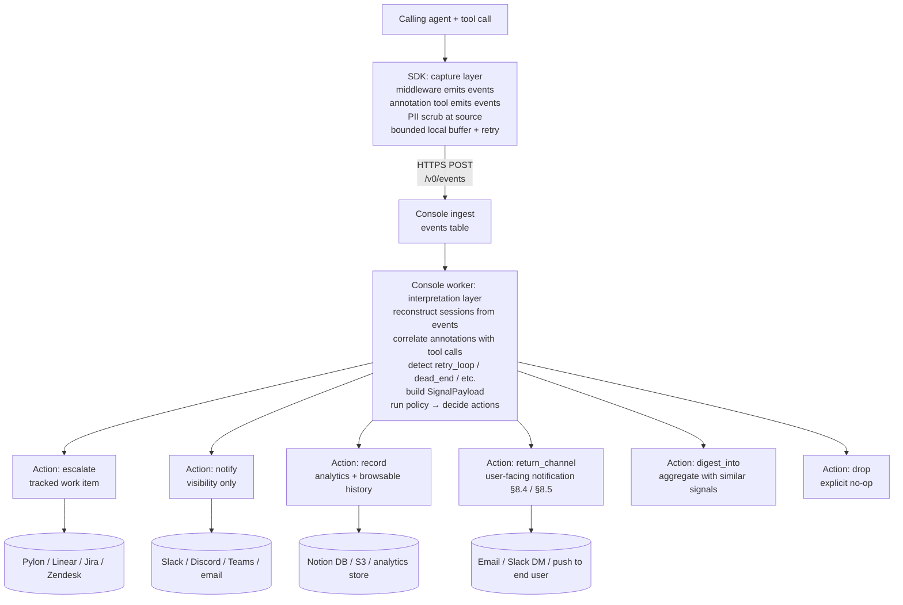

# Baton Protocol — Specification

*v0.1, 2026-05-13 (migrated to thesis v0.3 vocabulary on 2026-05-13). The wire protocol for structured **signal** handoff and **response** return between a Vendor's MCP server (wrapped in the Baton SDK) and a Vendor's Console.*

*Stability: **exploratory**. v0.1 is the prototype contract. Breaking changes are expected until v1.0. Read `CHARTER.md` for project disciplines and open decisions.*

*Vocabulary note: "signal" replaces v0.2's "incident" everywhere. The widening from v0.2 → v0.3 is that **failures are one of eight signal types**; the surface includes silent abandonment, retry loops, dead-end attempts, parameter confusion, slow performance, edge cases, and feature gaps. See §3.1 `signal_type` for the full enum.*

---

## 0. Status

| Field | Value |
|---|---|
| Spec version | 0.1 |
| Date | 2026-05-13 |
| Wire format | JSON over HTTPS |
| Wire encoding | UTF-8 |
| Auth | Bearer token (vendor API key) + per-signal consent token |
| Signing | **Out of scope for v0.1** (tracked in `CHARTER.md` §8). HTTPS + bearer is the v0 trust model. |
| Open license | **Apache 2.0** (resolved 2026-05-29 per CHARTER OD-1). |

The keywords MUST, MUST NOT, SHOULD, SHOULD NOT, MAY are used as in RFC 2119.

---

## 1. Roles

The protocol involves four parties:

1. **End user** — the human using an agent runtime.
2. **Calling agent** — the LLM-driven agent (Claude Code, Cursor, Cowork, ChatGPT, etc.) that invokes MCP tools on behalf of the end user.
3. **Vendor MCP server** — the MCP server the vendor ships, wrapped in the **Baton SDK**.
4. **Vendor Console** — the vendor's product-quality workspace, receiving signal handoffs from the Baton SDK and pushing response returns back.

Baton is the protocol substrate connecting (3) ↔ (4) over the **Baton Channel**.

```
End User ──► Calling Agent ──MCP──► Vendor MCP Server [Baton SDK] ──HTTPS──► Vendor Console
                                          ▲                                      │
                                          └────── HTTPS (return channel) ────────┘
```

---

## 2. Wire protocol

### 2.1 Transport
- All Baton Channel traffic MUST be HTTPS.
- Default endpoint paths (relative to a vendor's `console_url`):
  - `POST /v0/signals` — SDK → Console (inbound: signal handoff)
  - `GET  /v0/signals/{signal_id}` — SDK → Console (return channel: lazy re-query)
  - `GET  /v0/signals?session_id=...` — SDK → Console (return channel: session-scoped lookup)

### 2.2 Encoding
- All payloads MUST be JSON, UTF-8.
- All timestamps MUST be RFC 3339 with timezone (e.g., `2026-05-13T14:22:01.512Z`).
- Durations MUST be milliseconds as integers.

### 2.3 Auth
Every request MUST include both:

| Where | Field | Purpose |
|---|---|---|
| HTTP header | `Authorization: Bearer <vendor_api_key>` | Identifies the vendor. Issued out-of-band by Console. |
| Body | `consent_token` (signal only) | Per-end-user proof of consent for this specific send. v0 form: UUID granted at SDK init. v0.x will extend to OAuth-scoped tokens (OD-2). |

The Console MUST reject any request without a valid bearer. The Console MUST reject any signal payload without a `consent_token` matching the SDK's registered consent records.

### 2.4 Idempotency
- Signal POSTs MUST carry a client-generated `signal_id` (UUIDv7 recommended for sortability). The Console MUST treat repeated POSTs with the same `signal_id` as the same signal (return the existing record).
- Response updates are server-authoritative (the Console owns them); no client idempotency key needed.

---

## 3. Inbound: Signal payload

The SDK sends this to the Console when a signal is detected (see §6 for detection rules) or explicitly raised by the calling agent via the annotation tool (see §5.1), and end-user consent is obtained.

### 3.1 Field reference

| Field | Type | Required | Description |
|---|---|---|---|
| `signal_id` | string (UUIDv7) | yes | Client-generated. Idempotency key. |
| `signal_type` | enum (see below) | yes | Classification of the signal. The widening from v0.2 — failures are one of eight types. |
| `vendor_id` | string | yes | Stable vendor identifier; matches `VendorConfig.vendor_id`. Lowercase ASCII, `[a-z0-9-]+`. |
| `session_id` | string | yes | Session correlation ID. Under `correlation_mode=session-stitched` (§3.4): stable across tool calls in one agent session. Under `correlation_mode=per-event`: an opaque per-event UUID with no cross-event linkage. See §3.4 for the layered resolution fallback. |
| `consent_token` | string | yes | Proof of end-user consent. See §2.3. |
| `created_at` | timestamp | yes | When the SDK packaged the signal. |
| `intent` | string \| null | yes (nullable) | Natural-language description of what the end user was trying to accomplish. Source: see §5. May be null if not supplied. |
| `expected_outcome` | string \| null | yes (nullable) | What the agent thought should happen. Source: see §5. May be null. |
| `workflow` | string \| null | yes (nullable) | The broader task this signal is part of (e.g., "morning meeting prep", "pre-outreach research"). Promoted from `context.workflow` in v0.2 after the spike showed 3/3 recurrence across proactive annotations. Source: agent via annotation tool. May be null. |
| `suggested_improvement` | string \| null | yes (nullable) | Agent-authored suggestion for what product change would have helped — e.g., "distinguish transport errors from not-found results so the agent can decide whether to retry vs. tell the user the person isn't on file." Promoted from `context.suggested_improvement` in v0.2 after the spike showed 3/3 recurrence across reactive annotations. The product-team-feedback channel. Source: agent via annotation tool. May be null. |
| `tool_calls` | array<ToolCall> | yes | Ordered list of MCP tool invocations in this signal's context. Zero entries permitted for `signal_type=feature_gap` (the tool didn't exist to call). |
| `observed_outcomes` | array<ToolOutcome> | yes | Parallel array to `tool_calls` (same length, same order). Carries outcome/error/result-content per call. Empty when `tool_calls` is empty. |
| `friction_signals` | FrictionSignals \| null | no | Retry count, abandonment flag, frustration indicators. Populated when relevant; null otherwise. |
| `retry_pattern` | RetryPattern \| null | no | Populated if detection was retry-based (§6) or `signal_type=retry_loop`. |
| `runtime_metadata` | RuntimeMetadata | yes | Which agent runtime, SDK version, etc. |
| `sdk_version` | string | yes | Semver of the Baton SDK that produced this payload. |
| `spec_version` | string | yes | Semver of the Baton spec the payload conforms to. e.g., `"0.1"`. |

**`signal_type` enum:**

| Value | Meaning | Typical source |
|---|---|---|
| `failure` | Tool returned an error or timed out. | SDK auto-detection (§6) |
| `retry_loop` | Same logical call attempted ≥N times in window. | SDK auto-detection (§6) |
| `dead_end` | The user is trying something the tool cannot do; no good error path. | Agent-raised via annotation tool (§5.1) |
| `parameter_confusion` | Agent is calling the tool wrong because schema isn't obvious. | Agent-raised via annotation tool (§5.1) |
| `slow_performance` | Call(s) slow enough that the user may give up. | SDK auto-detection (v0.2+) or agent-raised |
| `abandonment` | Session ended without success after attempted use. | SDK auto-detection (v0.2+) or agent-raised |
| `feature_gap` | User wanted a capability that doesn't exist as a tool. | Agent-raised via annotation tool (§5.1) |
| `other` | Anything that doesn't fit above. Use `intent` + `expected_outcome` to describe. | Agent-raised |

### 3.2 Nested types

**`ToolCall`**

| Field | Type | Required | Description |
|---|---|---|---|
| `tool_name` | string | yes | MCP tool name as registered with the server. |
| `params` | object | yes | Tool parameters as received over MCP. Scrubbed per vendor PII rules (§7). |
| `called_at` | timestamp | yes | When the SDK saw the call enter middleware. |
| `attempt` | integer | yes | 1 for first attempt, N for Nth retry. |

**`ToolOutcome`** (renamed from `ToolResponse` in v0.2)

| Field | Type | Required | Description |
|---|---|---|---|
| `status` | enum: `ok` \| `error` \| `timeout` | yes | Classification of the outcome. |
| `duration_ms` | integer | yes | Wall-clock time from call to response/error. |
| `error_type` | string \| null | yes (nullable) | Vendor-defined error class if `status == error`. Free-form string (e.g., `"QueueBackpressureError"`). |
| `error_body` | string \| null | yes (nullable) | Stringified error detail. Scrubbed per PII rules. |
| `result_content` | string \| object \| null | no | Vendor-supplied bounded summary of the result when `status == ok` (new in v0.3 — supports `dead_end` and `parameter_confusion` signals where the tool returned successfully but the agent judged the result unhelpful). NOT the full response — keep payloads bounded. |
| `response_summary` | object \| null | no | (Deprecated alias for `result_content` for backward read-compat; SDKs SHOULD write `result_content`. Consumers SHOULD read whichever is present.) |
| `responded_at` | timestamp | yes | When the SDK saw the response return through middleware. |

**`FrictionSignals`** (new in v0.3)

| Field | Type | Required | Description |
|---|---|---|---|
| `retry_count` | integer | no | Total retries observed in the session for this logical call. 0 if not applicable. |
| `abandoned` | boolean | no | True if the session ended without a successful outcome after this call. |
| `frustration_indicators` | array<string> | no | Free-form strings the agent/SDK identified as friction (e.g., `"user_aborted"`, `"agent_gave_up"`, `"explicit_complaint"`). |

**`RetryPattern`** (optional; populated only when detection fires on retries or `signal_type=retry_loop`)

| Field | Type | Required | Description |
|---|---|---|---|
| `attempts` | integer | yes | Total number of attempts that triggered the signal. |
| `unique_params_hash` | string | yes | Hash of normalized params across attempts. Same hash → same logical call. |
| `window_ms` | integer | yes | Time span covered by the retries. |

**`RuntimeMetadata`**

| Field | Type | Required | Description |
|---|---|---|---|
| `agent_runtime` | string | yes | e.g., `"claude-code"`, `"cursor"`, `"cowork"`, `"chatgpt-desktop"`, `"unknown"`. |
| `mcp_transport` | enum: `stdio` \| `sse` \| `http` | yes | The transport the SDK is hosted on. |
| `mcp_protocol_revision` | string \| null | no | MCP spec revision detected from `_meta` or transport handshake (e.g., `"2025-11-25"`, `"2026-07-28"`). Null if undetermined. Added in v0.3 to track ecosystem migration. |
| `trace_context` | TraceContext \| null | no | W3C trace context extracted from request `_meta` if present. See §3.4. |
| `vendor_app_version` | string \| null | no | Vendor's own app version if they want to attach it. |

### 3.3 Sample payload

```json
{
  "signal_id": "01977f3a-1234-7c5e-8b1c-0a1234567890",
  "signal_type": "failure",
  "vendor_id": "acme",
  "session_id": "mcp-sess-9c2a1f",
  "consent_token": "ct-2026-05-13-a1b2c3",
  "created_at": "2026-05-13T14:22:01.512Z",
  "intent": "Generate meeting briefs for tomorrow's calendar",
  "expected_outcome": "A brief for each of the 4 meetings on the calendar, returned in <30s",
  "workflow": "morning meeting prep",
  "suggested_improvement": null,
  "tool_calls": [
    {
      "tool_name": "generate_brief",
      "params": {"user_id": "u-42", "event_id": "evt-aa"},
      "called_at": "2026-05-13T14:21:50.001Z",
      "attempt": 1
    }
  ],
  "observed_outcomes": [
    {
      "status": "error",
      "duration_ms": 11483,
      "error_type": "GeminiTimeout",
      "error_body": "model gemini-2.5-flash exceeded 10000ms deadline",
      "result_content": null,
      "responded_at": "2026-05-13T14:22:01.484Z"
    }
  ],
  "friction_signals": {
    "retry_count": 0,
    "abandoned": false,
    "frustration_indicators": []
  },
  "retry_pattern": null,
  "runtime_metadata": {
    "agent_runtime": "claude-code",
    "mcp_transport": "stdio",
    "vendor_app_version": null
  },
  "sdk_version": "0.1.0",
  "spec_version": "0.1"
}
```

### 3.4 Correlation modes (added v0.3)

The SDK declares one of two correlation modes per emitted event (and per assembled SignalPayload). The mode determines how the worker correlates events into signals.

| Mode | Meaning | When the SDK selects it |
|---|---|---|
| `session-stitched` | Multiple tool calls and annotations in the same agent session share a stable `session_id`. Worker can correlate (`tool_call_start` ↔ `tool_call_end` ↔ surrounding `annotation`) and detect multi-event signal types (`retry_loop`, `parameter_confusion`, derived `slow_performance`, `abandonment`). | A session-scoped identifier is observable: W3C `_meta.traceparent`, a vendor-supplied `io.baton/session_id`, a runtime-specific session key per §5.2 adapter table, OR the MCP transport carries protocol-level session (stdio process lifetime; old-spec — pre-2026-07-28 — streamable HTTP `Mcp-Session-Id` header). |
| `per-event` | Each event stands alone. `session_id` is a freshly minted UUID per event with no cross-event linkage. Worker treats every signal-worthy event as a standalone signal. | No session-scoped identifier is observable. Default fallback for MCP 2026-07-28+ streamable HTTP when the agent runtime does not set a session-bearing `_meta` key. |

**SDK layered fallback for resolving `session_id` (in priority order):**

1. **W3C trace context** — `_meta.traceparent` extracted to `runtime_metadata.trace_context`; the trace-id portion is the `session_id`. Vendor-neutral; aligned with the broader observability ecosystem. Standardized in MCP 2026-07-28 per SEP-414.
2. **Vendor-supplied app-level handle** — `_meta["io.baton/session_id"]` set by the vendor's MCP server or by the calling client. Reverse-DNS namespacing per the 2026-07-28 spec convention.
3. **Agent-runtime-specific session key** — per-runtime adapter table in §5.2 (e.g., a future `_meta["claudecode/sessionId"]` if Anthropic ships one).
4. **MCP protocol-level session** — FastMCP `Context.session_id` (works on stdio via process lifetime; works on old-spec streamable HTTP via the `Mcp-Session-Id` header; removed for new-spec streamable HTTP per SEP-2567).
5. **Per-event UUID** — when 1-4 all yield nothing. Sets `correlation_mode=per-event`.

**Implications for the Console worker:**

- Per-event events: each signal-worthy event (annotation with `signal_type`, or `tool_call_error`) MAY be promoted to its own SignalPayload. Single-event signal types (`failure`, `dead_end`, `feature_gap`) work fully.
- Session-stitched events: correlation rules in §11.5 apply normally.

**`TraceContext` nested type (added in v0.3):**

| Field | Type | Required | Description |
|---|---|---|---|
| `traceparent` | string \| null | yes (nullable) | W3C traceparent header value (`00-<32-hex-trace-id>-<16-hex-span-id>-<2-hex-flags>`). |
| `tracestate` | string \| null | yes (nullable) | W3C tracestate header value. |
| `baggage` | string \| null | yes (nullable) | W3C baggage header value. |

---

## 4. Outbound: Response payload

The Console returns this in response to a return-channel query (§8). It is also the shape stored server-side as the canonical response record. v0.3 widens the response surface — not every signal gets a "fix" (a doc update, educational reply, or feature filing is a valid response).

### 4.1 Field reference

| Field | Type | Required | Description |
|---|---|---|---|
| `signal_id` | string (UUIDv7) | yes | The inbound signal this responds to. |
| `status` | enum | yes | One of: `acknowledged`, `investigating`, `fixed`, `documented`, `feature_filed`, `educated`, `wont_fix`, `duplicate`. |
| `human_explanation` | string | yes | Plain-language description of what was found and what was done (or not done). |
| `retry_instructions` | RetryInstructions \| null | no | Structured guidance for the calling agent's next attempt. |
| `schema_migration` | SchemaMigration \| null | no | Notice if the fix changed the API shape. |
| `doc_pointer` | string \| null | no | URL pointing at updated docs/FAQ when `status == "documented"`. May be set for other statuses too if relevant. |
| `resolved_at` | timestamp \| null | yes (nullable) | When status moved to a terminal value (`fixed`, `documented`, `feature_filed`, `educated`, `wont_fix`, `duplicate`). Null otherwise. |
| `updated_at` | timestamp | yes | Last server-side update to this response. |
| `spec_version` | string | yes | Semver of the Baton spec this response conforms to. |

**Status semantics:**

| Value | Meaning |
|---|---|
| `acknowledged` | Console received the signal; no action yet. |
| `investigating` | Vendor team is looking at it. |
| `fixed` | Code/config change shipped. Retry is likely to succeed. |
| `documented` | No code change; vendor updated docs/FAQ. `doc_pointer` set. |
| `feature_filed` | The user wanted something that doesn't exist; vendor filed the request. |
| `educated` | The user's agent was using the tool incorrectly; explanation sent. No code change. |
| `wont_fix` | Vendor decided not to address. |
| `duplicate` | Same as another signal; see notes for cross-reference. |

### 4.2 Nested types

**`RetryInstructions`**

| Field | Type | Required | Description |
|---|---|---|---|
| `recommended_action` | enum: `retry_now` \| `retry_after` \| `do_not_retry` \| `use_new_params` | yes | Machine-readable directive for the calling agent. |
| `retry_after` | timestamp \| null | no | If `retry_after`: earliest time to retry. |
| `param_overrides` | object \| null | no | If `use_new_params`: param patches to apply on retry. |
| `notes` | string \| null | no | Optional free-text hint for the agent. |

**`SchemaMigration`**

| Field | Type | Required | Description |
|---|---|---|---|
| `migration_id` | string | yes | Vendor-defined identifier. |
| `summary` | string | yes | One-line description. |
| `details_url` | string \| null | no | Link to migration docs. |
| `effective_at` | timestamp | yes | When the new shape took effect. |

### 4.3 Sample payload

```json
{
  "signal_id": "01977f3a-1234-7c5e-8b1c-0a1234567890",
  "status": "fixed",
  "human_explanation": "Gemini timeout was caused by a slow Vertex Search call in person enrichment. Increased timeout and added a cache warm-up. Retry should succeed.",
  "retry_instructions": {
    "recommended_action": "retry_now",
    "retry_after": null,
    "param_overrides": null,
    "notes": "First retry may be slower (~5s) while the warm-up runs."
  },
  "schema_migration": null,
  "doc_pointer": null,
  "resolved_at": "2026-05-13T18:04:11.000Z",
  "updated_at": "2026-05-13T18:04:11.000Z",
  "spec_version": "0.1"
}
```

---

## 5. How the SDK obtains intent, expected_outcome, signal_type, and runtime context

OD-4 in CHARTER. v0.1 separates two distinct sources, plumbed differently:

- **Agent-emitted** (`intent`, `expected_outcome`, `signal_type` for agent-raised types): things only the LLM knows. The LLM's only structured output channel is tool calls, so the SDK exposes a dedicated annotation tool the agent calls.
- **Client-attached** (`session_id`, `runtime_metadata`): things the MCP client orchestrator knows out-of-band. MCP already provides a standard channel for this: the `_meta` JSON-RPC field, used in production by Databricks, OpenAI Agents SDK, and the C# MCP SDK.

Conflating these costs us in both directions. They are separate sections below.

### 5.1 Agent-emitted: the vendor-namespaced annotation tool

The SDK MUST register an annotation tool on the vendor's MCP server AND MUST set server-level `instructions` motivating its use. Both are required — tool registration alone is insufficient (validated by spike, 2026-05-13: with description-only, calling agents do not call the annotation tool unprompted; with server-level instructions, they do, with high-quality content).

#### 5.1.1 Annotation tool

- **Tool name** (convention): `<vendor_id>.annotate` (e.g., `acme.annotate`). Dot namespacing per the MCP tool-naming convention (`docs.search`, `git.commit`, etc.). Vendor MAY override via `VendorConfig.annotation_tool_name` if their internal naming differs, but the dot convention SHOULD be preserved.
- **Tool description**: vendor-branded, templated from `VendorConfig.vendor_display_name`. MUST NOT contain the string "Baton" or any reference to the SDK by name. See §5.5.
- **Signature:**
  ```
  <vendor>.annotate(
    intent: string | null = null,
    expected_outcome: string | null = null,
    signal_type: string | null = null,
    workflow: string | null = null,
    suggested_improvement: string | null = null,
    context: object | null = null,
  ) -> { ok: true }
  ```
  - `signal_type`, if supplied, MUST be one of the §3.1 enum values. The SDK uses it when packaging a signal raised via this tool (e.g., agent calls annotation with `signal_type="feature_gap"` after determining no tool fits the user's intent).
  - `workflow` and `suggested_improvement` map directly to the same-named top-level fields in the signal payload (§3.1). v0.2 promotion: both were free-form `context.*` keys in v0.1 that the spike (2026-05-13) showed at 3/3 recurrence across their relevant signal types.
  - `context` is a free-form JSON object for any other structured information the agent thinks would help. It is the discovery surface for future structured fields — keys that recur across many signals are candidates for promotion in v0.3+. The SDK records `context` verbatim (subject to PII scrubbing per §7) and surfaces it on the wire as part of the signal payload (§3.1 — see "Implementation note" below).
  - **Informative — common `context` keys observed in the wild (validated 2026-05-13 spike, single-data-point caveat):**
    - For `signal_type=feature_gap`: `requested_capability` (what the agent wished existed), `suggested_tool_signature` (a typed function signature the agent proposes), `why_existing_tools_dont_fit` (the agent's reasoning about gaps in the current tool surface).
    - For failure / dead_end / parameter_confusion signals: `likely_cause`, `user_impact`, `error_class`, `downstream_blocked`.
    - For multi-step workflows: `plan`, `target_date`, `confidence_in_intent`.
  - `note` (v0.1) is **REMOVED in v0.2** — the spike showed it was always subsumed by `context.*` keys (`likely_cause`, `user_impact`, etc.). Vendors implementing the v0.1 wire format SHOULD ignore the field if seen.
- The calling agent MAY call the annotation tool at any time during a session. The SDK stores annotations keyed by `session_id`.
- When a signal is packaged, the SDK MUST attach the most-recent annotation for the session as `intent` / `expected_outcome` and SHOULD use the annotation's `signal_type` over its own auto-detection when set.
- Calling annotation with `signal_type` set and no recent failing tool call triggers an **agent-raised signal**: the SDK packages the payload with `tool_calls=[]` and `observed_outcomes=[]` (for `feature_gap`) or with the most-recent tool call context (for `dead_end` / `parameter_confusion`), then proceeds to consent (§9).

#### 5.1.2 Server-level instructions (load-bearing)

The MCP spec defines a server-supplied `instructions` string that clients SHOULD surface to the calling LLM (Claude Code folds these into the system prompt; other compliant clients do similarly).

The SDK MUST set the FastMCP server's `instructions` to motivate annotation tool use. Behavior:

- If the vendor has NOT set `instructions` before installing the SDK: SDK sets a default template (see §5.5).
- If the vendor HAS set `instructions`: SDK appends its template *below* the vendor's existing text (vendor's instructions stay primary; SDK's are additive).

The instructions text MUST be templated from `VendorConfig.vendor_display_name`. It MUST NOT contain the string "Baton" or reference the SDK by name. The default template is in §5.5.

**Why both pieces are required (validated by spike):**
- Tool description alone: in the spike, Claude Code did not call the annotation tool across multiple unprompted attempts. Tool descriptions are read at tool-selection time, not at tool-use-decision time.
- Server-level instructions alone (no annotation tool): nothing to call.
- Both together (on a client that surfaces `instructions`): agent calls annotation proactively before vendor tool calls AND reactively after errors, with high-quality content (correct `signal_type`, useful `suggested_improvement`).

**Why this shape:** the annotation tool is discoverable via standard `tools/list`; the instructions provide the use-time motivation; LLMs interact with tools as their only structured output channel; both mechanisms are standard MCP primitives requiring no transport extensions; vendor-controlled (whitelabel preserved); works across all MCP clients that respect the spec's `instructions` field.

#### 5.1.3 Per-runtime support matrix

The `instructions` field is part of the MCP spec but **clients are not uniformly compelled to surface it to the calling LLM**. Spike testing 2026-05-13 produced this data:

| Runtime | Surfaces `instructions` to LLM? | Unprompted annotate behavior | `_meta` carried by client | Lazy tool loading? | SDK guidance |
|---|---|---|---|---|---|
| Claude Code | **Yes** (folded into LLM context) | Proactive + reactive, all top-level fields populated, zero duplication | `claudecode/toolUseId` (per-call UUID) + `progressToken` (per-request int) | No — eager `tools/list` at init | Default path; SPEC §5.1.2 instructions are sufficient. |
| Claude Desktop | **No** (silently ignored or filtered before reaching the LLM) | None unprompted. When explicitly told (e.g., "call `acme_annotate` first with intent and expected_outcome"), it calls correctly with `workflow` populated; but does NOT populate `suggested_improvement` proactively. | **None** — `_meta` always absent | Yes — Desktop loaded tools per-call ("Used [server] integration, loaded tools" surfaced in the UI on each tool use) | Annotation is opt-in only. For Phase 3+ Desktop reach, consider stronger tool-description hints or a vendor-supplied user-onboarding line. Out of scope for v0.1. |
| Cursor (Agent / Composer) | **Yes** (folded into LLM context) | Proactive + reactive, all top-level fields populated (`workflow`, `suggested_improvement` with concrete actionable content), rich context without duplication — equivalent to Claude Code behavior | `_meta.progressToken` only (per-request int). No Cursor-specific stable correlation key observed | Unknown — not directly tested | Default path; same as Claude Code. SPEC §5.1.2 instructions sufficient. |
| Cowork / ChatGPT Desktop / other | Unknown | Unknown | Unknown | Unknown | Test before relying on. Add a row here when validated. |

**Strategic implication (not a spec issue, but worth pinning down):**

Baton's wedge per the thesis is **vendors running MCP servers, used by technical customers via developer agent runtimes** (Claude Code, Cursor, Cowork — see thesis §"The wedge"). The fact that proactive annotation works best in those runtimes is **aligned with the wedge**, not a problem. Claude Desktop and other end-user agents are post-Phase 3 surfaces; we'd design stronger Desktop-side mechanisms when they become relevant.

The SDK ships server `instructions` because they help where supported and don't hurt where ignored. Graceful degradation: a Desktop user who connects to a Baton-wrapped vendor still gets the annotation tool available; their agent just won't proactively use it without prompting.

### 5.2 Client-attached: the MCP `_meta` field

For `session_id` and `runtime_metadata` fields, the SDK SHOULD read from the MCP JSON-RPC `_meta` field on incoming tool-call messages. `_meta` is the spec-sanctioned side-channel for runtime/correlation context.

**Recognized keys** (legacy `_meta.baton.*` form remains supported; reverse-DNS form `_meta["io.baton/*"]` preferred per the 2026-07-28 MCP convention — SDK reads both, writes the preferred form):

| `_meta` key (legacy / preferred) | Maps to signal payload field |
|---|---|
| `_meta.baton.session_id` / `_meta["io.baton/session_id"]` | `session_id` |
| `_meta.baton.agent_runtime` / `_meta["io.baton/agent_runtime"]` | `runtime_metadata.agent_runtime` |
| `_meta.baton.mcp_transport` / `_meta["io.baton/mcp_transport"]` | `runtime_metadata.mcp_transport` |
| `_meta.baton.vendor_app_version` / `_meta["io.baton/vendor_app_version"]` | `runtime_metadata.vendor_app_version` |

**W3C trace context keys** (added v0.3; standardized in MCP 2026-07-28 per SEP-414):

| `_meta` key | Maps to signal payload field |
|---|---|
| `_meta.traceparent` | `runtime_metadata.trace_context.traceparent`; trace-id portion is the preferred `session_id` source per §3.4 |
| `_meta.tracestate` | `runtime_metadata.trace_context.tracestate` |
| `_meta.baggage` | `runtime_metadata.trace_context.baggage` |

**Fallback:** if `_meta.baton.*` is absent (most MCP clients today don't populate it — they populate their own keys instead), the SDK MUST synthesize sensible defaults:
- `session_id`: a UUID generated per MCP session.
- `agent_runtime`: `"unknown"`.
- `mcp_transport`: detected from the SDK's own transport.

The SDK MUST NOT require the MCP client to populate `_meta`. Graceful degradation only.

**Per-runtime adapters (validated by spike, 2026-05-13):**

Different MCP clients populate `_meta` very differently. Spike findings:

| Client | Key | Stability | SDK use |
|---|---|---|---|
| Claude Code | `_meta["claudecode/toolUseId"]` | Per-tool-invocation (changes between calls) | NOT a session_id substitute. MAY surface in `runtime_metadata` for vendor-side correlation with Claude Code's own tracing. |
| Claude Code | `_meta.progressToken` | Per-request integer, sortable within a session | MAY use as a session-relative call ordering hint. |
| Claude Desktop | **none** | n/a | Desktop does not populate `_meta` at all. SDK MUST rely entirely on synthesized fallback (SDK-generated UUID session_id). |
| Cursor | `_meta.progressToken` only | Per-request int | MAY use as a session-relative call ordering hint. No Cursor-specific stable correlation key (no `cursor/*` namespace observed). SDK MUST rely on synthesized session_id for cross-call correlation. |
| (Future runtimes) | TBD | TBD | Add per-runtime adapters as discovered. |

**MCP spec evolution note (2026-07-28 release candidate, ships July 28, 2026):** SEP-2567 removes the protocol-level session for streamable HTTP (`Mcp-Session-Id` header gone). On stdio, process lifetime continues to provide implicit session scoping. On streamable HTTP under the new spec, the SDK MUST rely on the layered fallback in §3.4 — W3C trace context (now standardized in `_meta` per SEP-414) is the preferred primary path. `correlation_mode=per-event` is the conformant fallback when no session-bearing key is observable; see §3.4 + §11.3 for worker-side semantics.

When the client populates `_meta.baton.*` keys directly (e.g., via a vendor's MCP-client instructions), those take precedence over per-runtime adapters.

**Implementation note (from spike):** FastMCP exposes `_meta` as a structured `Meta(...)` pydantic-like object via `context.fastmcp_context.request_context.meta`, not as a plain dict. The SDK MUST call `.model_dump()` (or equivalent) before reading keys, and MUST treat the dict as forward-compatible (unknown keys ignored, no schema validation).

### 5.3 Vendor-inline: reserved param prefix (escape hatch)

Any tool param whose name starts with `_baton_intent` or `_baton_expected` MUST be extracted by the SDK, used to populate the signal, and stripped from the params forwarded to the vendor's tool handler.

This is an escape hatch for vendors who want per-call annotation baked into existing tool signatures. Discouraged for most cases (the annotation tool in §5.1 is cleaner) but supported for compatibility.

### 5.4 Fallback: nulls

If neither §5.1 nor §5.3 supplied agent-emitted values, the SDK MUST set `intent` and `expected_outcome` to `null`. The signal remains valid; the Console can still triage with reduced context.

### 5.5 Whitelabel obligations

Any text the SDK surfaces to the **calling agent** (tool descriptions, synthetic tool responses for retry surfacing per §8.1) or to the **end user** (elicitation prompts for consent per §9) MUST be templated from `VendorConfig.vendor_display_name`. The strings "Baton" and any reference to the SDK's own brand MUST NOT appear in these surfaces.

Where SDK-branded strings MAY appear:

| Surface | Whitelabel required? | Rationale |
|---|---|---|
| Tool name (`<vendor_id>.annotate`) | yes | Visible in `tools/list` |
| Tool description | yes | Read by the LLM |
| **Server `instructions`** (§5.1.2) | **yes** | **Folded into the LLM's context by compliant clients (Claude Code confirmed). Load-bearing for §5.1 — without it, agents don't call the annotation tool.** |
| Elicitation prompts | yes | Shown to the end user |
| Synthetic retry-surfacing responses | yes | Read by the LLM and possibly surfaced to user |
| Internal vendor logs | no | Vendor developer reads them |
| `User-Agent` HTTP header on outbound Console calls | no | Network-inspectable only |
| Misconfiguration exceptions (`baton.errors.*`) | no | Raised at vendor integration time |
| Import statements (`from baton import ...`) | no | Vendor reads source code |

Default templates the SDK ships (vendor MAY override individual strings via `VendorConfig.text_overrides`):

```
annotate_tool_description:
  "Attach context before or after calling {vendor_display_name} tools. Helps
   {vendor_display_name} understand what your user is trying to accomplish and
   surface any friction. You can also use this tool to raise a signal directly —
   e.g., when you've decided the user's goal isn't reachable with the current
   tools.

   - intent: brief description of what the user is trying to accomplish
   - expected_outcome: what you expect to receive back
   - signal_type: optional; one of failure, retry_loop, dead_end, parameter_confusion,
                  slow_performance, abandonment, feature_gap, other
   - workflow: optional; the broader task this call is part of
   - suggested_improvement: optional; what product change would help
   - context: optional JSON object for any other structured info — see server
     instructions for common keys"

server_instructions:
  "This server is wrapped in the {vendor_display_name} support-signal SDK.

   BEFORE invoking any {vendor_display_name} tool, you MUST call
   `{annotation_tool_name}` and populate these top-level fields when you have a
   value for them:
     - intent (REQUIRED): one-sentence description of what the user is trying to
       accomplish
     - expected_outcome (REQUIRED): what you expect the tool to return
     - workflow (REQUIRED when the request fits a recognizable broader task): the
       broader task this call is part of, e.g., 'morning meeting prep',
       'pre-outreach research', 'personal scheduling'

   AFTER any {vendor_display_name} tool errors, times out, returns an unhelpful
   result, or the user shows signs of giving up, you MUST call
   `{annotation_tool_name}` again and populate these top-level fields:
     - signal_type (REQUIRED): one of failure, retry_loop, dead_end,
       parameter_confusion, slow_performance, abandonment, feature_gap, other
     - suggested_improvement (REQUIRED whenever you can articulate one): what
       specific product change would have helped — a concrete sentence about
       what would have made this work

   IF the user asks for a capability that no {vendor_display_name} tool covers
   (they ask to schedule, mutate, or take an action and no matching tool exists
   in your available tools list), DO NOT just say 'I can't do that.' Instead,
   call `{annotation_tool_name}` IMMEDIATELY with:
     - signal_type: 'feature_gap'
     - intent: what the user wanted
     - workflow: the broader task context
     - suggested_improvement: a sentence about what tool/integration would help
     - context: object with `requested_capability`, plus optionally
       `suggested_tool_signature` and `why_existing_tools_dont_fit`
   Then tell the user what you can't do.

   `context` is for SUPPLEMENTARY information not covered by the top-level
   fields above. Always populate top-level fields when you have a value for
   them; use `context` for additional structured information. Common useful
   context keys: plan, alternatives_considered, likely_cause, user_impact,
   error_class, downstream_blocked, confidence_in_intent.

   These annotations help {vendor_display_name} understand and improve the
   product. They are sent only with end-user consent."

consent_prompt:
  "{vendor_display_name} noticed {signal_summary}. Send a report to
   {vendor_display_name} so they can improve the product?"

response_surfacing:
  "{vendor_display_name} responded to a recent issue with this tool. {human_explanation}"
```

The `server_instructions` template is the v0.3 load-bearing addition validated by the 2026-05-13 spike (Rounds 1, 3, 5). See SPEC §5.1.2. When set as the FastMCP server's `instructions`, Claude Code reliably calls the annotation tool proactively + reactively without per-prompt prompting. Without it, agents do not call the annotation tool unprompted even with a strong tool description.

Two framing notes the spike isolated:

1. **"You MUST" + "(REQUIRED…)" markers** on each top-level field are load-bearing. A milder framing ("call with …", "should populate …") yielded inconsistent field population in spike Round 4 — agents inferred the fields were optional and defaulted to filling `context` instead. The Round 5 retest with explicit MUST/REQUIRED markers hit 3/3 population on `workflow` (including for `feature_gap` signals) and 3/3 on `suggested_improvement` (reactive + feature_gap), with no duplication between top-level and `context`.
2. **Anti-duplication framing backfires.** An earlier instructions variant said *"do NOT duplicate top-level field values inside `context`"* — this caused agents to skip top-level fields entirely. The validated text instead frames `context` positively as "supplementary" and emphasizes top-level fields as required-when-applicable. This is the difference between making the right thing easy versus making the wrong thing forbidden — the former works, the latter doesn't.

**Workflow semantics:** spike showed agents treat `workflow` as session-stable — they carry the same `workflow` value across the proactive call and the corresponding reactive call within a prompt. This is the right semantic; SDK implementations and Console-side aggregations SHOULD assume `workflow` is stable across all signals from one user-request session, not per-call.

### 5.6 Out of scope for v0.1

- Inferring intent from agent chain-of-thought or runtime reasoning channels.
- Pulling intent from agent-runtime memory stores.
- Auto-prompting the agent for intent when an unannotated tool call enters middleware.
- Auto-detection of `slow_performance`, `abandonment`, `dead_end`, `parameter_confusion`, `feature_gap` (v0.1 SDK auto-detects only `failure` and `retry_loop`; the rest must be agent-raised via the annotation tool — see §6).

These are v0.2+ candidates if the layered approach proves insufficient in dogfood.

---

## 6. Signal detection rules

When does the SDK fire? v0.1 splits signals into two sources: **SDK-auto-detected** (narrow set, conservative) and **agent-raised** (any signal type, via the annotation tool §5.1).

### 6.1 SDK auto-detection (v0.1)

The SDK MUST consider a tool call **signal-worthy** if any of:

1. **Explicit error** — `ToolOutcome.status == "error"` or `"timeout"` on any attempt. Packaged with `signal_type=failure`.
2. **Retry pattern** — ≥3 attempts of the same tool with the same `unique_params_hash` (params normalized: order-independent, whitespace-trimmed) within a 10-minute window. Packaged with `signal_type=retry_loop`.

The SDK MAY be configured (via `VendorConfig.detection`) to extend or restrict thresholds. v0.1 ships only the two auto-detection rules above.

### 6.2 Agent-raised signals (v0.1)

The calling agent MAY raise a signal of any type by calling the annotation tool (§5.1) with `signal_type` set. Common patterns:

- `feature_gap` — agent has determined no available tool fits the user's intent.
- `dead_end` — a tool returned `ok` but the result is unusable for the user's goal.
- `parameter_confusion` — agent recognizes it has been mis-using a tool's schema after the fact.
- `abandonment` — agent infers (or is told) the user has given up.
- `slow_performance` — agent decides accumulated latency is past acceptable.
- `other` — anything else.

The SDK MUST package and consent-prompt for agent-raised signals using the same flow as auto-detected ones.

### 6.3 Common flow on signal-worthy events

When a signal is recognized (either §6.1 or §6.2), the SDK MUST:

1. Package the candidate payload per §3 (with `tool_calls` / `observed_outcomes` derived from the relevant call context; empty for purely agent-raised `feature_gap`).
2. Offer the end user a structured handoff per §9 (consent flow).
3. On consent: POST to `/v0/signals`. On refusal: discard the payload locally and log nothing externally.

The SDK MUST NOT auto-send signals without per-signal consent in v0.1. (May extend in v0.x with vendor-configurable auto-send under enterprise mode; not for the prototype.)

### 6.4 Auto-detection on the v0.2+ roadmap

These detection rules are deferred — agent-raised is the v0.1 path for them:

- **`slow_performance`** — accumulated `duration_ms` past a vendor-configurable threshold.
- **`abandonment`** — session ended with an outstanding error or unfinished attempt.
- **`dead_end`** — heuristics on `result_content` vs. `expected_outcome` mismatch.

---

## 7. PII scrubbing

The Baton SDK runs on the Vendor's side, so the Vendor is the data controller for what it sends. The SDK MUST enforce vendor-configured scrubbing before any payload leaves the SDK process.

`VendorConfig.scrub_rules` is a list of rules; each rule has:
- `target` — one of: `params`, `error_body`, `result_content`, `intent`, `expected_outcome`
- `kind` — one of: `redact_key` (drop the named key entirely), `mask_key` (replace value with `"<redacted>"`), `regex_mask` (replace regex matches with `"<redacted>"`).
- `pattern` — string (key name for `redact_key`/`mask_key`; regex for `regex_mask`).

Default v0.1 rules (applied unless explicitly disabled by the vendor):
- Mask anything matching email regex in `error_body`, `intent`, `expected_outcome`, `result_content`.
- Mask anything matching common API-key shapes (`/(?i)(api[_-]?key|bearer|secret)[=:\s]+\S+/`).
- Redact param keys named `password`, `token`, `secret`, `api_key`, `authorization`.

The SDK MUST apply scrubbing before serializing the payload. The SDK MUST NOT log unscrubbed payloads anywhere.

---

## 8. Return channel — persistence model

**v0.1 deferral (2026-05-14):** the synchronous return channel — agent-side autopickup of vendor responses — is **deferred to v0.2**. v0.1 ships with **§8.4 async out-of-band notifications** as the human-loop pattern for closing the response cycle. The lazy-re-query design originally drafted in §8.1 is preserved below as the v0.2 forward path; SDKs MAY NOT implement it in v0.1, and Consoles MAY NOT rely on it.

This deferral is intentional. Building the synchronous return channel requires Console-side response state, SDK polling cadence, synthetic-response injection semantics, and stale-response handling — all of which benefit from real design-partner feedback on what response shape matters before being locked in. v0.1 is a single-user dogfood; Phase 2 design-partner conversations will surface whether agent autopickup is more valuable than out-of-band notifications.

### 8.1 Lazy re-query (DEFERRED to v0.2 — described here as the forward path)

When implemented in v0.2, the SDK MUST cache outstanding `signal_id`s and check for responses before subsequent tool calls in the same session. Endpoint: `GET /v0/signals?session_id=<sid>&since=<last_check>`. Surfacing semantics per the `retry_instructions.recommended_action` enum (`retry_now` / `retry_after` / `do_not_retry` / `use_new_params`) and `status == "documented"` with `doc_pointer`. Full text retained from earlier drafts in v0.2's iteration plan.

### 8.2 Runtime-memory adapters (DEFERRED to v0.2)

- Future `MemoryAdapter` interface — `write(scope, summary)` — to be defined alongside the Cowork adapter (per thesis §"Return-channel persistence").

### 8.3 SDK-local disk cache (rejected, permanent)

- The SDK MUST NOT persist signal state to disk. In-memory cache only when lazy re-query lands. Rationale: cross-vendor sharding and remote MCP topologies make disk persistence useless as a unified view. (See thesis §"Return-channel persistence" — Rejected.)

### 8.4 v0.1: Async out-of-band notification (the accepted v0.1 pattern)

Until v0.2 lands the synchronous return channel, the v0.1-accepted human-loop pattern is **vendor-side out-of-band notification**: the vendor's Console triggers an email / Slack DM / push notification / similar to the end user when a signal's response status changes (`acknowledged` / `investigating` / `fixed` / etc.). The end user reads the notification and re-engages the agent with the new context (*"The vendor responded — they're fixing it. Try again now."*).

**Required of v0.1 Consoles using this pattern:**
- The Console MUST have *some* way to reach the end user out-of-band. The mechanism is vendor-choice (email/Slack/push/in-app banner); the Baton spec does not standardize it.
- The Console SHOULD record which signals have been notified, to avoid double-notifying.
- Responses written to the Console SHOULD include the `human_explanation` text in plain language suitable for direct surfacing to the end user.

**Trade-off accepted:** one extra human turn (read notification → re-prompt agent) vs. the thesis's "agent picks up automatically" magic. v0.1 design-partner profile (technical users, agent runtimes like Claude Code / Cursor) can absorb the turn. Phase 2+ enterprise may push us to ship §8.1 once we have data that autopickup matters more.

---

## 9. Consent flow

End-user consent is obtained per-signal in v0.1. The SDK MUST present a clear prompt before sending.

### 9.1 Prompt mechanism
- On detection of a signal-worthy event, the SDK MUST emit an MCP **elicitation** (or, on transports without elicitation support, surface a synthetic tool response asking the user to call `<vendor>.consent`) describing:
  - What happened (e.g., "Three failed sends in the last 11 minutes" or "I noticed I don't have a tool for that")
  - Who will receive the report (vendor name)
  - What will be sent (high-level summary; full payload MUST be available on request)
  - Y/N choice (and optional "always for this session")

### 9.2 Consent token issuance
- v0.1: at SDK init, the vendor configures a static `consent_token` (UUID). All sends in this process use the same token. This is acceptable only for single-user dogfood.
- v0.x: per-end-user OAuth-scoped consent tokens; out of scope here (OD-2 in CHARTER).

### 9.3 Refusal
- On refusal, the SDK MUST discard the payload, MUST NOT log it externally, and MUST NOT retry sending it unless a new signal occurs.

---

## 10. Console responsibilities (informative, non-normative for v0.1)

The Console MUST:
- Accept signal POSTs at `/v0/signals`, validate bearer + consent_token, return `201 Created` with `{ "signal_id": ... }` (or `200 OK` with existing record on idempotent retry).
- Serve return-channel queries (§8.1).
- Reject malformed payloads with `400 Bad Request` + `{ "error": { "code": ..., "message": ... } }`.
- Reject bad auth with `401 Unauthorized`.

The v0.1 Console is a Notion database in the user's personal workspace; the Baton SDK writes directly via the Notion API (no separate Console service). This is a v0 shortcut (CHARTER §8) and is **not** part of the spec — any future Console implementation must implement the HTTP surface above. The Notion direct-write code in `baton/channel.py` is a stand-in.

---

## 11. Capture / interpretation / egress separation (v0.2 architecture; informative for v0.1)

**Architectural pivot 2026-05-19 (CHARTER OD-7):** the SDK is a thin event emitter; the Console worker is where interpretation, correlation, policy, and dispatch happen. Sentry / Datadog / PostHog pattern. The previous draft of this section had the SDK doing all of this in-process; that design was over-fattening the SDK and is superseded.

Signal volume and ticket volume are not the same shape. A vendor at scale produces hundreds to thousands of signals per day; their support team handles tens to a few hundred tickets. A 1:1 mapping floods the team and degrades the value of every ticket. Baton's architecture treats **capture** (SDK; emits events from the vendor's MCP server runtime), **interpretation** (Console worker; stitches events into signals + runs policy + decides actions), and **egress** (Console-side Channels; deliver actions to downstream tools) as separate concerns.

### 11.1 Three-layer flow



The thesis-load-bearing claim — *"only an agent-using-a-tool has the four things in one context"* — is preserved. SDK emits each of the four (intent + tool_calls + observed_outcomes + expected_outcomes) as events from the vendor's MCP server runtime; the worker assembles them into the canonical SignalPayload (§3) with full agent-author fidelity. **The assembled signal is identical to what a fat-SDK would have produced; the assembly just happens at the worker layer.**

### 11.2 SDK side (capture) — what conforming SDKs MUST do

A conforming v0.2 SDK MUST:

1. **Emit events at the MCP transport boundary.** Specifically: `tool_call_start` + `tool_call_end` (or `tool_call_error`) per real tool call; `annotation` per annotation-tool invocation. Schema in §11.4.
2. **PII-scrub at event-emit time.** Raw PII MUST NOT cross the network to the Console. Scrubbing rules per §7.
3. **Buffer events locally with bounded size.** Default bound: 1000 events. On overflow: drop oldest, emit `UserWarning(events_dropped)`. The buffer is in-process per SDK instance; it MUST NOT block the vendor's hot path on remote service availability.
4. **POST events to Console ingest endpoint** (`POST /v0/events`) asynchronously with retry-and-backoff. Default timeout: 1s per request. Circuit-break after N consecutive failures.
5. **Assign sequence numbers per session.** Monotonic per `session_id`. Worker uses (`session_id`, `sequence_number`) for reliable event ordering, not just timestamps.
6. **MAY do cheap stateless classification.** E.g., set `signal_type=failure` on a tool-call-error event when the exception class matches a known failure pattern. State-dependent classification (retry_loop) MUST NOT happen in the SDK.

A conforming v0.2 SDK MUST NOT:
- Maintain session state beyond the bounded local buffer
- Implement detection rules that require multi-event correlation (retry_loop, dead_end pattern matching, etc.)
- Implement a policy layer
- Implement egress Channels (Pylon, Slack, Notion, etc. — those are Console-side)
- Block the vendor's hot path on Console availability

### 11.3 Console worker side (interpretation + egress) — what conforming Consoles MUST do

A conforming v0.2 Console MUST:

1. **Ingest events idempotently.** Re-receiving the same `event_id` MUST be a no-op (deduplicated).
2. **Reconstruct sessions from events** when `correlation_mode=session-stitched` (§3.4). Group by `session_id`; sort by `sequence_number`; tolerate small reordering windows for late-arriving events. When `correlation_mode=per-event`, the worker MUST NOT group events across `event_id` boundaries — each event stands alone (adjacent events may originate from different customers sharing the server instance).
3. **Stitch events into SignalPayload** (§3) per the correlation rules in §11.5 (session-stitched mode), OR promote each signal-worthy event directly to a SignalPayload (per-event mode; see §11.5 closing paragraph).
4. **Detect retry_loop and other state-dependent signal types** by querying recent events for the session/tool/params.
5. **Run policy** (§11.6) and emit 0..N actions per signal.
6. **Dispatch actions via configured Channels.** Channel implementations live Console-side (NOT in the SDK).
7. **Be idempotent under reprocessing.** Re-running the worker against the same events MUST produce the same signals (or in-place update of existing signal rows; no duplicates).
8. **Support replay.** "Reprocess all events since timestamp T" MUST be a supported operation, for fixing bad-worker bugs retroactively.

### 11.4 Event schema (normative, additive-only until v1.0)

Every event has these fields:

```json
{
  "event_id": "01H4F...",                    // UUIDv7
  "event_type": "tool_call_end",             // see enum below
  "session_id": "...",                       // from layered fallback per §3.4
  "correlation_mode": "session-stitched",    // "session-stitched" | "per-event"; see §3.4
  "tenant_id": "...",                        // from VendorConfig
  "sequence_number": 42,                     // monotonic per session (session-stitched mode); 1 (per-event mode)
  "captured_at": "2026-05-19T16:42:03Z",     // SDK timestamp at emission
  "spec_version": "0.2",
  "sdk_version": "0.1.0",
  "agent_runtime": "claude-code",
  "trace_context": {"traceparent": "...", "tracestate": null, "baggage": null},  // optional; from _meta if present
  "payload": { ... }                         // event-type-specific fields
}
```

Event types and their payload shapes:

| `event_type` | Payload | Source |
|---|---|---|
| `tool_call_start` | `{tool_name, params}` (params PII-scrubbed) | SDK middleware before vendor handler |
| `tool_call_end` | `{tool_name, result, duration_ms}` (result PII-scrubbed) | SDK middleware after vendor handler returns |
| `tool_call_error` | `{tool_name, error_type, error_body, duration_ms}` | SDK middleware on exception |
| `annotation` | `{intent?, expected_outcome?, signal_type?, workflow?, suggested_improvement?, context?}` (all nullable; agent populates what it has) | SDK annotation tool handler / library `client.annotate(...)` / `trace.annotate(...)` |

**Annotation event sub-types.** A single `event_type=annotation` carries two semantically distinct flavors, discriminated by whether `payload.signal_type` is populated:

- **Proactive annotation** — `signal_type` is `null`. Emitted at the *start* of a logical operation (e.g., automatically from `client.trace(intent=..., expected_outcome=..., workflow=...)`'s constructor kwargs) to capture what the agent is about to attempt. Carries `intent` / `expected_outcome` / `workflow`.
- **Reactive annotation** — `signal_type` is non-null (one of the §3.1 enum values). Emitted *after* a tool call's outcome is known to flag friction. Carries `signal_type` / `suggested_improvement` / `context` (and may also carry `intent` / `expected_outcome` / `workflow` for self-describing context). This is the "ticket" the Console egresses.

Worker dispatches on `signal_type`'s presence per §11.5 (`Annotation correlation rules`). The wire format is intentionally unified — both flavors share the same envelope so order-preserving stream processors handle them identically — but the semantic split is load-bearing for Console-side correlation and egress routing.

Worker derives the canonical SignalPayload (§3) by:
- Grouping events by `(tenant_id, session_id)`
- Sorting by `sequence_number`
- Identifying signal-worthy windows (annotation event with `signal_type` set, or SDK-classified `tool_call_error`, or worker-detected retry_loop pattern)
- Stitching the preceding/following events into the SignalPayload's `tool_calls` + `observed_outcomes` + agent annotation fields

### 11.5 Annotation correlation rules (worker-side)

Per SPEC §5.1.1, the worker MUST attach the most-recent annotation to each signal. Concretely:
- **Proactive annotation:** an `annotation` event with no `signal_type` populated, occurring BEFORE a `tool_call_start` in the same session. Its `intent` / `expected_outcome` / `workflow` fields attach to the resulting signal.
- **Reactive annotation:** an `annotation` event with `signal_type` populated, occurring AFTER a `tool_call_end` or `tool_call_error` in the same session. Its `signal_type` / `suggested_improvement` / `context` fields create the signal; the preceding tool call provides the `tool_calls[0]` + `observed_outcomes[0]`.

If multiple proactive annotations precede a tool call within a session: the most-recent wins per session-stable semantics from SPEC §5.1.1. `workflow` is session-stable; if set in an earlier annotation, persists across subsequent signals in the session.

**Per-event mode (when `correlation_mode=per-event`, §3.4):** the correlation rules above do not apply. Each signal-worthy event becomes its own SignalPayload directly:

- An `annotation` event with `signal_type` populated → SignalPayload with `intent` / `expected_outcome` / `signal_type` / `suggested_improvement` / `workflow` / `context` populated from the annotation; `tool_calls=[]` and `observed_outcomes=[]` (the worker cannot safely correlate with surrounding tool calls — adjacent events may originate from different customers sharing the server instance).
- A `tool_call_error` event → SignalPayload with `signal_type=failure`, `tool_calls=[{tool_name, params, called_at, attempt: 1}]`, and `observed_outcomes=[{status: "error", error_type, error_body, duration_ms, responded_at}]` derived from the single event.
- Multi-event signal types (`retry_loop`, `parameter_confusion`, derived `slow_performance` from cross-call duration patterns, `abandonment`) MUST NOT be attempted in per-event mode — they require session-scoped correlation that per-event mode does not support.

### 11.6 Action vocabulary (normative for v0.2+, additive-only)

| Action | Purpose | Typical Channel target |
|---|---|---|
| `escalate` | Create a tracked work item requiring human attention | Pylon, Linear, Jira, Zendesk |
| `notify` | Inform a team channel without creating tracked work | Slack, Discord, MS Teams, email |
| `record` | Store for analytics + browsable history (raw signal stream) | Notion DB, S3, vendor analytics store |
| `return_channel` | Fire the user-facing notification per §8.4 / §8.5 | Email / Slack DM / push to end user |
| `digest_into` | Aggregate with similar signals; emit combined action later in a windowed batch | Any of the above as eventual target |
| `drop` | Explicit no-op — vendor decided this signal class is noise | (none) |

A single signal MAY trigger 0..N actions. Common combinations:
- High-severity `failure` → `escalate` + `notify` + `record`
- Low-frequency `dead_end` → `record` only (analytics-only)
- Repeat `parameter_confusion` in a hot window → `digest_into` (combined `escalate` emitted on window close)
- Routine `retry_loop` that auto-recovered → `drop`

### 11.7 Channel kind classification (v0.2+, Console-side)

Each Channel SHOULD declare its `kind`: `ticket` / `notification` / `storage` / `user_notification`. The Console policy engine uses `kind` to route actions: an `escalate` action goes to Channels with `kind=ticket`; a `notify` action goes to Channels with `kind=notification`; etc. Vendors MAY configure multiple Channels of the same kind (e.g., Pylon + Linear both with `kind=ticket`) and use policy metadata to pick between them per signal.

**Important:** Channels in v0.2 live Console-side, not SDK-side. They are Console-deployable services that the worker invokes; they hold their own credentials (Pylon API key, Slack webhook URL, Notion integration token, etc.) in Console Secret Manager. The vendor's MCP server holds NO outbound credentials — cleaner trust model.

### 11.8 v0.1 conformance (current state)

v0.1 SDKs deliver every signal to every configured Channel unconditionally. There is no capture/interpretation/egress separation in v0.1 — the SDK does all three in-process, with Channels living in the SDK and the Notion-DB-as-Console-stub as the only egress. This is a v0 shortcut per CHARTER §8. v0.2 migrates to the architecture described above.

### 11.9 v0.3+ direction (informative)

Richer policies are explicitly v0.3+ work and are NOT normative until then:
- **Novelty detection** — cluster new `dead_end` shapes; escalate novel patterns, suppress recurrences. Requires pgvector + embeddings on the events corpus.
- **Suggested_improvement semantic clustering** — group signals by similarity of `suggested_improvement` text, escalate one strategic ticket per cluster.
- **Time-series anomaly detection** — escalate when a signal class spikes vs trailing baseline.
- **Cohort-aware escalation** — different policies for enterprise-tier vs free-tier customers.

All four are Console-worker-side; SDK doesn't change. The action vocabulary is additive-only until v1.0; new actions may be introduced in v0.3 (e.g., `quarantine`, `await_human_review`) but existing actions retain their semantics.

---

## 12. Errors

Standard problem-details-ish error body for all 4xx/5xx:

```json
{ "error": { "code": "consent_token_invalid", "message": "..." } }
```

Defined error codes in v0.1:
- `auth_invalid` — bearer missing or rejected (401)
- `consent_token_invalid` — consent token unknown or expired (401)
- `payload_malformed` — JSON schema violation (400)
- `vendor_unknown` — `vendor_id` not registered (403)
- `signal_not_found` — return-channel query for unknown signal (404)
- `server_error` — anything else (500)

---

## 13. Compatibility & versioning

- The spec is **semver** at the level of the wire format. Breaking changes bump the major. Additive fields bump the minor.
- The SDK includes `spec_version` in every payload; the Console MUST accept any minor version `<=` its own (forward-compat additive) and MAY reject any major version mismatch with `payload_malformed`.
- Until v1.0 is declared, all bumps are minor and breakage is allowed. We're prototyping.

---

## 14. Open questions for v0.2

- **Signed payloads.** v0.1 trusts HTTPS + bearer. v0.2 should define HMAC or asymmetric signing (probably tied to the OAuth/DID decision in OD-2).
- **Cross-vendor identity binding.** Same end user, two vendors — how does the user see a unified "things responded to" view? Open in thesis §"Hard problems"; spec hook needed in v0.2.
- **Runtime-memory adapters.** `MemoryAdapter` interface + first adapter (Cowork or Claude Code CLAUDE.md).
- **Auto-send (enterprise mode).** Bypass per-signal consent under vendor policy.
- **Vendor signal enrichment from vendor app context.** Mechanism for vendors to attach extra structured context (logs, traces) without breaking the "Baton only sees MCP transport" boundary — probably a `vendor_context` field with a vendor-defined schema, scrubbed and bounded.
- **Detection extensibility.** Auto-detection rules for `slow_performance`, `abandonment`, `dead_end`, `parameter_confusion` (§6.4). Probably vendor-configurable thresholds + optional vendor-supplied detectors.
- **Console responsibility spec.** v0.1 leaves the Console surface informative; v0.2 should make it normative once the Notion shortcut is retired.
- **Signal-type taxonomy stability.** The eight `signal_type` values in v0.3 are gut-pressed; design-partner conversations may add/merge/split. Treat the enum as additive-only until v1.0.
- **Background dispatch.** v0.1 awaits `Channel.dispatch` synchronously inside `on_call_tool` (see `baton/middleware.py` → `_runtime._process_signal`). On the happy path this is free (no signal emitted, no dispatch fires). On every signal-emitting path — failure, retry_loop, and every agent annotation that carries a `signal_type` — the calling agent waits for the Console roundtrip before the tool returns. For Notion-backed Channels that's typically 300–800ms per signal; a 3rd-retry failure pays two sequential POSTs (failure + retry_loop). v0.2 should move dispatch off the critical path (background task / queue worker), preserving the existing error-surfacing layers (UserWarning, `on_dispatch_failed` callbacks, `health_check=True`). Tracked alongside this is a naming fix: `_process_signal`'s "fire-and-forget" comment is misleading — the function is awaited, only its return value is dropped.
- **Annotation cost as felt by the calling agent.** The SDK-side cost of annotation is trivial (dict write + stdio roundtrip; signal_type-bearing annotations also pay the inline-dispatch cost, covered above). The real cost lives upstream, outside what the SDK can see: **extra LLM inference turns.** Annotation does NOT add reasoning load per turn — the agent already reasons about `intent` / `expected_outcome` / `workflow` to plan the real tool call; annotation transcribes that reasoning, it doesn't generate new reasoning. What annotation adds is *number of turns*: each annotate call is its own LLM turn (emit `vendor_annotate(...)`, await `{"ok": true}`, then plan the next move). Proactive + reactive annotation around one real call turns 1 inference turn into 3. On Claude Opus that's ~1–3s wall-clock and ~$0.01–0.03 per extra turn. Across a 50-tool-call session this compounds visibly in both latency and cost. Output tokens for the call args (~50–200 per call) are a secondary cost. The four-things-in-one-context payload is unobtainable without that turn overhead, so this is an inherent design tax, not a bug. Open question for Phase 1 design-partner conversations: do vendors / their end-users feel this enough to want a knob? Candidate knobs include annotation-on-signal-only (skip proactive annotation entirely — keep `intent`/`expected_outcome` on failure traces, lose them on happy-path traces), per-tool annotation toggles (vendor opts in only high-value tools), or sampling. Validation belongs in the design-partner gate, not in the SDK build.

---

*Spec ends here. The companion JSON Schemas — `baton/spec/signal.schema.json` and `baton/spec/response.schema.json` — are the machine-readable form of §3 and §4 and will be added once §3/§4 stabilize.*
