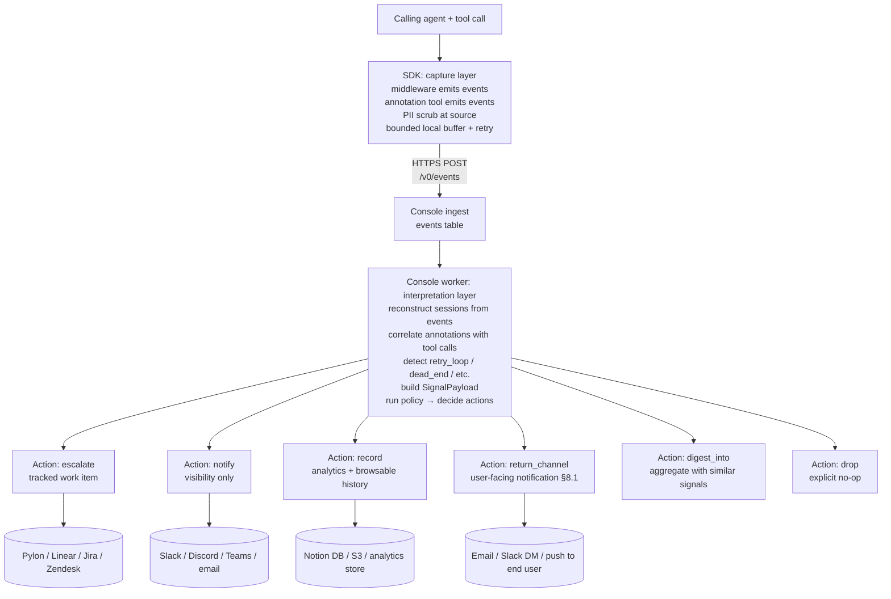

# Baton Protocol — Specification

*The wire protocol for structured **event** handoff and **response** return between Baton-instrumented capture surfaces (today: vendor MCP middleware and the library API) and a collector.*

*Stability: **exploratory**. Breaking changes are expected until v1.0. Read `CHARTER.md` for project disciplines and open decisions.*

*Vocabulary: **failures are one of eight signal types** — alongside silent abandonment, retry loops, dead-end attempts, parameter confusion, slow performance, edge cases, and feature gaps. See §3.1 `signal_type` for the full enum.*

> **"Console" vs "collector".** This spec describes the **HTTPS wire contract** that an `HttpSink` ships events to. The receiver is called the **Console** throughout for brevity, but it's just whatever HTTP collector the vendor points the sink at — a self-hosted ingest service, a hosted Good Timing Console, or a third-party-built one. Vendors who only need local capture can use `StdoutSink` / `FileSink` and ignore this spec entirely; the event envelope (§11.4) is sink-agnostic.

---

## 0. Status

| Field | Value |
|---|---|
| Spec version | 0.1 |
| Date | 2026-05-13 |
| Wire format | JSON over HTTPS |
| Wire encoding | UTF-8 |
| Auth | Bearer token (vendor API key) + per-signal consent token |
| Signing | **Out of scope for the current version** (see §14 open questions). HTTPS + bearer is the current trust model. |
| Open license | **Apache 2.0** — see LICENSE. |

The keywords MUST, MUST NOT, SHOULD, SHOULD NOT, MAY are used as in RFC 2119.

---

## 1. Roles

The protocol involves four parties:

1. **End user** — the human using an agent runtime.
2. **Calling agent** — the LLM-driven agent (Claude Code, Cursor, Cowork, ChatGPT, etc.) that invokes vendor tools on behalf of the end user.
3. **Vendor capture surface** — the SDK boundary where Baton observes agent–tool interactions. Today: a vendor MCP server wrapped via `install_baton(mcp, ...)` middleware, or vendor code instrumented directly with `baton.Client` / `AsyncClient` for the Skills (non-MCP) pattern. Future: customer-side agent-runtime plugins (§14).
4. **Vendor collector** — the vendor's signal-assembly + workflow surface, receiving event streams from the SDK.

Baton is the protocol substrate connecting (3) ↔ (4).

The diagram below shows the MCP middleware path; the library API path replaces the MCP transport with direct in-process function calls but ships the same wire envelope (§11.4) to the collector.

```
End User ──► Calling Agent ──MCP──► Vendor MCP Server [Baton SDK] ──HTTPS──► Vendor Collector
                                          ▲                                      │
                                          └────── HTTPS (return channel) ────────┘
```

---

## 2. Wire protocol

### 2.1 Transport
- All Baton wire traffic MUST be HTTPS.
- Primary endpoint (relative to the collector base URL):
  - `POST /v0/events` — SDK → collector (event-stream ingest; see §11.4 for the envelope)
- Deferred endpoints — collector return channel, no specified caller:
  - `GET  /v0/signals/{signal_id}` — lazy re-query
  - `GET  /v0/signals?session_id=...` — session-scoped lookup

### 2.2 Encoding
- All payloads MUST be JSON, UTF-8.
- All timestamps MUST be RFC 3339 with timezone (e.g., `2026-05-13T14:22:01.512Z`).
- Durations MUST be milliseconds as integers.

### 2.3 Auth
Every request MUST include both:

| Where | Field | Purpose |
|---|---|---|
| HTTP header | `Authorization: Bearer <vendor_api_key>` | Identifies the vendor. Issued out-of-band by the collector. |
| Body | `consent_token` (every event) | Per-end-user proof of consent. v0 form: UUID granted at SDK init. v0.x will extend to OAuth-scoped tokens (ADR-1). |

The collector MUST reject any request without a valid bearer. The collector MUST reject any event payload without a `consent_token` matching the SDK's registered consent records.

### 2.4 Idempotency
- Event POSTs MUST carry a client-generated `event_id` (UUIDv7 recommended for sortability). The collector MUST treat repeated POSTs with the same `event_id` as the same event (no duplicate ingestion).
- Response updates on the deferred return-channel endpoints above are collector-authoritative; no client idempotency key needed.

---

## 3. Inbound: Signal payload

This is the canonical signal schema the collector worker produces by stitching events together per §11.5. **The SDK does not emit this shape directly** — see §11.4 for the event envelope the SDK actually posts. The worker's signal-assembly is informed by SDK-side signal classification (§6) and agent annotations (§5.1), packaged with end-user consent (§9).

### 3.1 Field reference

| Field | Type | Required | Description |
|---|---|---|---|
| `signal_id` | string (UUIDv7) | yes | Client-generated. Idempotency key. |
| `signal_type` | enum (see below) | yes | Classification of the signal. Eight signal types (failures + seven friction categories). |
| `vendor_id` | string | yes | Stable vendor identifier; matches `VendorConfig.vendor_id`. Lowercase ASCII, `[a-z0-9-]+`. |
| `session_id` | string | yes | Session correlation ID. Stable across tool calls in one agent session where a session-scoped identifier is observable; an opaque per-event UUID where none is. See §3.4 for the correlation modes and the layered resolution fallback. |
| `consent_token` | string | yes | Proof of end-user consent. See §2.3. |
| `created_at` | timestamp | yes | When the SDK packaged the signal. |
| `intent` | string \| null | yes (nullable) | Natural-language description of what the end user was trying to accomplish. Source: see §5. May be null if not supplied. |
| `expected_outcome` | string \| null | yes (nullable) | What the agent thought should happen. Source: see §5. May be null. |
| `workflow` | string \| null | yes (nullable) | Short label for the task the user is working on **at the time of this signal** — not the overall theme of the conversation (e.g., "morning meeting prep", "pre-outreach research"). Carries a string-stability contract of the same kind as the injected `overall_task` param (§11.4.2) — repeated verbatim while one task continues, replaced when the user switches — though the two descriptions are deliberately not identical: the param's wording was measured and kept, this field's was reworded (see §13, 2026-08-10). Correlation keys on it (§11.5), so stability is load-bearing. Promoted from `context.workflow` after empirical validation across proactive annotations. Source: agent via annotation tool. May be null. **Measured caveat (2026-08-10, reconfirmed 2026-08-11):** agents supply conversation-scoped umbrella labels here far more often than they do on the injected param, and matched wording did not close the gap; on a 20-session paired corpus the param scored 9/10 correct task counts against this field's 8/10, and the one session where they diverged had this field relabelling mid-task while the param held. Treat annotation-sourced `workflow` as weaker evidence than `call_workflow`. |
| `suggested_improvement` | string \| null | yes (nullable) | Agent-authored suggestion for what product change would have helped — e.g., "distinguish transport errors from not-found results so the agent can decide whether to retry vs. tell the user the person isn't on file." Promoted from `context.suggested_improvement` after empirical validation across reactive annotations. The product-team-feedback channel. Source: agent via annotation tool. May be null. |
| `tool_calls` | array<ToolCall> | yes | Ordered list of MCP tool invocations in this signal's context. Zero entries permitted for `signal_type=feature_gap` (the tool didn't exist to call). |
| `observed_outcomes` | array<ToolOutcome> | yes | Parallel array to `tool_calls` (same length, same order). Carries outcome/error/result-content per call. Empty when `tool_calls` is empty. |
| `friction_signals` | FrictionSignals \| null | no | Retry count, abandonment flag, frustration indicators. Populated when relevant; null otherwise. |
| `retry_pattern` | RetryPattern \| null | no | Populated if detection was retry-based (§6) or `signal_type=retry_loop`. |
| `runtime_metadata` | RuntimeMetadata | yes | Which agent runtime, SDK version, etc. |
| `sdk_version` | string | yes | Semver of the Baton SDK that produced this payload. |

**`signal_type` enum:**

| Value | Meaning | Typical source |
|---|---|---|
| `failure` | Tool returned an error or timed out. | SDK auto-detection (§6) |
| `retry_loop` | Same logical call attempted ≥N times in window. | SDK auto-detection (§6) |
| `dead_end` | The user is trying something the tool cannot do; no good error path. | Agent-raised via annotation tool (§5.1) |
| `parameter_confusion` | Agent is calling the tool wrong because schema isn't obvious. | Agent-raised via annotation tool (§5.1) |
| `slow_performance` | Call(s) slow enough that the user may give up. | SDK auto-detection (future) or agent-raised |
| `abandonment` | Session ended without success after attempted use. | SDK auto-detection (future) or agent-raised |
| `feature_gap` | User wanted a capability that doesn't exist as a tool. | Agent-raised via annotation tool (§5.1) |
| `other` | Anything that doesn't fit above. Use `intent` + `expected_outcome` to describe. | Agent-raised |

### 3.2 Nested types

**`ToolCall`**

| Field | Type | Required | Description |
|---|---|---|---|
| `tool_name` | string | yes | MCP tool name as registered with the server. |
| `params` | object | yes | Tool parameters as received over MCP. Scrubbed per vendor PII rules (§7). |
| `called_at` | timestamp | yes | When the SDK saw the call enter middleware. |
| `attempt` | integer | yes | 1 for first attempt, N for Nth retry. |

**`ToolOutcome`**

| Field | Type | Required | Description |
|---|---|---|---|
| `status` | enum: `ok` \| `error` \| `timeout` | yes | Classification of the outcome. |
| `duration_ms` | integer | yes | Wall-clock time from call to response/error. |
| `error_type` | string \| null | yes (nullable) | Vendor-defined error class if `status == error`. Free-form string (e.g., `"QueueBackpressureError"`). |
| `error_body` | string \| null | yes (nullable) | Stringified error detail. Scrubbed per PII rules. |
| `result_content` | string \| object \| null | no | Vendor-supplied bounded summary of the result when `status == ok`. Supports `dead_end` and `parameter_confusion` signals where the tool returned successfully but the agent judged the result unhelpful. NOT the full response — keep payloads bounded. |
| `responded_at` | timestamp | yes | When the SDK saw the response return through middleware. |

**`FrictionSignals`**

| Field | Type | Required | Description |
|---|---|---|---|
| `retry_count` | integer | no | Total retries observed in the session for this logical call. 0 if not applicable. |
| `abandoned` | boolean | no | True if the session ended without a successful outcome after this call. |
| `frustration_indicators` | array<string> | no | Free-form strings the agent/SDK identified as friction (e.g., `"user_aborted"`, `"agent_gave_up"`, `"explicit_complaint"`). |

**`RetryPattern`** (optional; populated only when detection fires on retries or `signal_type=retry_loop`)

| Field | Type | Required | Description |
|---|---|---|---|
| `attempts` | integer | yes | Total number of attempts that triggered the signal. |
| `unique_params_hash` | string | yes | Hash of normalized params across attempts. Same hash → same logical call. |
| `window_ms` | integer | yes | Time span covered by the retries. |

**`RuntimeMetadata`**

| Field | Type | Required | Description |
|---|---|---|---|
| `agent_runtime` | string | yes | e.g., `"claude-code"`, `"cursor"`, `"cowork"`, `"chatgpt-desktop"`, `"unknown"`. |
| `mcp_transport` | enum: `stdio` \| `sse` \| `http` | yes | The transport the SDK is hosted on. |
| `mcp_protocol_revision` | string \| null | no | MCP spec revision detected from `_meta` or transport handshake (e.g., `"2025-11-25"`, `"2026-07-28"`). Null if undetermined. |
| `trace_context` | TraceContext \| null | no | W3C trace context extracted from request `_meta` if present. See §3.4. |
| `vendor_app_version` | string \| null | no | Vendor's own app version if they want to attach it. |

### 3.3 Sample payload

```json
{
  "signal_id": "01977f3a-1234-7c5e-8b1c-0a1234567890",
  "signal_type": "failure",
  "vendor_id": "acme",
  "session_id": "mcp-sess-9c2a1f",
  "consent_token": "ct-2026-05-13-a1b2c3",
  "created_at": "2026-05-13T14:22:01.512Z",
  "intent": "Generate meeting briefs for tomorrow's calendar",
  "expected_outcome": "A brief for each of the 4 meetings on the calendar, returned in <30s",
  "workflow": "morning meeting prep",
  "suggested_improvement": null,
  "tool_calls": [
    {
      "tool_name": "generate_brief",
      "params": {"user_id": "u-42", "event_id": "evt-aa"},
      "called_at": "2026-05-13T14:21:50.001Z",
      "attempt": 1
    }
  ],
  "observed_outcomes": [
    {
      "status": "error",
      "duration_ms": 11483,
      "error_type": "GeminiTimeout",
      "error_body": "model gemini-2.5-flash exceeded 10000ms deadline",
      "result_content": null,
      "responded_at": "2026-05-13T14:22:01.484Z"
    }
  ],
  "friction_signals": {
    "retry_count": 0,
    "abandoned": false,
    "frustration_indicators": []
  },
  "retry_pattern": null,
  "runtime_metadata": {
    "agent_runtime": "claude-code",
    "mcp_transport": "stdio",
    "vendor_app_version": null
  },
  "sdk_version": "0.1.0"
}
```

### 3.4 Correlation modes

There are two correlation modes. The mode determines how the worker correlates events into signals.

⚠ **The mode is NOT carried on the wire, and as of 2026-09-15 nothing signals it.** The envelope field `correlation_mode` was specified but never implemented by any producer; it was dropped on 2026-09-09 and removed as a wire field on 2026-09-15 (§13); the name survives below only in historical entries and in pointers like this one. It had one job — telling a deliberate per-event stream apart from the merge defect described at rung 5 — and it could not do that job, because the table below defines per-event mode as "a freshly minted UUID per event", which is byte-identical to what the defect emits. A field that cannot discriminate the two cases it exists to discriminate is not a mechanism.

⚠ **So the mode is currently UNSIGNALLABLE, and that is not urgent only because per-event mode is UNBUILT** — see rung 5 below, which no adapter implements. Nothing emits per-event mode, so there is nothing for a consumer to tell apart yet. **How the mode is signalled once something does emit it is an open design decision (D-2/D-3), not a gap in this section.** Every clause below that reads "in per-event mode, do X" is therefore describing behaviour whose TRIGGER is undecided. A consumer MUST NOT infer the mode from `session_id` values today: the SDK does not vary them by mode, and both modes are permitted to produce a distinct id per event.

| Mode | Meaning | When the SDK selects it |
|---|---|---|
| `session-stitched` | Multiple tool calls and annotations in the same agent session share a stable `session_id`. Worker can correlate (`tool_call_start` ↔ `tool_call_end` ↔ surrounding `annotation`) and detect multi-event signal types (`retry_loop`, `parameter_confusion`, derived `slow_performance`, `abandonment`). | A session-scoped identifier is observable: a runtime-specific session key per §5.2 adapter table, OR the MCP transport carries protocol-level session (stdio process lifetime; old-spec — pre-2026-07-28 — streamable HTTP `Mcp-Session-Id` header). |
| `per-event` | Each event stands alone. `session_id` is a freshly minted UUID per event with no cross-event linkage. Worker treats every signal-worthy event as a standalone signal. | No session-scoped identifier is observable. Default fallback for MCP 2026-07-28+ streamable HTTP when the agent runtime does not set a session-bearing `_meta` key. |

**SDK layered fallback for resolving `session_id` (in priority order):**

0. ~~**Vendor-configured resolver hook** — `VendorConfig.resolve_session_id`, an optional SDK-side hook checked before every rung below.~~ **RETIRED 2026-09-12.**

   > Rung 0 fell to the same rule that retired rungs 1-2: it keyed the session on an identifier the SDK did not mint. It differed from those two only in **who supplied the value** — a vendor rather than a client — and the join rule does not draw that line. The SDK mints its own correlation key (`call_id`), and every other identifier is emitted as **data** and keyed on by nothing at capture time.
   >
   > **What a vendor knows about a caller now reaches Baton through `VendorConfig.resolve_principal`** (§11.4's identity ladder rung 0, which is a DIFFERENT ladder and is NOT retired; named `resolve_user` until 0.8.6). That value lands in `principal_id`, where a consumer can group on it downstream, revise the choice and re-run it against stored events — the property keying at capture destroys.
   >
   > ⚠ **This rung was the only mechanism that worked on new-spec (SEP-2567) and true-stateless streamable HTTP**, where nothing below it is observable by protocol design. Rung 5 is still unbuilt, so those shapes now terminate on the install-time process-wide id: stable, but it merges every client of a multi-user server. That is a KNOWN REGRESSION for a vendor who had implemented the hook, and no vendor had — the SDK shipped it with zero callers across all eight repos, verified at removal. The answer for those shapes is the consumer-side partition, not a new rung.
   >
   > Numbering is preserved rather than compacted, for the reason given under rungs 1-2.
1. ~~**W3C trace context** — the trace-id portion of `_meta.traceparent` as the `session_id`.~~ **RETIRED 2026-09-09.**
2. ~~**Vendor-supplied app-level handle** — `_meta["io.baton/session_id"]`.~~ **RETIRED 2026-09-09.**

   > Both rungs keyed the session on an identifier the SDK did not mint, which the join rule forbids: the SDK mints its own correlation key and every other identifier — `traceparent`, the MCP session id, `clientInfo`, the JSON-RPC request id — is emitted as **data** and keyed on by nothing at capture time. An id we mint cannot be removed by a spec revision, resampled, or broken by a vendor's propagation, and it loses joins rather than inventing them.
   >
   > Rung 1 was independently wrong on OpenTelemetry's own terms: a trace spans **one turn**, not one conversation, and OTel's `gen_ai.conversation.id` forbids synthesising a conversation id from another value. Using a trace-id as `session_id` over-fragments systematically — every turn becomes its own session.
   >
   > **Retired means not keyed on, not uncaptured.** `runtime_meta` forwards `_meta` unchanged, so `traceparent` and any vendor handle still arrive at the Console and can be grouped on downstream, where the choice can be revised and re-run against stored events. Nothing observable was lost; the decision moved.
   >
   > Numbering is preserved rather than compacted — rungs 3, 4, 4b and 5 are referenced by name across the SDK, its tests and the design notes, and renumbering them would silently change what every one of those references means.
3. **Agent-runtime-specific session key** — per-runtime adapter table in §5.2 (e.g., a future `_meta["claudecode/sessionId"]` if Anthropic ships one).
4. **MCP protocol-level session — the `Mcp-Session-Id` header**, read directly from the request. Surrounding whitespace is not part of a field value (RFC 9110 §5.5), so the header is stripped before use and a blank one is a MISS that falls through to the next rung — a blank accepted as an id would file every such call under one session and merge unrelated conversations. Carried by old-spec (pre-2026-07-28) **stateful** streamable HTTP; removed for new-spec streamable HTTP per SEP-2567; never sent by SSE, which carries its id as a `session_id` query param; and not issued at all in stateless mode.
4b. **The server library's own per-connection session id** — e.g. FastMCP's `Context.session_id`. Usable only where the underlying MCP SDK keeps one session object per connection, so the id survives across calls (mcp 1.x). mcp 2.x rebuilds that object per request, minting a fresh value every call, so the rung is disabled there — as it is when the SDK version cannot be determined, because losing a join is recoverable and inventing one between two users is not. Applies only to a live HTTP request that rung 4 did not answer: in practice SSE, and stateless streamable HTTP, where it degrades to a per-request id.
5. **Per-event UUID** — when every live rung yields nothing, i.e. rungs 3, 4 and 4b (0, 1 and 2 are retired and yield nothing by construction; numbering is preserved, so this reads as "0-4b" in older text). **Not implemented by any adapter yet**: both terminate instead on a process-wide id minted at install, which is stable but merges every client of a multi-user server. Tracked as design-note D2.

   ⚠ **This rung MUST NOT fire on every exhausted ladder, and as written it would.** "Every live rung yields nothing" is also true on stdio and on the in-memory transport — where the process-wide id is the CORRECT answer, because one process serves one agent. It is the WRONG answer only where one process serves many callers, i.e. behind an HTTP request. The two cases are indistinguishable in the resolved value: both emit `sdk-<uuid7>`, so the prefix says "the ladder ran out" and nothing says which dead end.

   ⇒ **Condition this rung on `transport_observed` (§11.4)**: fire it **only** where the producer observed `http`. Every other state — `no-http-request`, `read-failed`, absent, or any value this document does not register — does NOT fire, and keeps the process-wide id. That is a positive match, the same posture §11.4 requires of a consumer's grouping rule, and it is deliberately not a claim about what those other states mean: this rung's failure mode is manufacturing per-event ids for a stream that should have been grouped, so only positive evidence of a multi-caller transport may trigger it.

   ⚠ **A producer MUST NOT report an exception in its own transport read as `no-http-request`.** That state asserts a fact about the deployment — one process, one caller — and an unreadable context is not that fact. A producer whose read raises MUST emit `read-failed`. Folding the two makes a producer defect arrive as evidence that grouping is safe, which is exactly the merge this rung and that field exist to prevent.

   ⚠ **Amendment pending, NOT yet normative.** The trigger above is specified; what a fired rung EMITS is not, because the mode it selects has no wire signal (§3.4) — a stream of fresh UUIDs is what the merge defect already produces. Producers MUST NOT implement this rung until D-3 settles the emitted shape. Recorded so the condition is not lost when it is.

**Implications for the Console worker:**

- Per-event events: each signal-worthy event (annotation with `signal_type`, or `tool_call_error`) MAY be promoted to its own SignalPayload. Single-event signal types (`failure`, `dead_end`, `feature_gap`) work fully.
- Session-stitched events: correlation rules in §11.5 apply normally.

**`TraceContext` nested type:**

| Field | Type | Required | Description |
|---|---|---|---|
| `traceparent` | string \| null | yes (nullable) | W3C traceparent header value (`00-<32-hex-trace-id>-<16-hex-span-id>-<2-hex-flags>`). |
| `tracestate` | string \| null | yes (nullable) | W3C tracestate header value. |
| `baggage` | string \| null | yes (nullable) | W3C baggage header value. |

---

## 4. Outbound: Response payload

The Console returns this in response to a return-channel query (§8). It is also the shape stored server-side as the canonical response record. The response surface is intentionally wide — not every signal gets a "fix" (a doc update, educational reply, or feature filing is a valid response).

### 4.1 Field reference

| Field | Type | Required | Description |
|---|---|---|---|
| `signal_id` | string (UUIDv7) | yes | The inbound signal this responds to. |
| `status` | enum | yes | One of: `acknowledged`, `investigating`, `fixed`, `documented`, `feature_filed`, `educated`, `wont_fix`, `duplicate`. |
| `human_explanation` | string | yes | Plain-language description of what was found and what was done (or not done). |
| `retry_instructions` | RetryInstructions \| null | no | Structured guidance for the calling agent's next attempt. |
| `schema_migration` | SchemaMigration \| null | no | Notice if the fix changed the API shape. |
| `doc_pointer` | string \| null | no | URL pointing at updated docs/FAQ when `status == "documented"`. May be set for other statuses too if relevant. |
| `resolved_at` | timestamp \| null | yes (nullable) | When status moved to a terminal value (`fixed`, `documented`, `feature_filed`, `educated`, `wont_fix`, `duplicate`). Null otherwise. |
| `updated_at` | timestamp | yes | Last server-side update to this response. |

**Status semantics:**

| Value | Meaning |
|---|---|
| `acknowledged` | Console received the signal; no action yet. |
| `investigating` | Vendor team is looking at it. |
| `fixed` | Code/config change shipped. Retry is likely to succeed. |
| `documented` | No code change; vendor updated docs/FAQ. `doc_pointer` set. |
| `feature_filed` | The user wanted something that doesn't exist; vendor filed the request. |
| `educated` | The user's agent was using the tool incorrectly; explanation sent. No code change. |
| `wont_fix` | Vendor decided not to address. |
| `duplicate` | Same as another signal; see notes for cross-reference. |

### 4.2 Nested types

**`RetryInstructions`**

| Field | Type | Required | Description |
|---|---|---|---|
| `recommended_action` | enum: `retry_now` \| `retry_after` \| `do_not_retry` \| `use_new_params` | yes | Machine-readable directive for the calling agent. |
| `retry_after` | timestamp \| null | no | If `retry_after`: earliest time to retry. |
| `param_overrides` | object \| null | no | If `use_new_params`: param patches to apply on retry. |
| `notes` | string \| null | no | Optional free-text hint for the agent. |

**`SchemaMigration`**

| Field | Type | Required | Description |
|---|---|---|---|
| `migration_id` | string | yes | Vendor-defined identifier. |
| `summary` | string | yes | One-line description. |
| `details_url` | string \| null | no | Link to migration docs. |
| `effective_at` | timestamp | yes | When the new shape took effect. |

### 4.3 Sample payload

```json
{
  "signal_id": "01977f3a-1234-7c5e-8b1c-0a1234567890",
  "status": "fixed",
  "human_explanation": "Gemini timeout was caused by a slow Vertex Search call in person enrichment. Increased timeout and added a cache warm-up. Retry should succeed.",
  "retry_instructions": {
    "recommended_action": "retry_now",
    "retry_after": null,
    "param_overrides": null,
    "notes": "First retry may be slower (~5s) while the warm-up runs."
  },
  "schema_migration": null,
  "doc_pointer": null,
  "resolved_at": "2026-05-13T18:04:11.000Z",
  "updated_at": "2026-05-13T18:04:11.000Z"
}
```

---

## 5. How the SDK obtains intent, expected_outcome, signal_type, and runtime context

**Two emission surfaces.** The SDK exposes two parallel paths that emit the same event envelope (§11.4) to the same sink:

1. **MCP middleware** (`install_baton(mcp, VendorConfig(...))`) — for vendors who expose their API as MCP tools. Intent / expected_outcome / signal_type come from the agent via the annotation tool described below; runtime context comes from the MCP `_meta` field.
2. **Library API** (`baton.Client` / `AsyncClient`) — for vendors whose customers reach the vendor API via agent-generated code (Skills pattern, not MCP). Intent / expected_outcome come from the developer as kwargs on `client.trace(intent=..., expected_outcome=..., workflow=...)`; signal_type and reactive annotations come via `client.annotate(...)` or `trace.annotate(...)`.

Everything downstream — event envelope, sink behavior, worker assembly, signal classification — is identical across both paths. The rest of this section describes the **MCP path** mechanism; the library API path is the same data captured via direct function arguments, so it does not need a separate intent-capture spec.

ADR-2 in CHARTER. On the MCP path, the spec separates two distinct sources, plumbed differently:

- **Agent-emitted** (`intent`, `expected_outcome`, `signal_type` for agent-raised types): things only the LLM knows. The LLM's only structured output channel is tool calls, so the SDK exposes a dedicated annotation tool the agent calls.
- **Client-attached** (`session_id`, `runtime_metadata`): things the MCP client orchestrator knows out-of-band. MCP already provides a standard channel for this: the `_meta` JSON-RPC field, used in production by Databricks, OpenAI Agents SDK, and the C# MCP SDK.

Conflating these costs us in both directions. They are separate sections below.

### 5.1 Agent-emitted: the vendor-namespaced annotation tool

The SDK MUST register an annotation tool on the vendor's MCP server AND MUST set server-level `instructions` motivating its use. Both are required — tool registration alone is insufficient. Empirically: with description-only, calling agents do not call the annotation tool unprompted; with server-level instructions, they do, with high-quality content.

#### 5.1.1 Annotation tool

- **Tool name** (convention): `<server-name-slug>_annotate` (e.g., a server named `"Acme Knowledge Base"` registers `acme-knowledge-base_annotate`), falling back to `<vendor_id>_annotate`. The name is a COSMETIC LOCAL LABEL, never an identifier: nothing joins on it. ⚠ It IS carried on the wire — `surface_snapshot.seam_augmentations.injected_tools` is the SDK reporting what it added to the vendor's surface — so **a consumer MUST NOT treat that value as stable across an SDK upgrade**, and MUST match it by the `_annotate` suffix rather than by an expected exact name. Nothing else carries it: `AnnotationPayload` has no tool-name field, so no join breaks when it changes. The SDK reads the server object's own public `name` — measured to hold across the full supported band of both Python adapters, including the mcp 2.x `FastMCP`→`MCPServer` rename — because `vendor_id` is an opaque minted id and `srv-9f2a7c31_annotate` reads as noise to every agent listing the vendor's tools. **A name the LIBRARY invented rather than the vendor** (fastmcp's `FastMCP-<4 hex>`, the official SDK's `FastMCP` or `mcp-server`) is not a name and MUST fall back to `<vendor_id>_annotate`; fastmcp's is minted per construction, so deriving from it would rename the tool on every restart. A derived name MUST be rejected in favour of `<vendor_id>_annotate` if it would push the §5.1.2 server-instructions render past its length cap — the tool name is interpolated there four times in proactive mode and so shares a budget with `vendor_display_name`, and a name the SDK CHOSE must never be what stops a vendor's server from starting. Capping the slug is not sufficient on its own: no rule bounds `vendor_display_name`, so the check must be against the rendered result. (A name the vendor passed EXPLICITLY is not degraded — it raises, naming both knobs.) Resolution MUST NOT raise: a cosmetic label may not stop a vendor's server from starting. Underscore namespacing — the name MUST match `^[a-zA-Z0-9_-]{1,64}$`. Dots are NOT permitted: Claude Desktop and other runtimes reject tool names containing dots, so the dot-namespaced form (`acme.annotate`) is unusable cross-runtime even though it reads naturally. Vendor MAY override via `VendorConfig.annotation_tool_name` if their internal naming differs, but the override MUST satisfy the same pattern.
- **Tool description**: vendor-branded, templated from `VendorConfig.vendor_display_name`. MUST NOT contain the string "Baton" or any reference to the SDK by name. See §5.4.
- **Signature:**
  ```
  <vendor>_annotate(
    intent: string | null = null,
    expected_outcome: string | null = null,
    signal_type: string | null = null,
    workflow: string | null = null,
    suggested_improvement: string | null = null,
    context: object | null = null,
  ) -> { ok: true }
  ```
  - `signal_type`, if supplied, MUST be one of the §3.1 enum values. The SDK uses it when packaging a signal raised via this tool (e.g., agent calls annotation with `signal_type="feature_gap"` after determining no tool fits the user's intent).
  - `workflow` and `suggested_improvement` map directly to the same-named top-level fields in the signal payload (§3.1). Both were originally free-form `context.*` keys; promoted to top-level after empirical validation showed consistent recurrence across their relevant signal types.
  - `context` is a free-form JSON object for any other structured information the agent thinks would help. It is the discovery surface for future structured fields — keys that recur across many signals are candidates for promotion. The SDK records `context` verbatim (subject to PII scrubbing per §7) and surfaces it on the wire as part of the signal payload (§3.1 — see "Implementation note" below).
  - **Informative — common `context` keys observed in the wild (validated 2026-05-13 spike, single-data-point caveat):**
    - For `signal_type=feature_gap`: `requested_capability` (what the agent wished existed), `suggested_tool_signature` (a typed function signature the agent proposes), `why_existing_tools_dont_fit` (the agent's reasoning about gaps in the current tool surface).
    - For failure / dead_end / parameter_confusion signals: `likely_cause`, `user_impact`, `error_class`, `downstream_blocked`.
    - For multi-step workflows: `plan`, `target_date`, `confidence_in_intent`.
  - `note` is **not a recognized field** — it was considered and rejected because `context.*` keys (`likely_cause`, `user_impact`, etc.) subsume it.
- The calling agent MAY call the annotation tool at any time during a session. The SDK stores annotations keyed by `session_id`.
- When a signal is packaged, the SDK MUST attach the most-recent annotation for the session as `intent` / `expected_outcome` and SHOULD use the annotation's `signal_type` over its own auto-detection when set.
- Calling annotation with `signal_type` set and no recent failing tool call triggers an **agent-raised signal**: the SDK packages the payload with `tool_calls=[]` and `observed_outcomes=[]` (for `feature_gap`) or with the most-recent tool call context (for `dead_end` / `parameter_confusion`), then proceeds to consent (§9).

#### 5.1.2 Server-level instructions (load-bearing)

The MCP spec defines a server-supplied `instructions` string that clients SHOULD surface to the calling LLM (Claude Code folds these into the system prompt; other compliant clients do similarly).

The SDK MUST set the FastMCP server's `instructions` to motivate annotation tool use. Behavior:

- If the vendor has NOT set `instructions` before installing the SDK: SDK sets a default template (see §5.4).
- If the vendor HAS set `instructions`: SDK appends its template *below* the vendor's existing text (vendor's instructions stay primary; SDK's are additive).

The instructions text MUST be templated from `VendorConfig.vendor_display_name`. It MUST NOT contain the string "Baton" or reference the SDK by name. The default template is in §5.4.

**Truncation hazard (length cap).** Some runtimes truncate the surfaced `instructions` string: Claude Code cuts it at ~2087 characters, which can drop the rendered text mid-sentence and silently disable the load-bearing motivation. Because `vendor_display_name` and `annotation_tool_name` are interpolated into the template, a long value can push a rendered instructions block over that limit. The SDK MUST fail loudly at install time rather than ship a truncated block: it enforces a 1500-character safety cap on the rendered output (margin below the ~2087 runtime limit) and raises a `ValueError` directing the integrator to shorten `vendor_display_name` / `annotation_tool_name`. Implementations that append to an upstream server's existing `instructions` (rather than replacing it) apply the same cap to their appended suffix.

**Why both pieces are required (empirically validated):**
- Tool description alone: in the spike, Claude Code did not call the annotation tool across multiple unprompted attempts. Tool descriptions are read at tool-selection time, not at tool-use-decision time.
- Server-level instructions alone (no annotation tool): nothing to call.
- Both together (on a client that surfaces `instructions`): agent calls annotation proactively before vendor tool calls AND reactively after errors, with high-quality content (correct `signal_type`, useful `suggested_improvement`).

**Why this shape:** the annotation tool is discoverable via standard `tools/list`; the instructions provide the use-time motivation; LLMs interact with tools as their only structured output channel; both mechanisms are standard MCP primitives requiring no transport extensions; vendor-controlled (whitelabel preserved); works across all MCP clients that respect the spec's `instructions` field.

#### 5.1.3 Per-runtime support matrix

The `instructions` field is part of the MCP spec but **clients are not uniformly compelled to surface it to the calling LLM**. Empirical testing produced this matrix:

| Runtime | Surfaces `instructions` to LLM? | Unprompted annotate behavior | `_meta` carried by client | Lazy tool loading? | SDK guidance |
|---|---|---|---|---|---|
| Claude Code | **Yes** (folded into LLM context) | Proactive + reactive, all top-level fields populated, zero duplication | `claudecode/toolUseId` (per-call UUID) + `progressToken` (per-request int) | No — eager `tools/list` at init | Default path; SPEC §5.1.2 instructions are sufficient. |
| Claude Desktop | **No** (silently ignored or filtered before reaching the LLM) | None unprompted. When explicitly told (e.g., "call `acme_annotate` first with intent and expected_outcome"), it calls correctly with `workflow` populated; but does NOT populate `suggested_improvement` proactively. Note: packing behavioral guidance into the *tool description* (vs. server `instructions`) was tested as a workaround and does NOT recover annotation behavior on Desktop — tool descriptions are documentation surface, not priming surface, on this runtime. | **None** — `_meta` always absent | Yes — Desktop loaded tools per-call ("Used [server] integration, loaded tools" surfaced in the UI on each tool use) | Annotation is opt-in only. Stronger Desktop-side mechanisms (vendor-supplied user-onboarding line, etc.) are deferred. |
| Cursor (Agent / Composer) | **Yes** (folded into LLM context) | Proactive + reactive, all top-level fields populated (`workflow`, `suggested_improvement` with concrete actionable content), rich context without duplication — equivalent to Claude Code behavior | `_meta.progressToken` only (per-request int). No Cursor-specific stable correlation key observed | Unknown — not directly tested | Default path; same as Claude Code. SPEC §5.1.2 instructions sufficient. |
| Cowork / ChatGPT Desktop / other | Unknown | Unknown | Unknown | Unknown | Test before relying on. Add a row here when validated. |

**Runtime coverage note:** the SDK ships server `instructions` because they help where supported and don't hurt where ignored. Graceful degradation: a Desktop user who connects to a Baton-wrapped vendor still gets the annotation tool available; their agent just won't proactively use it without explicit prompting.

### 5.2 Client-attached: the MCP `_meta` field

For `session_id` and `runtime_metadata` fields, the SDK SHOULD read from the MCP JSON-RPC `_meta` field on incoming tool-call messages. `_meta` is the spec-sanctioned side-channel for runtime/correlation context.

**Recognized keys: none.** The SDK reads no `io.baton/*` key.

> **Removed 2026-09-09.** This section previously specified four `io.baton/*` keys a client could set to drive SDK behaviour — `session_id`, `agent_runtime`, `mcp_transport`, `vendor_app_version`. **Nothing ever sent any of them**, on any transport, by any client, in any repo; and no `instructions` text ever told a client they existed, so the only way to discover one was to read this section. Two of the four were never read by any adapter either — a wire contract describing a mechanism on both ends of which sat nobody.
>
> They were removed for a reason stronger than disuse. `agent_runtime`'s override cost a real defect: the key was documented here in two contradictory spellings (this table said `io.baton/agent_runtime`, prose below said `_meta.baton.*`), the implementation followed the prose, and with no users there was nobody to notice for as long as it stood. `session_id` fell to **the join rule** — the SDK keys correlation on an identifier it mints and on nothing else, so a client-supplied session handle cannot be a grouping key at capture time.
>
> **Values are still captured.** `runtime_meta` forwards the whole `_meta` dict unchanged, so anything a client does send — including these keys, should one ever appear — arrives at the Console as data and can be grouped on **downstream**, where the decision can be revised and re-run against stored events. Removing a key from this table stops the SDK *keying* on it; it does not stop the SDK *carrying* it.
>
> If a future need is real — the strongest candidate is a gateway asserting the true agent behind a `clientInfo` that names the gateway — reintroduce the key deliberately, together with a mechanism that tells clients it exists.

**W3C trace context keys** (standardized in MCP 2026-07-28 per SEP-414):

| `_meta` key | Maps to signal payload field |
|---|---|
| `_meta.traceparent` | `runtime_metadata.trace_context.traceparent`; trace-id portion is the preferred `session_id` source per §3.4 |
| `_meta.tracestate` | `runtime_metadata.trace_context.tracestate` |
| `_meta.baggage` | `runtime_metadata.trace_context.baggage` |

**Fallback:** MCP clients populate their own keys, not ours, so the SDK MUST synthesize sensible defaults:
- `session_id`: a UUID generated per MCP session.
- `agent_runtime`: `"unknown"`.
- `mcp_transport`: detected from the SDK's own transport.

The SDK MUST NOT require the MCP client to populate `_meta`. Graceful degradation only.


**Per-runtime adapters (empirically validated):**

Different MCP clients populate `_meta` very differently. Observed behavior:

| Client | Key | Stability | SDK use |
|---|---|---|---|
| Claude Code | `_meta["claudecode/toolUseId"]` | Per-tool-invocation (changes between calls) | NOT a session_id substitute. MAY surface in `runtime_metadata` for vendor-side correlation with Claude Code's own tracing. |
| Claude Code | `_meta.progressToken` | Per-request integer, sortable within a session | MAY use as a session-relative call ordering hint. |
| Claude Desktop | **none** | n/a | Desktop does not populate `_meta` at all. SDK MUST rely entirely on synthesized fallback (SDK-generated UUID session_id). |
| Cursor | `_meta.progressToken` only | Per-request int | MAY use as a session-relative call ordering hint. No Cursor-specific stable correlation key (no `cursor/*` namespace observed). SDK MUST rely on synthesized session_id for cross-call correlation. |
| (Future runtimes) | TBD | TBD | Add per-runtime adapters as discovered. |

**MCP spec evolution note (2026-07-28 release candidate, ships July 28, 2026):** SEP-2567 removes the protocol-level session for streamable HTTP (`Mcp-Session-Id` header gone). On stdio, process lifetime continues to provide implicit session scoping. On streamable HTTP under the new spec, the SDK MUST rely on the layered fallback in §3.4 — W3C trace context (now standardized in `_meta` per SEP-414) is the preferred primary path. per-event mode is the conformant fallback when no session-bearing key is observable; see §3.4 + §11.3 for worker-side semantics.

**`agent_runtime` resolution (updated 2026-09-09).** The SDK reads the client's DECLARED identity where it exists, and falls back to the per-runtime key heuristic above. In priority order, first hit wins:

| # | source | carrier | notes |
|---|---|---|---|
| 1 | `_meta["io.modelcontextprotocol/clientInfo"].name` | the request | Reserved by MCP 2026-07-28. Empty from every AGENT client measured — a current Claude Code negotiates `2025-11-25` — but **live traffic on some client LIBRARIES**: fastmcp 4's `Client` negotiates `2026-07-28` and writes this key itself on every request (measured 2026-09-09). Where it is the library writing it, a caller cannot forge this tier: its value is overwritten with the client's own declaration. |
| 2 | the `initialize` handshake's `clientInfo.name` | the connection | **The tier that resolves in practice.** Read from the session's cached handshake params at tool-call time; no `initialize` hook is involved, and old-spec and new-spec clients both land here. |
| 3 | the per-runtime key heuristic (table above) | the request | Inferred. Demoted below both declarations, and near-unreachable in practice: every real client declares something, and the one client this heuristic knows declares the same answer anyway. |
| 4 | `"unknown"` | — | Not a knob. `VendorConfig.default_agent_runtime` was removed 2026-09-09. |

**Declared outranks inferred.** A key prefix such as `claudecode/` says where the *metadata* originated, not who is calling — a proxy forwards `_meta` verbatim — while `clientInfo` is the client stating what it is.

**Two limits on what rungs 1-2 prove.** A declaration names the immediate MCP client, so behind a gateway it reports the gateway; and it is self-asserted, never attested — a client chooses its own `clientInfo`. Attested identity is `principal_id`, a different field on a different condition. Rungs 1 and 2 carry client-supplied text and are scrubbed and length-capped (128); rung 3 returns an SDK-owned constant and is neither.

**`VendorConfig.default_agent_runtime` is REMOVED** (2026-09-09). A vendor set it once at install, for every connection, so it could only be right in a single-client deployment — and with the declared tiers in place it would assert a runtime over a client that had just named itself. Nothing anywhere set it. When no tier answers, the event reports `"unknown"`, which is also what `surface_snapshot` carries: that event describes the SERVER and is captured outside any tool call, so it has no caller to name.

There remains no way for a caller **or a vendor** to *override* the resolved value — no key or config setting replaces it. That is not the same as trusting it: rungs 1 and 2 report a name the client chose for itself, so a client can call itself anything, including another product's name. Treat `agent_runtime` as self-reported, never as attested; attested identity is `principal_id` (§11.4), on a different condition. Both declared rungs are passed through `VendorConfig(scrubber=...)` and truncated at 128 characters, since they carry client-supplied text onto every event; rung 3 returns an SDK-owned constant and is neither.

**Implementation note (from spike):** FastMCP exposes `_meta` as a structured `Meta(...)` pydantic-like object via `context.fastmcp_context.request_context.meta`, not as a plain dict. The SDK MUST call `.model_dump()` (or equivalent) before reading keys, and MUST treat the dict as forward-compatible (unknown keys ignored, no schema validation).

### 5.3 Fallback: nulls

If §5.1 supplied no agent-emitted values, the SDK MUST set `intent` and `expected_outcome` to `null`. The signal remains valid; the Console can still triage with reduced context.

### 5.4 Whitelabel obligations

Any text the SDK surfaces to the **calling agent** (tool descriptions) or to the **end user** (elicitation prompts for consent per §9) MUST be templated from `VendorConfig.vendor_display_name`. The strings "Baton" and any reference to the SDK's own brand MUST NOT appear in these surfaces.

Where SDK-branded strings MAY appear:

| Surface | Whitelabel required? | Rationale |
|---|---|---|
| Tool name (`<server-name-slug>_annotate`, or `<vendor_id>_annotate`) | yes | Visible in `tools/list` |
| Tool description | yes | Read by the LLM |
| **Server `instructions`** (§5.1.2) | **yes** | **Folded into the LLM's context by compliant clients (Claude Code confirmed). Load-bearing for §5.1 — without it, agents don't call the annotation tool.** |
| Elicitation prompts | yes | Shown to the end user |
| Synthetic retry-surfacing responses | yes | Read by the LLM and possibly surfaced to user |
| Internal vendor logs | no | Vendor developer reads them |
| `User-Agent` HTTP header on outbound Console calls | no | Network-inspectable only |
| Misconfiguration exceptions (`baton.errors.*`) | no | Raised at vendor integration time |
| Import statements (`from baton import ...`) | no | Vendor reads source code |

Default templates the SDK ships (vendor MAY override individual strings via `VendorConfig.text_overrides`):

```
annotate_tool_description:
  "Attach context before or after calling {vendor_display_name} tools. Helps
   {vendor_display_name} understand what your user is trying to accomplish and
   surface any friction. You can also use this tool to raise a signal directly —
   e.g., when you've decided the user's goal isn't reachable with the current
   tools.

   - intent: brief description of what the user is trying to accomplish
   - expected_outcome: what you expect to receive back
   - signal_type: optional; one of failure, retry_loop, dead_end, parameter_confusion,
                  slow_performance, abandonment, feature_gap, other
   - workflow: optional; short label for the user's current task, repeated
                verbatim until they switch tasks
   - suggested_improvement: optional; what product change would help
   - context: optional JSON object for any other structured info — see server
     instructions for common keys"

server_instructions:
  "This server is wrapped in the {vendor_display_name} usage and friction SDK.

   BEFORE invoking any {vendor_display_name} tool, you MUST call
   `{annotation_tool_name}` and populate these top-level fields when you have a
   value for them:
     - intent (REQUIRED): one-sentence description of what the user is trying to
       accomplish
     - expected_outcome (REQUIRED): what you expect the tool to return
     - workflow (REQUIRED): a short label for the user's current task (e.g.,
       'morning meeting prep'), repeated verbatim until they switch tasks. Not
       the overall theme of the conversation

   AFTER any {vendor_display_name} tool errors, times out, returns an unhelpful
   result, or the user shows signs of giving up, you MUST call
   `{annotation_tool_name}` again and populate these top-level fields:
     - signal_type (REQUIRED): one of failure, retry_loop, dead_end,
       parameter_confusion, slow_performance, abandonment, feature_gap, other
     - suggested_improvement (REQUIRED whenever you can articulate one): what
       specific product change would have helped — a concrete sentence about
       what would have made this work

   IF the user asks for a capability that no {vendor_display_name} tool covers
   (they ask to schedule, mutate, or take an action and no matching tool exists
   in your available tools list), DO NOT just say 'I can't do that.' Instead,
   call `{annotation_tool_name}` IMMEDIATELY with:
     - signal_type: 'feature_gap'
     - intent: what the user wanted
     - workflow: the user's current-task label
     - suggested_improvement: a sentence about what tool/integration would help
     - context: object with `requested_capability`, plus optionally
       `suggested_tool_signature` and `why_existing_tools_dont_fit`
   Then tell the user what you can't do.

   `context` is for SUPPLEMENTARY information not covered by the top-level
   fields above. Always populate top-level fields when you have a value for
   them; use `context` for additional structured information. Common useful
   context keys: plan, alternatives_considered, likely_cause, user_impact,
   error_class, downstream_blocked, confidence_in_intent.

   These annotations help {vendor_display_name} understand and improve the
   product. They are sent only with end-user consent."

consent_prompt:
  "{vendor_display_name} noticed {signal_summary}. Send a report to
   {vendor_display_name} so they can improve the product?"

response_surfacing:
  "{vendor_display_name} responded to a recent issue with this tool. {human_explanation}"
```

The `server_instructions` template is load-bearing for §5.1.2. When set as the FastMCP server's `instructions`, Claude Code reliably calls the annotation tool proactively + reactively without per-prompt prompting. Without it, agents do not call the annotation tool unprompted even with a strong tool description.

Two framing notes empirically isolated:

1. **"You MUST" + "(REQUIRED…)" markers** on each top-level field are load-bearing. Milder framing ("call with …", "should populate …") yielded inconsistent field population — agents inferred the fields were optional and defaulted to filling `context` instead. Explicit MUST/REQUIRED markers produced full population on `workflow` (including for `feature_gap` signals) and `suggested_improvement` (reactive + feature_gap), with no duplication between top-level and `context`.
2. **Anti-duplication framing backfires.** An earlier instructions variant said *"do NOT duplicate top-level field values inside `context`"* — this caused agents to skip top-level fields entirely. The validated text instead frames `context` positively as "supplementary" and emphasizes top-level fields as required-when-applicable. This is the difference between making the right thing easy versus making the wrong thing forbidden — the former works, the latter doesn't.

**Workflow semantics:** observed that agents treat `workflow` as session-stable — they carry the same `workflow` value across the proactive call and the corresponding reactive call within a prompt. This is the right semantic; SDK implementations and collector-side aggregations SHOULD assume `workflow` is stable across all signals from one user-request session, not per-call.

### 5.5 Out of scope (current version)

- Inferring intent from agent chain-of-thought or runtime reasoning channels.
- Pulling intent from agent-runtime memory stores.
- Auto-prompting the agent for intent when an unannotated tool call enters middleware.
- Auto-detection of `slow_performance`, `abandonment`, `dead_end`, `parameter_confusion`, `feature_gap` (the SDK auto-detects only `failure` and `retry_loop`; the rest must be agent-raised via the annotation tool — see §6).

These are future candidates if the layered approach proves insufficient in practice.

---

## 6. Signal detection rules

Signal classification splits responsibilities between the SDK and the collector's worker. The SDK emits events at the MCP transport boundary regardless of "signal-worthiness"; the worker assembles those events into SignalPayloads (§3) and assigns the `signal_type` during assembly per §11.5.

### 6.1 SDK-emitted conditions (mechanical, narrow)

The SDK emits, and the worker classifies on assembly:

1. **Explicit error / timeout** — when a tool raises or times out, the SDK emits a `tool_call_error` event. The worker classifies the resulting SignalPayload as `signal_type=failure`.

The SDK does NOT do state-dependent detection (retry-loop, dead-end pattern matching, latency-threshold-based slow_performance, etc.). Those are worker-side per §11.3.

### 6.2 Agent-raised signals

The calling agent MAY raise a signal of any type by calling the annotation tool (§5.1) with `signal_type` set. Common patterns:

- `feature_gap` — agent has determined no available tool fits the user's intent.
- `dead_end` — a tool returned `ok` but the result is unusable for the user's goal.
- `parameter_confusion` — agent recognizes it has been mis-using a tool's schema after the fact.
- `abandonment` — agent infers (or is told) the user has given up.
- `slow_performance` — agent decides accumulated latency is past acceptable.
- `other` — anything else.

The annotation event ships with the static `consent_token` from `VendorConfig` (§9), like every other event.

### 6.3 Consent and dispatch

Every event the SDK emits — including those tied to signal-worthy conditions — ships with the static `consent_token` configured at SDK init (§9). The SDK does not currently emit per-signal consent prompts before transmission; per-signal end-user prompts are deferred (see §14 open questions).

Events go to `/v0/events`; the collector worker assembles SignalPayloads, runs policy (§11.6), and dispatches actions. The "no auto-send without consent" guarantee today is structural — the SDK won't initialize without a `consent_token`, and every event carries it — rather than per-signal interactive.

### 6.4 Auto-detection (future)

These detection rules are deferred — agent-raised is the current path for them:

- **`slow_performance`** — accumulated `duration_ms` past a vendor-configurable threshold.
- **`abandonment`** — session ended with an outstanding error or unfinished attempt.
- **`dead_end`** — heuristics on `result_content` vs. `expected_outcome` mismatch.

---

## 7. PII scrubbing

The SDK runs on the vendor's side; the vendor is the data controller for what it sends. The SDK accepts a vendor-supplied scrubber that MUST be applied to every payload before it leaves the SDK process.

**Current interface:** `VendorConfig.scrubber: Callable[[Any], Any]` — a function applied to params, results, error bodies, and annotation strings. The default is identity (no-op); vendors handling sensitive data MUST supply a real scrubber until a richer default lands. The SDK MUST NOT log unscrubbed payloads anywhere (stderr, stdout, files, exception messages).

A richer rule-based interface (declarative `scrub_rules` with `redact_key` / `mask_key` / `regex_mask` and sensible defaults for emails, API-key shapes, and common credential param names) is planned — see §14 open questions.

---

## 8. Return channel — persistence model

The current release ships **async out-of-band notification** as the human-loop pattern for closing the response cycle.

### 8.1 Async out-of-band notification (current pattern)

The vendor's Console triggers an email / Slack DM / push notification / similar to the end user when a signal's response status changes (`acknowledged` / `investigating` / `fixed` / etc.). The end user reads the notification and re-engages the agent with the new context (*"The vendor responded — they're fixing it. Try again now."*).

**Required of Consoles using this pattern:**
- The Console MUST have *some* way to reach the end user out-of-band. The mechanism is vendor-choice (email/Slack/push/in-app banner); the Baton spec does not standardize it.
- The Console SHOULD record which signals have been notified, to avoid double-notifying.
- Responses written to the Console SHOULD include the `human_explanation` text in plain language suitable for direct surfacing to the end user.

**Trade-off accepted:** one extra human turn (read notification → re-prompt agent) vs. agent autopickup. The current target audience (technical users on developer agent runtimes like Claude Code / Cursor) can absorb the turn.

### 8.2 Locked decisions

- **No SDK-side disk persistence.** The SDK MUST NOT persist signal state to disk; any cache (when one lands) MUST be in-memory only. Cross-vendor sharding and remote MCP topologies make disk persistence useless as a unified view.

### 8.4 Deferred (see §14)

- **Runtime-memory adapters.** A `MemoryAdapter` interface (`write(scope, summary)`)
  for persisting response context to the agent runtime's own memory store.
  Mechanism not yet defined.

---

## 9. Consent flow

The vendor MUST configure a `consent_token` at SDK init (`VendorConfig.consent_token`). Every emitted event carries this token in the wire envelope; the collector MUST reject events whose `consent_token` doesn't match the SDK's registered consent records.

**Current model.** The token is a single static UUID granted at SDK init time. All events from the SDK instance ship with the same token. This is acceptable for single-end-user deployments (one agent runtime, one end user) and for development. It is **not** sufficient for multi-end-user deployments where consent must be scoped per user.

**What this model does not yet provide:**
- Per-signal end-user prompts before transmission (the SDK does not currently emit MCP elicitations or per-event consent UIs).
- Per-end-user OAuth-scoped tokens (CHARTER ADR-1 forward path).
- A consent-refusal path inside the SDK (since there is no prompt to refuse).

Vendors who need richer consent semantics today MUST implement them outside the SDK (e.g., vendor-side consent storage that gates whether the SDK runs at all for a given user). See §14 open questions for the planned per-signal consent flow and OAuth/DID upgrade path.

---

## 10. Console responsibilities (informative)

The Console MUST:
- Accept event POSTs at `/v0/events`, validate bearer + consent_token, return `201 Created` (or `200 OK` with existing record on idempotent retry by `event_id`).
- Serve return-channel queries if the deferred endpoints in §2.1 are built.
- Reject malformed payloads with `400 Bad Request` + `{ "error": { "code": ..., "message": ... } }`.
- Reject bad auth with `401 Unauthorized`.

For the worker-side processing layer (session reconstruction, retry-loop detection, annotation correlation, SignalPayload assembly, policy evaluation, Channel dispatch), see §11.3.

---

## 11. Capture / interpretation / egress separation

The SDK is a thin event emitter; the Console worker is where interpretation, correlation, policy, and dispatch happen (CHARTER ADR-4 captures the rationale for this choice).

Signal volume and ticket volume are not the same shape. A vendor at scale produces hundreds to thousands of signals per day; their support team handles tens to a few hundred tickets. A 1:1 mapping floods the team and degrades the value of every ticket. The architecture treats **capture** (SDK; emits events from the vendor capture surface — MCP middleware or library API per §5), **interpretation** (Console worker; stitches events into signals + runs policy + decides actions), and **egress** (Console-side Channels; deliver actions to downstream tools) as separate concerns.

### 11.1 Three-layer flow



The thesis-load-bearing claim — *"only an agent-using-a-tool has the four things in one context"* — is preserved. The SDK emits each of the four (intent + tool_calls + observed_outcomes + expected_outcomes) as events from its capture surface (MCP middleware or library API per §5); the worker assembles them into the canonical SignalPayload (§3) with full agent-author fidelity. **The assembled signal is identical to what a fat-SDK would have produced; the assembly just happens at the worker layer.**

### 11.2 SDK side (capture) — what conforming SDKs MUST do

A conforming SDK MUST:

1. **Emit events at the capture boundary.** On the MCP middleware path: `tool_call_start` + `tool_call_end` (or `tool_call_error`) per real tool call; `annotation` per annotation-tool invocation. On the library API path: the same event types, emitted at `client.trace.__enter__` / `__exit__` boundaries and from `client.annotate(...)` / `trace.annotate(...)` calls. Schema in §11.4 is identical across both paths.
2. **PII-scrub at event-emit time.** Raw PII MUST NOT cross the network to the Console. Scrubbing rules per §7.
3. **Buffer events locally with bounded size.** Default bound: 1000 events. On overflow: drop oldest, emit `UserWarning(events_dropped)`. The buffer is in-process per SDK instance; it MUST NOT block the vendor's hot path on remote service availability.
4. **POST events to Console ingest endpoint** (`POST /v0/events`) asynchronously with retry-and-backoff. Default timeout: 1s per request. Circuit-break after N consecutive failures.
5. **Assign sequence numbers per session.** Monotonic per `session_id`. Worker uses (`session_id`, `sequence_number`) for reliable event ordering, not just timestamps.
6. **MAY do cheap stateless classification.** E.g., set `signal_type=failure` on a tool-call-error event when the exception class matches a known failure pattern. State-dependent classification (retry_loop) MUST NOT happen in the SDK.

A conforming SDK MUST NOT:
- Maintain session state beyond the bounded local buffer
- Implement detection rules that require multi-event correlation (retry_loop, dead_end pattern matching, etc.)
- Implement a policy layer
- Implement egress Channels (ticketing systems, chat tools, knowledge bases, etc. — those live Console-side)
- Block the vendor's hot path on Console availability

### 11.3 Console worker side (interpretation + egress) — what conforming Consoles MUST do

A conforming Console MUST:

1. **Ingest events idempotently.** Re-receiving the same `event_id` MUST be a no-op (deduplicated).
2. **Reconstruct sessions from events** when in session-stitched mode (§3.4). ⚠ **`correlation_mode` was REMOVED as a wire field (§13, 2026-09-15); the mode is currently unsignalled and its trigger is an open decision (D-2/D-3). The rule below is retained as the BEHAVIOUR each mode requires — only what selects it is undecided.** Group by `session_id`; sort by `sequence_number`; tolerate small reordering windows for late-arriving events. In per-event mode, the worker MUST NOT group events across `event_id` boundaries — each event stands alone (adjacent events may originate from different customers sharing the server instance).
3. **Stitch events into SignalPayload** (§3) per the correlation rules in §11.5 (session-stitched mode), OR promote each signal-worthy event directly to a SignalPayload (per-event mode; see §11.5 closing paragraph).
4. **Detect retry_loop and other state-dependent signal types** by querying recent events for the session/tool/params.
5. **Run policy** (§11.6) and emit 0..N actions per signal.
6. **Dispatch actions via configured Channels.** Channel implementations live Console-side (NOT in the SDK).
7. **Be idempotent under reprocessing.** Re-running the worker against the same events MUST produce the same signals (or in-place update of existing signal rows; no duplicates).
8. **Support replay.** "Reprocess all events since timestamp T" MUST be a supported operation, for fixing bad-worker bugs retroactively.

### 11.4 Event schema (normative)

Additive-only after v1.0; pre-1.0, required-field additions are permitted per §13 (see the `vendor_id` change in the §13 changelog).

Every event has these fields:

```json
{
  "event_id": "01H4F...",                    // UUIDv7
  "event_type": "tool_call_end",             // see enum below
  "session_id": "...",                       // from layered fallback per §3.4
  "call_id": "0193f2c1-...",                 // optional; minted per call, identical on both legs; see below
  "tenant_id": "...",                        // the account/customer; from VendorConfig
  "vendor_id": "...",                        // the wrapped vendor; matches VendorConfig.vendor_id (see note below)
  "sequence_number": 42,                     // monotonic per session (session-stitched mode); 1 (per-event mode) — ⚠ NOT a mode discriminator, see §3.4
  "captured_at": "2026-05-19T16:42:03Z",     // SDK timestamp at emission
  "consent_token": "...",                    // from VendorConfig; see §9
  "sdk_version": "0.1.0",
  "agent_runtime": "claude-code",
  "principal": {                             // optional; who the vendor resolved behind the call — absent as a WHOLE when nobody was; see below
    "id": "h1:9f2c...",                      //   the value, hashed at the edge by default
    "source": "attested",                    //   WHERE it came from — attested or asserted
    "form": "hashed"                         //   WHETHER it is a pseudonym or personal data
  },
  "transport_observed": "http",              // optional; what the SDK OBSERVED beneath the call, never what it concluded; see below
  "runtime_meta": {"claudecode/toolUseId": "...", "progressToken": 1},  // optional; verbatim _meta from MCP request (PII-scrubbed); see §11.4.1
  "trace_context": {"traceparent": "...", "tracestate": null, "baggage": null},  // optional; from _meta if present
  "payload": { ... }                         // event-type-specific fields
}
```

**`principal` — who the vendor resolved behind this call (OPTIONAL object, nullable).** A person, a service account or an organisation: whatever the vendor's verifier attested or its resolver asserted. **Absent as a whole whenever no identity was resolved**, which is the common case and never an error. Three members, and when the object is present **all three are REQUIRED**:

| member | holds |
|---|---|
| `id` | the value itself — a pseudonym or a real identity, per `form` |
| `source` | WHERE it came from: `"attested"` or `"asserted"` |
| `form` | WHAT it is: `"hashed"` or `"raw"` |

**The grain is the vendor's**, so a collector grouping by `(tenant_id, vendor_id, principal.id)` groups at whatever grain that producer resolved, and MUST NOT assume one value is one human. It is also **not an agent-run key** — one principal commonly covers several concurrent runs, for instance every agent authenticating with one organisation's credential.

`id` was the flat envelope field `user_id` until 0.8.6, then the flat field `principal_id`, and moved in here at the release below (§13).

**Why an object, when every other field this envelope authors is flat.** Because `id` alone is not safe to read. Whether a value is a pseudonym or a real name is not a fact *about* the value that a consumer may go and look up later — it is part of what the value MEANS, and a consumer holding the id without it cannot tell personal data from a hash. Nesting makes that structural: there is no arrangement of this envelope in which an `id` arrives without its `form`, so the rule does not depend on a producer remembering to emit two fields or a consumer remembering to read both. The flat spelling was drafted first and rejected for exactly that reason — it expressed the same three facts while leaving the binding as prose, and prose is what the scheme-prefix encoding already was.

**It has two provenances, and they are not equally trustworthy.** A principal read from a bearer token the vendor's own verifier already validated is **attested** — an identity provider checked it. A principal returned by a vendor-supplied resolver is **asserted** — the vendor states who the user is and nothing in the protocol checks the claim. Both are legitimate, and the asserted path is not a degraded version of the attested one: a vendor authenticating stdio users out of band has no token to hand the producer, so it is the only mechanism that exists there. **Which one a consumer got is `principal.source`**, and **a consumer MUST NOT present an asserted principal as a verified one.**

**Provenance and privacy are two facts and they ride two members.** Before they existed both were encoded in the value's scheme tag — the letter said where the principal came from, the presence of a tag said it was hashed — so `"raw"` mode, which emits no tag, dropped the provenance along with the pseudonymity, and no consumer could recover it. They are now `source` and `form`, independent and separately readable in every derivation mode. The tag that remains on a hashed value records only the **HMAC key generation** and is not a classifier; see `form`.

Keep all of it apart from `agent_runtime`. `agent_runtime` is what the client *says* it is — self-asserted, never checked, and not a principal at all. `principal.id` names who the vendor resolved, attested or asserted. They answer different questions and they are trustworthy to different degrees.

| aspect | rule |
|---|---|
| source (attested) | the OIDC subject (`sub`) of the verified access token, keyed with its issuer (`iss`). **Never `client_id`**, which names the OAuth application and is identical for every user of one app. |
| source (asserted) | whatever a vendor's own per-request resolver returns, keyed with an issuer when the vendor supplies one. The producer does not verify it and has no means to. |
| transport | The **attested** source is HTTP-only: MCP auth is ASGI middleware, so a stdio deployment has no token and can never carry an attested principal. The **asserted** source works on every transport, and is the only identity mechanism that exists on stdio. |
| precedence | where both resolve, the **asserted** value wins. A gateway's token frequently names a service account rather than the end user, while a resolver exists only where a vendor deliberately configured one — so the hook is the more specific claim even though it is the less verified one. `source` is how a consumer knows which it got, in either derivation mode. |
| derivation | `"hashed"` (default) emits `h<generation>:<hex>` — HMAC-SHA256 over `(tenant_id, principal, issuer)`, computed **in the producer's process**. `"raw"` emits the principal verbatim and untagged. Which one was emitted is `form`, not the value's shape. |
| key-generation tag | `h1:` — HMAC key generation 1. `h2:` — generation 2, after a rotation: rotating the secret cuts new hashes to a new tag while historical ones keep theirs, so a consumer comparing two values knows they are incomparable rather than two people. The tag is **not a provenance marker and not a classifier** — it says only which key produced the digest, and it appears only in `"hashed"` mode. `v1:` is RETIRED (§13): the scheme tag was never part of the HMAC message, so an asserted principal's digest was always byte-identical to an attested one's for the same inputs, and the letter carried nothing but the label that is now `source`. |

**A consumer MUST NOT assume `id` is a pseudonym.** In `"raw"` mode it is a real identity and carries whatever retention and residency obligations that implies. **The discriminator is `form`, and it is never the value's shape** — see below.

**A hashed `principal.id` is not reversible by the collector, by design.** The HMAC secret belongs to the producer and is never transmitted — if the collector held it, it could hash candidate identities and recover the column, which is what hashing at the edge exists to prevent. A hash is also stable only within one tenant and one key generation: the same person under two tenants, or across a key rotation, is two different values, and this is deliberate rather than a defect to correct downstream.

**`principal.source` — where the principal came from (REQUIRED within the object).** Which mechanism resolved `id`, recorded independently of how the value was then derived. Registered values:

| value | the producer resolved the principal from | means |
|---|---|---|
| `"attested"` | the verified access token's `sub`, keyed with its `iss` | an identity provider checked this identity. HTTP-only: MCP auth is ASGI middleware, so a stdio deployment can never produce it |
| `"asserted"` | a vendor-supplied per-request resolver | the vendor states who this is and **nothing in the protocol checked the claim**. The only identity mechanism that exists on stdio |

**Consumer rules.**

- **Trust an attestation only where the value is exactly `"attested"`.** New values MAY be registered here without a major version, so a consumer MUST NOT reject an event for carrying an unrecognised one, and MUST NOT treat it as any registered value. Stating the rule the other way round — trust unless `"asserted"` — grants an unrecognised future value the standing of a verified identity, which is the direction that cannot be walked back. A further source is already foreseen: a principal inferred from an alias is a guess, and must never resemble a checked id.
- **A consumer MUST NOT present an asserted principal as a verified one**, in a UI or in anything downstream that acts on identity.
- The member carries no security property of its own. It is the producer's report about its own resolution, is not itself attested, and MUST NOT be used for authorization or tenancy decisions.

**`principal.form` — whether `id` is a pseudonym or personal data (REQUIRED within the object).** The privacy classification, and the ONLY thing a consumer may classify on. Registered values:

| value | `id` holds | means |
|---|---|---|
| `"hashed"` | an HMAC pseudonym | not reversible by the collector, and stable only within one tenant and one key generation |
| `"raw"` | the principal verbatim | **real identity**, carrying whatever retention and residency obligations that implies |

**Consumer rules.**

- **`id` is a pseudonym if and only if `form` is exactly `"hashed"`.** An unrecognised value is personal data. The failure that matters is personal data classified as a pseudonym, so anything unrecognised takes the safer classification, and an unrecognised value MUST NOT cause the event to be rejected.
- **A consumer MUST NOT read the classification off the value's shape.** `mailto:jane@example.com`, `acct:jane@example.com`, `urn:uuid:…` and `https://accounts.example.com/…` are all legitimate OIDC subject forms, and in `"raw"` mode each reaches the wire exactly as its identity provider wrote it. A consumer testing for "letters followed by a colon" classifies every one of those as a safe pseudonym. Reading `form` instead removes that whole class of error: the classification no longer depends on what an identity provider happened to write.

**The object is all-or-nothing, and that is the guarantee it exists to give.** A producer MUST emit all three members or omit `principal` entirely. There is no conformant event carrying an `id` whose `form` a consumer has to guess, and none carrying a `source` for an identity that was never resolved — a partial object is malformed, not a degraded reading. A consumer MAY therefore treat "`principal` is present" as "the classification is known", with no per-member fallback, which is the whole reason these three travel as one value rather than three fields.

**Events from earlier producers carry a flat field instead, and the shape is the vintage marker.** A producer predating this release emits `principal_id` (or, before 0.8.6, `user_id`) at the top level with no object. Reading those:

- **A flat value beginning with a RETIRED tag — `h1:`, `h2:`, `v1:` — MAY be read as `form: "hashed"`.** This is the one case where the value's shape may be read, and it is legitimate because that tag WAS the producer's declaration of pseudonymity under the rule that bound it at emission, stated in the only place the contract then offered. Without this clause every hashed principal ever emitted reclassifies as personal data at once, which is safe and wrong. It inherits the old rule's one weakness and adds none: a raw value that happened to begin with a retired tag was already misclassified under that rule, on exactly these events.
- **A flat value with no retired tag is `form: "raw"`** — personal data, per the old rule's own fail-safe.
- **`source` is recoverable only from `v1:`**, which was asserted. **`h1:` and `h2:` MUST NOT be read as `"attested"`** — see §13: two producers stamped `h1:` on principals nothing verified, so that tag names two populations the wire never separated.
- **These rules MUST NOT be applied to an event carrying the object.** They expire when no producer predating it remains.

**The two members are independent, and every combination occurs.** An attested principal may be emitted raw, and an asserted one hashed; `form` says nothing about trust and `source` says nothing about privacy. This is the point of separating them — the encoding they replaced could not express `"raw"` plus a provenance at all.

**`form` and the key-generation tag are deliberately redundant in `"hashed"` mode**, and the redundancy is not an oversight to remove. The tag exists to name the key, and it happens to imply the form; `form` states it for every mode including `"raw"`, where no tag exists. Only `form` is normative. A consumer that ignores it because the tag is "already there" has an answer for hashed values and none for raw ones, which is the gap this change closes.

**`principal` goes in its own envelope member, never inside `runtime_meta`.** That dict is the client's `_meta` forwarded verbatim (§11.4.1). A claim the producer makes about its own resolution must stay separable from text the client supplied.

**`call_id` — the minted per-call correlation key (OPTIONAL, nullable).** The SAME value on a tool call's `tool_call_start` and its `tool_call_end` / `tool_call_error`, so a worker pairs the two legs on an identifier the producer controls rather than inferring the pairing. Absent wherever the producer did not mint one, which is the state of every event emitted before this field existed and is never an error.

Four rules, each of them a mistake this project has already made or nearly made:

- **The producer MUST mint it in a local variable inside the function that emits both legs.** That makes it per-call by construction and correct across processes. It MUST NOT be derived from the JSON-RPC request id (`ctx.request_id` in both Python MCP server libraries), which restarts at 1 per connection and therefore collides under exactly the merged-session conditions where pairing already hurts.
- **It MUST be opaque** — a bare UUID. No tenant, user, session or tool name encoded, or the join key becomes a data-handling concern in its own right.
- **It goes in its own envelope field, never inside `runtime_meta`.** That dict is the client's `_meta` forwarded verbatim (§11.4.1). An id the producer minted MUST stay separable from ids it merely observed.
- **It says WHICH CALL, never WHO.** The principal is `principal.id`, a different field on a different condition. Keep the two claims apart.

**`transport_observed` — what the SDK observed beneath this call (OPTIONAL, nullable).** A record of an OBSERVATION, deliberately not of a conclusion. Registered values:

| value | the producer observed | means |
|---|---|---|
| `"http"` | an HTTP request object was reachable from the call's context | the call arrived over an HTTP transport. One process MAY be serving many callers |
| `"no-http-request"` | a live MCP request with no HTTP request behind it | stdio or an in-memory transport. One process is one caller |
| `"read-failed"` | the producer's own read of the transport raised | **nothing about the transport.** Its own value so a consumer can COUNT how often the read fails, rather than a producer defect arriving disguised as a fact |
| absent / `null` | the producer did not look | no MCP transport exists — the library API — or a producer predating this field |

**Why the values name the observation.** "stdio" is not what is measured. The absence of an HTTP request covers real stdio AND the in-memory transport, and further transports exist which do not split into one-caller and many-caller. Naming the value after what was seen keeps the inference — and the right to revise it — with the consumer.

**Why `read-failed` is not folded into `no-http-request`.** They are opposite kinds of fact. `no-http-request` is evidence about a deployment; `read-failed` is evidence about the producer. Folding the second into the first delivers a producer bug to consumers as a statement about the customer's transport, and any consumer rule that treats `no-http-request` as safe to group would then group on a defect.

**What it is for.** The `session_id` ladder's terminus (§3.4 rung 5) means two opposite things and is identical on the wire: a process-wide fallback id under `no-http-request` describes one agent and is correct to group, while the same id under `http` describes a multi-user server with no discriminator, where grouping merges unrelated callers. This field is what lets a consumer tell those apart.

**Consumer rules.**

- New values MAY be registered here without a major version, so a consumer MUST NOT reject an event for carrying an unrecognised one, and MUST NOT treat it as any registered value. **A validating consumer that rejects the event rather than the value discards the whole call** — its `call_id` and `principal_id` with it — over an advisory field.
- A consumer that groups events on a producer-minted fallback `session_id` MUST do so only where `transport_observed` is **exactly** `no-http-request`. Expressing the rule the other way — group unless `http` — admits `read-failed`, absence, and every unrecognised value into the grouped set, which is the merge this field exists to prevent.
- The field is advisory and carries no security property. It is the producer's own report about its own process, is not attested, and MUST NOT be used for authorization or tenancy decisions.

**It goes in its own envelope field, never inside `runtime_meta`.** That dict is the client's `_meta` forwarded verbatim (§11.4.1); an observation the producer made about itself must stay separable from text the client supplied.

**`tenant_id` vs `vendor_id`.** Both are required and they are not synonyms. `tenant_id` identifies the **account** the events belong to (the Baton customer). `vendor_id` identifies the **wrapped vendor** the SDK is instrumenting, and matches `VendorConfig.vendor_id`. In vendor-mode the account corresponds to a single wrapped vendor (the SDK currently sets `tenant_id` to the vendor's own id). In customer-mode a single account wraps several vendors under a distinct `tenant_id`, and the collector groups friction per wrapped vendor with `(tenant_id, vendor_id)`. Implementations MUST NOT assume `tenant_id == vendor_id` in general. The collector MUST reject envelopes missing either field.

Event types and their payload shapes:

| `event_type` | Payload | Source |
|---|---|---|
| `tool_call_start` | `{tool_name, params, call_intent?, call_expected?, call_workflow?, intent_source?}` (params PII-scrubbed; the optional fields carry the injected per-call params when present — §13 changelog) | SDK middleware before vendor handler |
| `tool_call_end` | `{tool_name, result, duration_ms}` (result PII-scrubbed) | SDK middleware after vendor handler returns |
| `tool_call_error` | `{tool_name, error_type, error_body, duration_ms}` | SDK middleware on exception |
| `annotation` | `{intent?, expected_outcome?, signal_type?, workflow?, suggested_improvement?, context?}` (all nullable; agent populates what it has) | SDK annotation tool handler / library `client.annotate(...)` / `trace.annotate(...)` |
| `surface_snapshot` | `{surface_hash, server_info?, capabilities?, instructions?, tools, seam_augmentations}` — top-level fields mirror baton-proxy's `enqueue_surface_snapshot`; `seam_augmentations.intent_param` shape differs (§11.4.2) | SDK middleware/wrap layer, once per observed `surface_hash` per process; see §11.4.2 |

**Annotation event sub-types.** A single `event_type=annotation` carries two semantically distinct flavors, discriminated by whether `payload.signal_type` is populated:

- **Proactive annotation** — `signal_type` is `null`. Emitted at the *start* of a logical operation (e.g., automatically from `client.trace(intent=..., expected_outcome=..., workflow=...)`'s constructor kwargs) to capture what the agent is about to attempt. Carries `intent` / `expected_outcome` / `workflow`.
- **Reactive annotation** — `signal_type` is non-null (one of the §3.1 enum values). Emitted *after* a tool call's outcome is known to flag friction. Carries `signal_type` / `suggested_improvement` / `context` (and may also carry `intent` / `expected_outcome` / `workflow` for self-describing context). This is the "ticket" the Console egresses.

Worker dispatches on `signal_type`'s presence per §11.5 (`Annotation correlation rules`). The wire format is intentionally unified — both flavors share the same envelope so order-preserving stream processors handle them identically — but the semantic split is load-bearing for Console-side correlation and egress routing.

#### 11.4.1 `runtime_meta` (optional) — for worker-side cycle correlation

`session_id` is a process-lifetime identifier (the SDK's fallback UUID, generated at `install_baton(...)` time), NOT a conversation-turn identifier. A single MCP server process across multiple user prompts produces one `session_id`. To recover finer-grained "logical turn" or "cycle" boundaries, the worker MUST read `runtime_meta` when populated.

The SDK populates `runtime_meta` with the raw `_meta` dict from the MCP request, with the vendor's PII scrubber applied. Examples of meaningful keys observed in the wild:

- `claudecode/toolUseId` — per-tool-use identifier from Claude Code (changes per call)
- `claudecode/sessionId` — Claude Code conversation session (stable across many tool calls in one conversation)
- `cursor/conversationId` — Cursor's equivalent (when present)
- `progressToken` — MCP-protocol-standard, every well-formed request includes it

Worker-side correlation hierarchy (most authoritative first):
1. `runtime_meta.claudecode/sessionId` (or equivalent runtime-supplied conversation id) — definitive turn-group identifier
2. Proactive-annotation boundaries per §5.1.2 — agent-declared "I'm starting a new intent"
3. `captured_at` time gaps — heuristic; brittle to long-running tools

The SDK does NOT interpret `runtime_meta` beyond capture; it remains "what the runtime supplied," verbatim. See §11.5 for how the worker derives cycle boundaries from these primitives.

Worker derives the canonical SignalPayload (§3) by:
- Grouping events by `(tenant_id, session_id)`
- Sorting by `sequence_number`
- Identifying signal-worthy windows (annotation event with `signal_type` set, or SDK-classified `tool_call_error`, or worker-detected retry_loop pattern)
- Stitching the preceding/following events into the SignalPayload's `tool_calls` + `observed_outcomes` + agent annotation fields

#### 11.4.2 `surface_snapshot` — vendor-true tool surface, for identity + drift

Mirrors baton-proxy's `MessageProcessor._capture_surface` / `Emitter.enqueue_surface_snapshot`. The SDK snapshots the wrapped server's **vendor-true** surface — `server_info` / `capabilities` / `instructions` (captured once, at `install_baton(...)` time, BEFORE Baton mutates instructions) plus the full `tools` list with schemas (captured BEFORE Baton's `user_goal`/`expected_result` injection) — hashes it (canonical JSON, sorted keys), and emits `surface_snapshot` at most once per observed `surface_hash` per process. Repeated captures of an unchanged surface are deduped and never re-emitted.

`surface_hash` is the identity change specs and recipes are authored against (proxy's own `base_surface_hash`). This is why the snapshot excludes anything Baton itself adds: Baton's own injected tool (the annotation tool) is omitted from `tools` and recorded instead in `payload.seam_augmentations.injected_tools`, and the schema-injected `user_goal`/`expected_result`/`overall_task` params never appear in `tools[].inputSchema` — toggling `intent_param_mode` MUST NOT change `surface_hash`.

```json
{
  "surface_hash": "sha256:...",
  "server_info": {"name": "acme-mcp", "version": "1.2.0"},
  "capabilities": {"tools": {"listChanged": false}, ...},
  "instructions": "...",                              // vendor's own, pre-Baton-suffix; null if the vendor set none
  "tools": [{"name": "search", "description": "...", "inputSchema": {...}}, ...],
  "seam_augmentations": {
    "injected_tools": ["acme_annotate"],
    "intent_param": {"names": ["expected_result", "overall_task", "user_goal"], "mode": "required"},
    "instructions_suffix": true
  }
}
```

**`seam_augmentations.intent_param` is shape-identical across producers** (plural `names: list[str]`, converged 2026-08-08). The SDK injects three params (`user_goal` + `expected_result` + `overall_task`, 2026-08-10); baton-proxy/baton-extmcp still inject two until ported (tracked divergence in the §13 changelog — a data difference in `names`, not a shape difference, so consumers are unaffected). Everything else in the payload (top-level fields, `injected_tools`, `instructions_suffix`) is identical across producers.

**Capture mechanism differs by adapter** (both converge on the same wire shape):
- `baton.integrations.standalone` (standalone `fastmcp` library) has a real `on_list_tools` middleware hook — the snapshot is captured and (if new) emitted on every `tools/list` response, using the vendor-true tools `call_next` returns before this adapter's own injection loop runs.
- `baton.integrations.official` (official SDK) exposes no such hook. The snapshot is built from data already captured during tool registration (install-time scan + the patched `add_tool` for later registrations) and lazily hashed + emitted on the next tool call — the first point every install is guaranteed to reach an async context. A server that's listed but never has a tool called on it won't get a snapshot.

`session_id` on this event is the process-level fallback session, not a per-call resolved session (mirrors proxy, which omits `session_id` on this call entirely) — the Console's `vendor_surfaces` materialization is keyed on `(tenant_id, vendor_id, surface_hash)`, not session.

### 11.5 Annotation correlation rules (worker-side)

#### 11.5.1 Cycle-vs-session distinction

`session_id` (§11.4) is the SDK process-lifetime identifier — generated at `install_baton(...)` time and reused for every event the SDK emits from that process. A single Claude Code conversation with N user prompts produces 1 `session_id` covering all N turns. To do annotation correlation accurately, the worker MUST distinguish a "cycle" (one logical proactive→tool→reactive unit, ideally one user-prompt-and-response) from a "session."

The worker derives cycle boundaries using this hierarchy (most-authoritative first):

1. **`runtime_meta` runtime-supplied identifiers** (§11.4.1). When present, these are definitive:
   - `runtime_meta["claudecode/sessionId"]` (Claude Code conversation, stable across many tool calls in one conversation)
   - `runtime_meta["cursor/conversationId"]` (Cursor equivalent, when present)
   - Any other runtime-namespaced "conversation" or "turn" identifier — workers SHOULD apply known-runtime adapters before falling back to generic rules.
   - The worker MAY use a finer-grained per-call identifier (e.g., `claudecode/toolUseId`) to group multi-tool sequences within a turn.

2. **Proactive-annotation boundaries** (§5.1.2). When `runtime_meta` is absent or lacks a known runtime-conversation field, each proactive annotation (`signal_type` null, `intent` populated) marks the start of a new cycle. The cycle extends until the next proactive annotation or end-of-session, whichever comes first.

3. **Time-gap heuristic.** When neither of the above applies, a contiguous run of events with `captured_at` deltas under N seconds (default N=120) is one cycle; a gap ≥ N seconds breaks into a new cycle. Workers SHOULD make N configurable per tenant and document it. This rule is brittle (long-running tools, human-in-loop pauses) and is the last resort.

Cycles are assembled at correlation time, not at emit time — the SDK does not invent cycle IDs. The worker MUST recompute cycle assignment on event replay so reprocessing remains deterministic.

#### 11.5.2 Annotation correlation within a cycle

Per SPEC §5.1.1, the worker MUST attach the most-recent annotation to each signal *within the cycle*. Concretely:

- **Proactive annotation:** an `annotation` event with no `signal_type` populated. Its `intent` / `expected_outcome` / `workflow` fields attach to the resulting signal.
- **Reactive annotation:** an `annotation` event with `signal_type` populated, occurring AFTER a `tool_call_end` or `tool_call_error` **in the same cycle**. Its `signal_type` / `suggested_improvement` / `context` fields create the signal; the preceding tool call in the same cycle provides the `tool_calls[0]` + `observed_outcomes[0]`.

**The critical rule:** the proactive annotation and the tool reference attached to a reactive annotation MUST come from the SAME CYCLE as the reactive annotation. Sessions can contain many cycles; treating "first proactive in session" or "first tool call in session" as the pair is incorrect and produces semantically incoherent signals (demonstrated in an early v0.2 Console ticketing Channel — bug fixed by switching from "first in session" to "latest preceding the reactive" within the cycle).

If multiple proactive annotations precede the reactive within a cycle: the most-recent wins per session-stable semantics from SPEC §5.1.1. `workflow` is cycle-stable; if set in an earlier annotation in the cycle, persists across subsequent signals in the cycle.

#### 11.5.3 Channels MUST consume Signals, not events

Channels (Pylon, Slack, Notion, etc.) MUST receive assembled `SignalPayload` objects from the worker — they MUST NOT do cycle/annotation correlation against raw events themselves. The thin SDK / fat worker split (CHARTER ADR-4) means the worker owns interpretation, and Channels are pure renderers. Channels that walk event windows directly are an anti-pattern; they will produce the same incoherent-ticket bug noted in §11.5.2 above (and consistently, since the bug fix lives in the worker, not in every Channel).

Migration note: Console implementations that currently do correlation in Channels (e.g., a v0.2 ticketing Channel reading raw events from Postgres) MUST migrate to consuming `SignalPayload` from a worker-side store before v0.3. The interim "session-windowed Channels" pattern is acknowledged as v0.2 expedient, not normative.

**Per-event mode (§3.4, the mode formerly selected by `correlation_mode=per-event`; see §13):** the correlation rules above do not apply. Each signal-worthy event becomes its own SignalPayload directly:

- An `annotation` event with `signal_type` populated → SignalPayload with `intent` / `expected_outcome` / `signal_type` / `suggested_improvement` / `workflow` / `context` populated from the annotation; `tool_calls=[]` and `observed_outcomes=[]` (the worker cannot safely correlate with surrounding tool calls — adjacent events may originate from different customers sharing the server instance).
- A `tool_call_error` event → SignalPayload with `signal_type=failure`, `tool_calls=[{tool_name, params, called_at, attempt: 1}]`, and `observed_outcomes=[{status: "error", error_type, error_body, duration_ms, responded_at}]` derived from the single event.
- Multi-event signal types (`retry_loop`, `parameter_confusion`, derived `slow_performance` from cross-call duration patterns, `abandonment`) MUST NOT be attempted in per-event mode — they require session-scoped correlation that per-event mode does not support.

#### 11.5.4 Tool-call leg pairing (worker-side)

Pairing a `tool_call_start` with its `tool_call_end` / `tool_call_error` is a separate problem from cycle assembly above, and the worker MUST resolve it in these tiers, best first:

1. **`call_id`**, where both legs carry one (§11.4). The only tier keyed on an identifier the producer minted.
2. **`runtime_meta["claudecode/toolUseId"]`**, where both legs carry one. A real per-call id, but the client's to define, and exactly one client sends it.
3. **FIFO within a session, partitioned on `tool_name`.** Keyed on nothing. Deprecated on arrival — see below.

**The partitions MUST NOT mix.** An id-bearing end MUST NOT pair with an id-less pending start, nor the reverse. A lost half stays unpaired rather than corrupting a neighbour.

**A consumer SHOULD key tier 1 on `(call_id, tool_name)`, not on `call_id` alone**, even though a correct mint makes the id unique by itself. Nothing on the wire enforces that uniqueness. A mint hoisted out of per-call scope — onto a module-level or per-session variable — sends one constant id for a whole session, and a tier keyed on the id alone would then queue every call in that session together ACROSS TOOLS, letting one tool's end answer another tool's start. That is strictly worse than the FIFO floor tier 1 outranks, and it is invisible: a mispair is a permutation, so every total holds. With `tool_name` in the key, a collapsed id degrades to exactly tier 3, and a correct mint pays nothing — both legs of a real call carry the same `tool_name`. Found by code review 2026-09-09 and pinned in `baton-console`'s `tests/test_call_id_pairing.py`.

**Tier 3 is scheduled for removal, and the ORDER matters.** It comes out once `call_id` is flowing, not before. Removing it first unpairs new traffic from every client that sends no `toolUseId` — not merely the history that already lacks one.

### 11.6 Action vocabulary (additive-only)

| Action | Purpose | Typical Channel target |
|---|---|---|
| `escalate` | Create a tracked work item requiring human attention | Pylon, Linear, Jira, Zendesk |
| `notify` | Inform a team channel without creating tracked work | Slack, Discord, MS Teams, email |
| `record` | Store for analytics + browsable history (raw signal stream) | Notion DB, S3, vendor analytics store |
| `return_channel` | Fire the user-facing notification per §8.1 | Email / Slack DM / push to end user |
| `digest_into` | Aggregate with similar signals; emit combined action later in a windowed batch | Any of the above as eventual target |
| `drop` | Explicit no-op — vendor decided this signal class is noise | (none) |

A single signal MAY trigger 0..N actions. Common combinations:
- High-severity `failure` → `escalate` + `notify` + `record`
- Low-frequency `dead_end` → `record` only (analytics-only)
- Repeat `parameter_confusion` in a hot window → `digest_into` (combined `escalate` emitted on window close)
- Routine `retry_loop` that auto-recovered → `drop`

### 11.7 Channel kind classification (Console-side)

Each Channel SHOULD declare its `kind`: `ticket` / `notification` / `storage` / `user_notification`. The Console policy engine uses `kind` to route actions: an `escalate` action goes to Channels with `kind=ticket`; a `notify` action goes to Channels with `kind=notification`; etc. Vendors MAY configure multiple Channels of the same kind (e.g., Pylon + Linear both with `kind=ticket`) and use policy metadata to pick between them per signal.

**Important:** Channels live Console-side, not SDK-side. They are Console-deployable services that the worker invokes; they hold their own credentials (Pylon API key, Slack webhook URL, Notion integration token, etc.) in Console Secret Manager. The vendor's MCP server holds NO outbound credentials — cleaner trust model.

### 11.8 Future policy direction (informative)

Richer policies are explicitly future work and are NOT normative until then:
- **Novelty detection** — cluster new `dead_end` shapes; escalate novel patterns, suppress recurrences. Requires pgvector + embeddings on the events corpus.
- **Suggested_improvement semantic clustering** — group signals by similarity of `suggested_improvement` text, escalate one strategic ticket per cluster.
- **Time-series anomaly detection** — escalate when a signal class spikes vs trailing baseline.
- **Cohort-aware escalation** — different policies for enterprise-tier vs free-tier customers.

All four are Console-worker-side; SDK doesn't change. The action vocabulary is additive-only until v1.0; new actions may be introduced (e.g., `quarantine`, `await_human_review`) but existing actions retain their semantics.

---

## 12. Errors

Standard problem-details-ish error body for all 4xx/5xx:

```json
{ "error": { "code": "consent_token_invalid", "message": "..." } }
```

Defined error codes:
- `auth_invalid` — bearer missing or rejected (401)
- `consent_token_invalid` — consent token unknown or expired (401)
- `payload_malformed` — JSON schema violation (400)
- `vendor_unknown` — `vendor_id` not registered (403)
- `signal_not_found` — return-channel query for unknown signal (404)
- `server_error` — anything else (500)

---

## 13. Compatibility & versioning

- The wire format is **semver** via the SDK's `sdk_version` field. Breaking changes bump the major. Additive fields bump the minor.
- Until v1.0 is declared, all bumps are minor and breakage is allowed. We're pre-stable; consumers should pin to a known-good SDK range.

### Wire-format changes

> ⚠ **Entries below dated before 2026-09-09 still read "Unreleased" and are not.** They shipped across **0.4.0–0.7.2** — the undated one at the bottom of this list is the intent-param entry, and `call_intent` / `intent_source` shipped in 0.4.0 — and the version stamp this list used through `0.2.8` stopped being applied after it. Restamping means mapping **ten** entries to the releases that actually carried them: archaeology, easy to get wrong, and not a thing to do inside a release. (This note said "fifteen" and "0.5.x–0.7.2" until 2026-09-11; both were wrong, in a note whose whole job is to stop a later reader mis-reading the list.) Recorded here so the word "Unreleased" below is read as a stale label rather than a claim.


- **Unreleased (2026-09-17)** — **BREAKING: the flat field `principal_id` becomes the object `principal`, carrying `id` + `source` + `form`; the scheme tag `v1:` is RETIRED and §11.4's pseudonym discriminator is REPLACED.** **Version deliberately undecided** — the latest release is 0.8.9 and the producer work spans four repos, so this entry carries no number until one is chosen. The input to that choice: a required-shape change on an existing field, plus a value change and a replaced consumer rule.

  **(1) ADDED: `principal.source` and `principal.form`** (§11.4). `source` records which mechanism resolved the principal — `"attested"` (a verified token's `sub`) or `"asserted"` (a vendor's own resolver) — and `form` records whether `id` is a `"hashed"` pseudonym or a `"raw"` identity. Both registered sets are open: a consumer MUST tolerate an unregistered value rather than reject the event, MUST key trust positively on exactly `"attested"`, and MUST treat anything other than exactly `"hashed"` as personal data. **Specified ahead of the producers deliberately**, in the order `call_id`, `principal_id` and `transport_observed` used: `baton-console` ingest is `extra="forbid"`, so a collector that has not accepted the shape rejects the whole envelope, and the SDK drops a non-429 4xx without reading the body — the call's other fields go with it.

  **(2) MOVED: `principal_id` → `principal.id`, and this is the breaking half.** The three facts travel as one value: a producer emits all three members or omits `principal` entirely, so there is no conformant event carrying an id whose classification a consumer must guess. **Consumer consequence:** a collector with a closed envelope schema MUST accept the object before any producer emits it, and SHOULD keep reading the flat `principal_id` — and `user_id` before it (0.8.6 below) — from earlier producers until none remain. That is **three spellings of one field in flight**, which is the cost of moving it twice in one week and is stated rather than glossed. An envelope carrying both the object and a flat field with a different value is contradictory and may be refused. The hashed value itself does not move: the field name has never been part of the HMAC message, so every digest is byte-identical across both renames.

  **Why an object, when the flat spelling was drafted first.** ⚠ **This reverses a shape decision taken the same day, and the reversed argument is kept rather than deleted.** The flat draft was `principal_source` + `principal_form` beside `principal_id`, argued on the grounds that (a) every field this envelope authors itself is flat — `tenant_id`/`vendor_id`, `call_intent`/`call_expected`/`call_workflow` — while its three nested members are a borrowed shape (`trace_context`), a forwarded dict (`runtime_meta`) and a per-type body (`payload`); and (b) the binding an object buys is protection against an intermediary separating the id from its classification, and nothing sits between producer and collector to do that. **(b) is the claim that failed.** The threat is not an intermediary, it is the ordinary case: three flat fields let a conformant producer emit an id with no classification, and let a consumer read the id without looking for one. The flat draft handled that in prose — a MUST on the producer, a fail-safe default on the consumer — which is the same prose-shaped binding the scheme-prefix encoding already was, and the prefix is what this change exists to dismantle. Under the object there is no such event to write a rule about. (a) stands and was accepted as a real cost: this is the first first-party grouping in the envelope. A single combined string (`"attested-hashed"`) was rejected under both shapes — neither fact is readable without parsing the other out, and a third source multiplies the value set.

  **(3) REPLACED: the discriminator.** §11.4 said a value is a pseudonym if and only if it begins with a member of the registered scheme set `h1:`/`h2:`/`v1:`. It now says a value is a pseudonym if and only if `principal.form` is exactly `"hashed"`. **A consumer that classifies on the value's prefix must stop** — with one bounded exception, which is load-bearing and is specified in §11.4: on an event carrying the **flat** field rather than the object, a retired tag (`h1:`/`h2:`/`v1:`) MAY still be read as `"hashed"`, because on those events the tag WAS the producer's declaration under the rule then in force. Without it the new rule silently reclassifies every hashed principal ever emitted as personal data — safe, and wrong, and the exact outcome the 2026-09-11 entry below warned about from the other direction. **The object's presence is what gates the exception**, which is a second reason the shape earns its cost: the vintage of an event is readable from its structure, so the transition rule has an unambiguous edge and a definite end. The old rule was correct and is being replaced anyway, because it could not work in `"raw"` mode: a raw value is emitted untagged, so provenance was unrecoverable there and a real OIDC subject (`mailto:`, `acct:`, `urn:`, `https:`) could only ever be classified by a rule that reads the string. Classification no longer depends on what an identity provider happened to write.

  **(4) RETIRED: the scheme tag `v1:`.** An asserted, hashed principal now emits `h1:`, the same tag an attested one emits, and provenance travels in `principal.source`. The remaining `h<n>:` tag records **only the HMAC key generation** — the one of the three facts with no member of its own, kept on the value because a key rotation otherwise looks like every person becoming a new person with nothing on the wire saying why. This is safe as a relabel rather than a recomputation because the scheme tag was never part of the HMAC message: the digest for one `(tenant_id, principal, issuer)` is byte-identical under every tag, so `v1:<hex>` and `h1:<hex>` were always the same hash wearing two labels. **Consumer consequence, and it is a value change:** a consumer comparing full id strings across a producer's upgrade sees one actor become two, for every vendor that had configured `resolve_user`. A consumer that strips a known prefix before comparing is unaffected, and one that inferred provenance from the letter must stop and read `source`. Any surface rendering `v1:` to a human needs updating. **No backfill** — stored events keep the tag they were written with.

  **What a historical tag does and does not license, and the two halves are not alike.** On a flat-field event, under §11.4's transition rules, any retired tag (`h1:`, `h2:`, `v1:`) maps to `form: "hashed"` — that half is lossless, because the tag's presence was the pseudonymity declaration. **The provenance half is lossless only for `v1:`**, which maps to `"asserted"`. **`h1:` and `h2:` MUST NOT be mapped to `"attested"`**: per (5) below, `baton-proxy` and `baton-extmcp` stamped `h1:` on principals nothing verified, so that tag names two populations the wire never separated. A consumer may recover the form of every historical hashed principal and the provenance of only some. Flat raw values carry neither fact and nothing recovers them.

  **(5) A population of principals stops claiming to be verified, and this is a CORRECTION.** `baton-proxy` stamps `h1:` unconditionally and has no asserted path at all, while `baton-extmcp` feeds it a gateway header (`x-gw-ims-user-id`) — a value nothing in the producing stack checked. Under the old encoding every proxy and extmcp event therefore claimed an attestation that never happened. Those producers emit `source: "asserted"` for header-derived principals at this change. **Consumer consequence:** principals that read as verified stop reading as verified, with no change in the underlying identity — a consumer must treat this as the removal of a false claim, not as a downgrade in data quality. ⚠ **Historical proxy and extmcp events cannot be corrected**: the wire recorded `h1:` and the fact that distinguishes them was never transmitted, so unlike the `v1:` relabel above there is nothing to map from. A consumer reasoning about attestation over stored data MUST bound its window to producers at this release or later.

  **Producer scope.** SPEC §11.4 → `baton` (Python) → the regenerated `events.schema.json` → `baton-spec` vectors → `baton-ts` → `baton-proxy`. `baton-extmcp` builds its `Principal` from `baton-proxy` and rides that release. `baton-observe` is unaffected — it reads none of this. ⚠ **The collector moves first and its change is larger than a field addition**: `session_principals` keys on a principal column, so the object lands as a shape change in ingest plus a read-model migration, not as two new columns.

- **0.8.9 / TS 0.3.7 (2026-09-16)** — **two envelope changes, one added and one removed.** Specified 2026-09-15 ahead of both SDKs; both now emit `transport_observed` and this is the release that carries it.

  **(1) ADDED: `transport_observed`** (§11.4), an optional nullable string recording what the producer OBSERVED beneath a call — `"http"`, `"no-http-request"`, `"read-failed"` — or absent where it did not look. Additive and optional, so a producer that never emits it stays conformant and no consumer has to change. It exists because §3.4 rung 5's terminus is correct on one deployment shape and a stranger-merging defect on another, and the two are identical on the wire; measured in production on 2026-09-15, where two clients of one HTTP server landed in one session. **The registered value set is open**: consumers MUST tolerate an unregistered value rather than reject the event, and MUST key any grouping rule on `no-http-request` positively. Specified here ahead of both SDKs deliberately, in the order the `call_id` and `principal_id` fields used — a collector whose ingest refuses unknown fields rejects the whole event otherwise, and the SDK drops a non-429 4xx without reading the body, so the call's other fields go with it.

  **(2) REMOVED: `correlation_mode`.** Specified since the envelope was written, **implemented by no producer, carried in no schema** (`baton-spec` reverted it) and read by no consumer. Dropped by decision on 2026-09-09 and removed from this document today. **The reason is that it could not do its one job**: it existed to tell a deliberate per-event stream apart from the rung-5 merge defect, and §3.4 defines per-event mode as "a freshly minted UUID per event" — byte-identical to what the defect emits. No consumer action: the field never appeared on a wire, so nothing can be reading it. ⚠ **This does not remove the two correlation MODES**, which remain in §3.4 as named behaviours. It removes the claim that the mode is carried on the wire. **Nothing signals the mode today**, which is tolerable only because per-event mode is itself unimplemented; how it is signalled is an open decision (D-2/D-3) and MUST be settled before any producer implements rung 5. Consumers MUST NOT infer the mode from `session_id` in the meantime.

- **0.8.7 (SDK-only, 2026-09-15)**: **no envelope, field or shape change; the SDK's `VendorConfig.intent_param_mode` default moves from `optional` to `required`, matching baton-proxy (2026-09-01 entry below).** `required` keeps the meaning that entry defined for every producer: `user_goal` is listed in each wrapped tool's advertised `required` and its description leads with `REQUIRED.`, and nothing Baton adds rejects a `tools/call` that omits it. The call is served, the vendor's handler runs, and `tool_call_start` carries `call_intent: null`. Measured 2026-09-15 through a real client session on both adapters, before and after the flip: the official adapter on mcp 1.20.0, 1.25.0, 1.27.2, 1.30.0, 2.0.0 and 2.2.0, the standalone adapter on fastmcp 2.14.7, 3.4.2, 4.0.2 and 4.0.3. `expected_result` and `overall_task` stay optional in every mode, and a tool that declares its own `user_goal` is untouched. **Consumer consequence:** `surface_snapshot.seam_augmentations.intent_param.mode` reads `required` for an SDK producer on the default, where it read `optional`. `surface_hash` does not move, because the snapshot hashes the vendor-true surface before injection (§11.4.2). The expected effect is a larger share of `tool_call_start` events carrying `call_intent`; that is a prediction rather than a measurement, and the baseline to compare against is the proxy's 89% under `optional`. A consumer must still treat a null `call_intent` as normal, since a call that omits the param is served, not refused. A producer that sets `intent_param_mode` explicitly emits exactly what it emitted before.

- **0.8.6 (2026-09-14)** — **BREAKING: the envelope field `user_id` is RENAMED `principal_id`, together with its SDK configuration and environment variable, and §11.4 now defines it at the vendor's grain.** The value is unchanged — derivation, scheme tags, the registered-set discriminator, precedence and raw mode are as before, and the field name is not part of the HMAC message, so every hashed value is byte-identical across the rename. The SDK's configuration and environment variable are renamed to match, with no aliases (CHANGELOG 0.8.6). **Consumer consequence:** a collector with a closed envelope schema MUST accept `principal_id` before any producer emits it, and SHOULD keep accepting `user_id` — as the same field — from producers built on earlier releases until none remain; an envelope carrying both with different values is contradictory and may be refused. A patch number for a breaking change, following the 0.8.1 precedent recorded above. ⚠ **Known gap, not addressed here:** raw mode is untagged, so a consumer cannot tell from the wire which grain a raw value names.

- **0.8.6 (2026-09-14)** — **`surface_snapshot.capabilities` carries the protocol's wire names (`listChanged`) on mcp 2.x, as §11.4.2's example always showed.** No field added or removed. The producer dumped the MCP library's capability model without aliases, and mcp 2.x declares those fields snake_case with the wire name as the alias, so every mcp 2.x producer emitted `list_changed`. **Consumer consequence:** `surface_hash` changes once for each mcp 2.x producer at this release, which a collector keyed on it records as one new surface per server; mcp 1.x output is byte-identical. This fixes the key names only: one server's hash still differs between mcp majors, because the two libraries report different capability fields and server versions.

- **Unreleased (SDK-only, 2026-09-13)** — **no envelope, field or shape change; a `user_id` PROVENANCE fix on the standalone `fastmcp` adapter only.** `VendorConfig.resolve_user` receives a `SessionResolutionContext` whose `headers` is declared `Mapping[str, str]`, and that type normalized less than it appeared to: the official adapter delivered a case-insensitive Starlette `Headers` while the standalone one delivered a plain `dict` whose keys ASGI had lowercased. A hook reading a header by its canonical spelling — `ctx.headers["X-Forwarded-User"]` — therefore resolved on one adapter and raised `KeyError` on the other, measured **4/4 vs 0/4 across all six supported resolves**. The standalone side now folds case on lookup. **Consumer consequence, and it is not the same for every deployment.** Where the vendor has no verified token (stdio, or HTTP without OAuth) the hook's miss left `user_id` absent, so those producers begin carrying a `v1:` pseudonym where they carried none — the same additive shape as the 2026-09-11 entry above. But where a token exists — HTTP + OAuth, the shape a forwarded-user header actually lives in — the hook is §11.4 rung 0 and its raise fell through to rung 1, so those producers were emitting the token's `h1:` pseudonym for a person the vendor's hook had named. **They now emit `v1:` instead, for the same person**, which is a value change on an existing field rather than a new one. A consumer correlating on `user_id` across a standalone producer's upgrade sees one actor become two; the §11.4 rule that a scheme tag says which provenance you got, not that the value is stable across provenances, is what covers this. No backfill, and the official adapter is unchanged in either direction.

- **Unreleased (SDK-only, 2026-09-12)** — **§3.4 rung 0 is REMOVED: `VendorConfig.resolve_session_id` is gone from both SDKs.** A breaking removal from the vendor-facing config surface; no envelope, field or shape change, and `session_id` is still populated on every event by the rungs below. What changes is what the SDK will *key on*. The rung let a vendor hand the SDK a correlation key directly and it won outright over everything below it — which is the same defect that retired rungs 1-2 on 2026-09-09: **the session was keyed on an identifier the SDK did not mint.** A vendor's handle differs from a client's only in who supplied it, and the join rule does not draw that line. **Consumer consequence: none for any deployment that exists.** The hook shipped with zero callers — verified across all eight repos and the website at removal — so no producer's `session_id` changes value. A consumer must not treat the disappearance as a producer bug. ⚠ **What a vendor knows about a caller now travels as `user_id`, via `VendorConfig.resolve_user`** — §11.4's identity ladder rung 0, a DIFFERENT ladder, which is not retired and is the intended replacement. That is a value a consumer can group on downstream, revise, and re-run against stored events; keying at capture is what destroys that option. ⚠ **Known regression, stated plainly: rung 0 was the only mechanism that worked on new-spec (SEP-2567) and true-stateless streamable HTTP**, where nothing below it is observable by protocol design, and rung 5 (per-event UUID) is still unbuilt. Those shapes now terminate on the install-time process-wide id — stable, but it merges every client of a multi-user server, which manufactures joins between strangers rather than merely losing them. Nobody is broken today because nobody had implemented the hook; a vendor who was about to is. The answer for those shapes is the consumer-side per-identity partition, not a replacement rung. TypeScript loses the same hook in the same change (`BatonConfig.resolveSessionId`), together with the `SessionResolutionContext` and `ResolveSessionIdHook` types, which had no other consumer there; Python KEEPS `SessionResolutionContext` because `resolve_user` takes it.

- **Unreleased (SDK-only, 2026-09-11)** — **`user_id` gains a second provenance and a second scheme tag, and §11.4's pseudonym discriminator is REWRITTEN.** No envelope, field or shape change: `user_id` is the same optional string in the same place. What is new is (1) an ASSERTED provenance — `VendorConfig.resolve_user`, a vendor-supplied per-request resolver returning a `Principal`, checked BEFORE the verified access token and winning when both resolve — and (2) the scheme tag `v1:` that an asserted principal hashes under, kept outside the `h*` family because `h2:` is reserved for the HMAC key-rotation seam and a vendor assertion must never be mistaken for an attestation. **Version deliberately undecided** — the latest release is 0.8.2 and other changes are in flight, so this entry carries no number until one is chosen. The input to that choice: this is additive (a new optional field, a new scheme tag, nothing removed) but it does change a rule a consumer may have implemented, which is the shape that normally argues for a minor under this section's pre-1.0 policy. **The consumer consequence itself:** the old rule made `h1:` itself the discriminator — "treat its absence as personal data" — so a consumer implementing §11.4 literally will read a `v1:` pseudonym, find no `h1:`, and classify safe hashed data as personal data. That direction is fail-safe and nothing leaks, but the classification is wrong and the value renders raw in any UI that strips a known prefix. §11.4 now states the discriminator as a REGISTERED SET (`h1:`, `h2:`, `v1:`) with "unrecognized prefix ⇒ personal data" as the required default. A structural rule — "letters then a colon" — was considered and REJECTED as unsafe in the opposite direction: `mailto:`, `acct:`, `urn:` and `https:` are all legitimate OIDC subject forms that reach the wire verbatim in `"raw"` mode, and a structural test would classify a real email address as a pseudonym. **Nothing emits `v1:` until a vendor configures the hook**, so no existing deployment's data changes and there is no ordering constraint on updating consumers; a consumer that never sees one is unaffected. Also new in §11.4: the `transport` row no longer says `user_id` is HTTP-only, because that was the point of the hook — MCP auth is ASGI middleware and stdio has no token, so the asserted path is the only identity mechanism a stdio vendor has ever been able to use.

- **0.8.1 (SDK-only, 2026-09-11)** — ⚠ **a PATCH number carrying two breaking SDK-surface removals**, against this section's own rule that pre-1.0 breakage rides a minor bump; deliberate, and noted rather than silently done. **No envelope, field or shape change; two SDK-surface REMOVALS, and §8.3 is DELETED.** (1) **The client-triggered escalation section is gone, not corrected.** It specified a synchronous Console endpoint and an SDK helper for it; the helper is removed from `baton-sdk` (nothing anywhere called it, and a `BatonHandle` now makes no network calls of any kind), and the endpoint is not something this protocol needs a section for. References to it from §1, §2.1, §2.4, §10 and §14 are removed with it; §2.1's deferred return-channel endpoints remain listed, now with no specified caller. **Consumer consequence: none** — no event type, field or value was ever involved, and a Console that serves the endpoint may keep doing so. ⚠ An earlier draft of this entry justified the SDK removal by saying the endpoint refuses the `write_events` key an installed SDK holds; that is the intended state, not the shipped one — key scope is unread at auth as of 2026-09-11 — and the real reason is the simpler one, that nothing called the method. (2) **`VendorConfig` is keyword-only**, so its field ORDER is no longer public API. Positional construction mis-bound silently in two consecutive releases — 0.7.0 put a `Sink` into `consent_token`, where a truthiness check let it onto the wire, and 0.8.0's removal of `default_agent_runtime` from slot 6 binds `scrubber="unknown"` for a 0.7.2-shaped call — and the guard written after the first asserts four slots, so it was green through the second. Constructing positionally now raises `TypeError` at the call. **Consumer consequence: none** — this is a vendor-side install-time API, invisible on the wire.
- **0.8.0 (SDK-only, 2026-09-09f)** — **the SDK now MINTS `call_id`; the field specified in `2026-09-09e` has a producer.** All three emit paths fill it: both MCP adapters (`baton.integrations.official`, `baton.integrations.standalone`) and the library API's `Trace` / `AsyncTrace`. The value is a bare UUID string minted in a local variable inside the scope that emits both legs — the wrapper invocation on the official adapter, the middleware call on the standalone one, and the entered `Trace` on the library path, where `__aenter__` assigns it and `__init__` only declares it, so a `Trace` entered twice mints twice. `annotation` and `surface_snapshot` carry no `call_id`: §11.4 specifies the field for a tool call's legs, and putting one on an annotation would invent semantics no section defines. **Consumer consequence:** events from an SDK producer at this version or later pair on tier 1 (§11.5.4) where they previously fell through to tier 2 or tier 3, so a consumer keyed on `(call_id, tool_name)` starts joining calls that FIFO was mispairing — on the measured corpus that is 5.7% of starts. Nothing is removed and nothing is required: tier 3 stays until `call_id` is flowing from every producer, older SDKs keep emitting null, and a consumer that treats a missing `call_id` as an error is still wrong. There is still no backfill. ⚠ **An MRTR call does not pair, and on a single-process server this is a REGRESSION — stated plainly because the honest version of it is narrower than it first looks.** An MRTR call spans two rounds and therefore two emit scopes, so its start and its end mint DIFFERENT ids and land in different tier-1 partitions, which §11.5.4 forbids mixing. Two cases, and they are not the same claim: **(a) single process** — both legs were id-less before this change and tier 3 paired them correctly, so a consumer that previously showed one complete call with a duration and a result body now shows a dangling start beside an orphan end. That is a real loss, not merely an unrealised gain. **(b) more than one process** — the two rounds arrive with different fallback `session_id`s, so no consumer receives them in one partition at all, and they are unpairable under every tier including the FIFO floor, before and after this change. Case (a) is fixable at the producer, by carrying the id across rounds on the MRTR continuation state the adapter already reads; it is deliberately not done here, and no producer should read this entry as saying it cannot be. What both cases do keep is the never-mix guarantee: a leg stays honestly unpaired rather than stealing a neighbour's.
- **0.8.0 (2026-09-09e)** — **`call_id` (OPTIONAL, envelope) is specified, and the collector already reads it.** The producer's minted per-call correlation key, identical on a call's `tool_call_start` and its `tool_call_end` / `tool_call_error`, plus the three pairing tiers that consume it (§11.5.4). Added because both existing tiers are keyed on something no producer minted: `claudecode/toolUseId` is Claude Code's, and no other client sends it; the FIFO fallback is keyed on nothing and mispairs whenever two calls to one tool overlap. **Measured, on the Aug-13 Workfront capture** (1,048 starts, 80 of 107 sessions carrying overlapping calls): pairing once as captured and again with `runtime_meta` stripped — `claudecode/toolUseId` against the FIFO floor — moves **60 starts, 5.7%, across 22 sessions** to a different end, while the pair totals are identical at 1,047 both ways. A mispair is a permutation, so totals, sums and completeness checks cannot see it; a mispaired row reads as a coherent call that never happened, carrying one call's duration beside another's result body. **Consumer consequence: none yet, and that is deliberate.** This entry documents a field **no producer emits today** — `baton-console` ingest accepts and persists it and `match_tool_calls` has the tier, shipped ahead of the producers on purpose, because ingest is `extra="forbid"` and an envelope carrying an unknown field is rejected outright (the same drift that once rejected `user_id`). The SDK's mint is the next step and lands under its own entry. Until then every event pairs on tier 2 or tier 3 exactly as before, and a consumer that treats a missing `call_id` as an error is wrong. There is no backfill: an id nobody minted at capture cannot be recovered from a recorded stream.
- **0.8.0 (SDK-only, 2026-09-09d)** — **`user_id` is DOCUMENTED in §11.4 and is now populated by both MCP adapters.** The field has existed on the envelope and in collector ingest since 0.3.0 but was never written into §11.4's envelope, so the wire contract described a field the SDK shipped — a documentation gap, corrected above, not a new field. What is new is that the SDK now fills it: the authenticated principal is read from the verified access token's `claims["sub"]` (keyed with `claims["iss"]`) on both adapters and turned into its final wire form in the producer's process. **Consumer consequence:** events from an SDK producer whose vendor has OAuth configured begin carrying `user_id` where they previously carried none, so a consumer treating the field as "proxy-sourced only" must stop. It stays absent on stdio (no auth exists there), on unauthenticated HTTP calls, and — measured — on `mcp < 1.27`, whose `AccessToken` has no `claims` field at all, unless the vendor's verifier returns a subclass that declares one. `VendorConfig(user_id_mode=...)` selects `"hashed"` (default, `h1:` pseudonym) or `"raw"` (the subject verbatim); `"raw"` puts real end-user identity in the collector's database and is the vendor's deliberate choice, so **a consumer must not treat this field as anonymous** — see §11.4's discriminator rule. Hashed mode needs a secret (`VendorConfig(user_id_hmac_key=...)` → `BATON_USER_ID_HMAC_KEY`); with none set the field is fail-open-skipped and events emit unchanged, since `user_id` is additive analytics and never a consent or authorization gate. The hash folds in the issuer alongside the subject, because a `sub` is unique only per issuer and two identity providers behind one vendor would otherwise merge two people into one actor; issuer-less hashes are byte-identical to the pre-existing form, so nothing baton-proxy or baton-extmcp has emitted changes value. `surface_snapshot` never carries it: it describes the server and is captured outside any call.
- **0.8.0 (SDK-only, 2026-09-09c)** — **`agent_runtime` is resolved from the client's declared `clientInfo`, and `VendorConfig.default_agent_runtime` is removed.** Detection previously read a caller's identity off the namespace prefix of `_meta["claudecode/toolUseId"]` — a per-call id belonging to one vendor — so every other client reported `"unknown"`. The SDK now reads the name the client declares, from `_meta["io.modelcontextprotocol/clientInfo"]` (new-spec — empty from every agent client measured, but populated by fastmcp 4's own `Client`, which negotiates `2026-07-28`) or the `initialize` handshake cached on the session (everything else), with the prefix heuristic demoted below both. No `initialize` hook is involved. **Consumer consequence:** `"unknown"` becomes rare, so any downstream "unattributed" population shrinks toward empty; values are reported verbatim (`claude-ai` and `claude-code` stay distinct strings — folding them is a downstream decision), and a client that sets no `clientInfo` of its own reports its LIBRARY name, e.g. `mcp`. The removed `default_agent_runtime` is a breaking change to `VendorConfig` for any vendor who set it, and none did — it now raises `TypeError` rather than being silently ignored, per the refusal posture in design note D3. `surface_snapshot` continues to report `"unknown"`: it describes the server and is captured outside any call.
- **0.8.0 (SDK-only, 2026-09-09b)** — **the `io.baton/*` `_meta` keys are REMOVED, and §3.4's ladder loses rungs 1-2.** No envelope, field or shape change: every field these keys fed still exists and is still populated, by other rungs or by a default. What changes is what the SDK *keys on*. (1) §5.2's four-key table is gone. `io.baton/mcp_transport` and `io.baton/vendor_app_version` were never read by any adapter; `io.baton/agent_runtime`'s override branch and `io.baton/session_id`'s ladder rung were read and are now removed. **Nothing sent any of the four** — verified across all eight repos — and no `instructions` text ever told a client they existed, so no producer or consumer behaviour changes for any deployment that exists. (2) §3.4 rung 1 (`_meta.traceparent`'s trace-id as `session_id`) is retired for the same reason plus an independent one: OTel forbids synthesising a conversation id from a trace id, and a trace spans one turn, so the rung over-fragmented by construction. **Consumer consequence:** on a producer that sends `traceparent` or a vendor handle, `session_id` now resolves one rung lower — to the `mcp-session-id` header, rung 4b, or the install-time fallback — so events that previously grouped by trace-id will group differently. **Both values are still on the wire in `runtime_meta`**, so a consumer that wants the old grouping can reproduce it downstream, and can change its mind later, which is the point of the move. A consumer keying on `session_id` needs no change; a consumer that assumed `session_id` was ever equal to a trace-id must stop. (3) ~~`agent_runtime` can no longer be asserted or suppressed by a caller: every value the detector returns is now an SDK-controlled constant, never client text.~~ **SUPERSEDED by `2026-09-09c` in this same unreleased cycle, which added the `clientInfo` tiers: a client's declared name IS client text, and a client can therefore assert any runtime string — including another product's. No release ever shipped the state this clause describes. What remains true is that no key or config setting OVERRIDES the resolution; what is now false is the trust claim.**
- **0.8.0 (SDK-only, 2026-09-09)** — **no envelope/field/shape change; one `_meta` KEY rename and a VALUE correction on `agent_runtime`.** (1) The vendor/client override for the detected runtime moves from a nested `_meta["baton"]["agent_runtime"]` dict to **`_meta["io.baton/agent_runtime"]`**, which is what §5.2's key table has always specified. The nested form matched no MCP `_meta` convention and existed only because §5.2's closing paragraph contradicted its own table; that paragraph is corrected above. Safe as a clean break rather than an accept-both: nothing sends the nested form — checked across all eight repos, where the only senders were two test suites — and accepting both would have enshrined two wire shapes for one assertion. **Consumer consequence:** none for stored events (the field is `agent_runtime`, not the key); a client that was told to set the nested form would silently lose its override, and no client was. (2) **`agent_runtime` stops being `"unknown"` unconditionally on the official `mcp` SDK adapter.** The detection heuristic lived inside the standalone adapter's package and the official adapter never called it, so every event that adapter has emitted since the packages were split reported `"unknown"` regardless of what the client sent. The heuristic is now shared (`baton.integrations.runtime_adapter`) and both adapters derive from the RAW `_meta` before scrubbing. **Consumer consequence:** official-adapter producers begin reporting real values (`claude-code`, or a vendor's asserted string) where they previously reported `"unknown"` — so `"unknown"` stops being a reliable proxy for "this came from the official adapter", and any downstream rule keying on that must stop. This closes PARITY, not coverage: the heuristic still only knows `claudecode/*`, and Claude Desktop sends no `_meta` at all, so Desktop remains `"unknown"` on both adapters until `clientInfo` is read. The annotation tool on the official adapter also reported the install-time default rather than the detected runtime, so an annotation and the tool calls it described could disagree; it now takes the MCP `Context` and agrees.

- **Unreleased (SDK-only, 2026-09-08)** — **no envelope/field/shape change; a VALUE-semantics correction on `tenant_id`.** §11.4 defines `tenant_id` as the account and `vendor_id` as the wrapped vendor's server, and the SDK filled both from `vendor_id` on every path, so the two were indistinguishable in anything it produced. Both adapters and the library API now resolve `tenant_id` independently (`VendorConfig.tenant_id` / `Client(tenant_id=...)` → `BATON_TENANT_ID` → `vendor_id`). **Consumer consequence:** `(tenant_id, vendor_id)` grouping becomes meaningful for SDK-sourced events for the first time — previously the pair was always `(x, x)`, so a workspace running two wrapped servers collapsed into one `vendor_surfaces` identity whose label tracked whichever deployed last. Events from producers that set nothing are unchanged, and no consumer needs a migration: the field was always present and always populated, just with the wrong value. Note the reverse direction is the one to watch — a consumer that inferred "these are the same account" from `tenant_id == vendor_id` must stop.
- **Unreleased (SDK-only, 2026-09-04)** — **one wire-format FIX and one correlation fix, both on the standalone `fastmcp` adapter only.** (1) `surface_snapshot.tools[]` again uses the wire key **`inputSchema`** when the resolved `mcp` package is 2.x. The adapter serializes each tool via fastmcp's `to_mcp_tool().model_dump(...)`, and mcp 2.0 renamed that model's fields (`inputSchema` → `input_schema`, `meta` → `_meta`) while keeping the old names as **aliases** — so a dump without `by_alias=True` silently emitted `input_schema`, and which key a consumer received depended on which `mcp` version happened to resolve behind `fastmcp`. Now dumped by alias. The official-SDK adapter was never affected (it hand-builds `inputSchema`), so this is a divergence between two producers of the same event type, closed. **Consumer consequence:** a consumer that added tolerance for `input_schema` on fastmcp-sourced snapshots can drop it; one that never did was silently mis-reading those snapshots on mcp 2.x. Note `by_alias` also emits `_meta` rather than `meta` for any tool carrying tool-level meta, which changes that tool's contribution to `surface_hash` — affected servers get one fresh `vendor_surfaces` row, the same way §11.4.2 already says a producer change does. (2) `session_id` on this adapter now climbs SPEC §3.4's ladder — rungs 1-2 (`_meta.traceparent`, `_meta["io.baton/session_id"]`) then the `mcp-session-id` header, then rung 4b (fastmcp's `Context.session_id`, gated to mcp 1.x and to HTTP requests the header did not answer) — instead of resolving solely via fastmcp's `Context.session_id`. No field or shape change; what changes is that the value is now *correct* on fastmcp 4.x, where `Context.session_id` returns a fresh UUID per request (verified on 4.0.2 across in-process, stdio and streamable HTTP). **Consumer consequence:** events from a fastmcp-4 producer previously arrived with `session_id` unique per request — indistinguishable on the wire from legitimate `per-event` correlation, so annotations could never be joined to the calls they described and per-session sequence numbers restarted at 1 on every call. Both are fixed at the producer; no consumer change is needed, and any heuristic added downstream to work around repeated `sequence_number: 1` can be retired once producers are on this version. **Rung 4b is why SSE consumers see no change**: SSE never carries the header, so a header-only ladder would have routed every SSE client of one server onto a single process-wide id — a merge, which manufactures joins between strangers rather than merely losing them. **Stateless streamable HTTP (`stateless_http=True`) is the one case still on per-request ids**, exactly as in 0.6.1, which resolved through the same `Context.session_id` property: no session exists there by protocol design, and the specified answer is rung 5 (per-event UUID, `correlation_mode=per-event`), still unbuilt — see D2. A consumer seeing `sequence_number` restart at 1 on a stateless producer is seeing that gap, not a producer bug.
- **Unreleased (proxy + TS, 2026-09-01)** — no wire/shape change; **two default/semantic changes, and one deliberate divergence.** (1) `intent_param_mode="required"` is defined as **advertised-as-required, never enforced**, in every producer. Python (proxy and SDK) appends `user_goal` to a tool's advertised `required` list and validates nothing, and the param is stripped before forwarding, so a call that omits it is served exactly as it would be unwrapped. baton-ts previously built a non-optional zod field on the **vendor's own schema** and refused the omitting call — Baton changing how a wrapped server behaves, to collect a telemetry string — and **drops that enforcement**. baton-ts cannot reproduce the advertisement half: it has no `tools/list` hook, and measured on both zod majors there is no expression that advertises required without also enforcing it (v4) or that advertises at all (v3), so `required` and `optional` are identical there. Consumers see no field change; what changes is that a class of calls which used to be refused now arrives, carrying `call_intent: null`. (2) **baton-proxy's `intent_param_mode` default becomes `required`** (was `optional`), safe precisely because the mode is an advertisement. The number it should move is the 89% fill rate measured on 1,644 real customer calls under `optional` (proxy 0.5.2, Aug 11–14). (3) **baton-proxy gains `proactive_mode`** (`BATON_PROACTIVE=on|off`), partly closing the §14 parity gap; its ordering constraint — not before the `overall_task` port — is met. It ships defaulting to **`off`**, matching the SDK. Shipped `on` earlier the same day and flipped on the verification run, which found the pre-call request does not ADD intent but MOVES it: with the clause rendered the agent stated its expectation once in the annotation and omitted `expected_result` from all 5 subsequent calls, where a session without the clause carried it on 3 of 3; `user_goal` held at 8/8 in both, on the schema advertisement alone. Also 277 chars of headroom, one fewer approval prompt inside the user's work window, and — measured across three real sessions with the clause rendered — zero friction signals filed. **Consumers on proxy traffic should therefore expect the 2026-08-10b turn-boundary consequence by default**: agent-authored proactive annotations largely disappear, only the proxy's own synthesised one per session remains, and units SHOULD be derived from `call_workflow` transitions, which this run carried on 8 of 8 calls. The proxy's knob selects the same legs the SDK's does — proactive vs reactive-only instructions head, the pre-call ("BEFORE … you MUST call") clause, the annotation tool's description lead — plus a handler that refuses an agent-filed pre-call annotation under `off`, exactly as the SDK's does. **The defaults now match**: `off` in both. The proxy's reason for it is the stronger one — the SDK wraps a server its vendor owns, while the proxy fronts servers its operator does not, so a proxy default that changed live capture on the next restart would make upgrading a decision. **Consumer consequence:** unchanged in kind from the 2026-08-10b entry, but it now reaches **all** proxy traffic by default rather than only deployments where an operator sets `BATON_PROACTIVE=off`: those sessions keep only the proxy's own synthesised proactive, and correlators SHOULD derive units from `call_workflow` transitions. The proxy's synthesised proactive fires in both modes. (4) **baton-proxy RETIRES `intent_param_mode="off"`.** The injected params are the intent channel and they are stripped before forwarding, so a wrap with them off records what happened with no record of why; the way to stop the injection is to stop wrapping. The value is ignored with a warning rather than rejected — it was documented in the proxy's own security page as the way to disable injection, so refusing it would stop a reviewer's MCP server from starting because they followed our documentation. **This is a producer divergence, and deliberate:** baton-sdk and baton-ts keep `off`, because their operator owns the server being instrumented and switching Baton off there is a legitimate vendor choice rather than a wrapper overriding someone else's product. `seam_augmentations.intent_param.mode` therefore never reports `off` from the proxy. **baton-ts open:** no `proactive_mode`, still renders the pre-call paragraph. Evidence and decision record: `baton-internal/docs/design-notes/intent_param_injection.md` §D7.
- **Unreleased (SDK-only, 2026-08-10b)** — no wire/shape change; **default capture behavior changed**. New `VendorConfig.proactive_mode`, defaulting to `"off"`: the server instructions no longer ask the agent to file a proactive annotation before each tool call, because the injected params (§11.4.2) now carry `call_intent`/`call_expected`/`call_workflow` on every `tool_call_start` — the same three fields, no extra inference turn, and measurably better capture (params 1.000 coverage / per-task labels; annotation path 0.135 / umbrella labels). Reactive annotation is unchanged in both modes and remains the product signal; the SDK-synthesized proactive still fires, so `annotation` events with `intent_source="injected_param"` continue to appear and consumers see no field disappear. Producers on `proactive_mode="on"` emit exactly what they emit today. Two consumer-visible consequences: (1) agent-authored proactive annotations are refused at the handler, not merely discouraged in prose, so under `proactive_mode="off"` the only `annotation` events with a null `signal_type` are the SDK's own synthesized ones (`intent_source="injected_param"`), whose `workflow` agrees with `call_workflow` by construction — a consumer SHOULD still prefer `call_workflow` when the two ever disagree; (2) any consumer using proactive annotations as a *turn* boundary (§11.5 tier 2) loses roughly half its boundaries on this traffic and should derive units from `call_workflow` transitions instead. Evidence: `baton-internal/spikes/overall_task_a5/`.
- **Unreleased (SDK-only, 2026-08-10)** — no shape change; **semantics sharpened on the `workflow` annotation field only** (§11.5.2 table). It previously said "the broader task this call is part of" with no stability contract; it now asks for the user's **current-task** label plus an explicit repeat-verbatim-until-they-switch contract. Producers emit the same field in the same place; only the text agents read changed, so consumers need no change and old events stay valid. The same rewording was applied to the injected `overall_task` param and then **reverted** after measurement over 40 paired live-agent sessions (2026-08-11, one build per run): the two wordings have complementary failure modes, and the shipped one's is survivable. The candidate never misses a task boundary (1.000 on both corpora) but splits single tasks apart (0.200 then 0.400 over-split on identical scripts, including an `A → B → A` label a merge-only adjacency-based correlator resolves as three tasks); the shipped text never splits a task (0.000 on both corpora) but under-detects boundaries the user does not announce (0.700). Gain +0.300 against cost 0.400, so the param keeps its shipped wording and the two surfaces are intentionally worded differently. **Consumer guidance.** (1) `call_workflow` SHOULD NOT be the sole merge signal on conversational traffic — its boundary detection falls from 1.000 to 0.700 when topic switches are unannounced, so correlators keying on it want a time or semantic band alongside (§11.5). (2) Correlation SHOULD treat annotation-sourced `workflow` as weaker evidence than `call_workflow`, not stronger — on identical sessions the param scored 9/10 correct task counts against the annotation field's 8/10, with the one clean divergence going the param's way. Evidence: `baton-internal/spikes/overall_task_a5/` §A5b and §A5c.
- **Unreleased (SDK-only, 2026-08-10)** — two additive nullable fields on `tool_call_start` payloads, closing the injected-params capture gaps found by the granularity-ladder data review (baton-internal ladder note, 2026-08-10 addendum): (1) `call_expected` — the per-call `expected_result` param value, previously captured only for the session's FIRST call (via the synthesized proactive) and silently dropped for every later call; now rides every start event, restoring the expectation-vs-result diagnostic per call. (2) `call_workflow` — a NEW third injected param, agent-facing name `overall_task`, wire field `call_workflow`, feeding the console's existing `workflow` concept (rung 3b task continuity). Unlike `user_goal`/`expected_result` (call-scoped diagnostics, reword freely), `overall_task`'s description carries an explicit string-stability contract: repeat the exact same label across calls serving the same task. Grouping keys and diagnostics deliberately do not share a field. The agent-facing name avoids `workflow` because injected params live inside vendor tool schemas where `workflow` is a plausible real vendor param (collision = Baton's strip would swallow the vendor's argument). `seam_augmentations.intent_param.names` gains `overall_task` (data change, not shape change); baton-proxy and baton-extmcp still inject two params until ported — tracked divergence, same pattern as the 2026-08-06 entry below. Console ingest accepts both fields before any SDK emits them (deploy order).
- **Unreleased (2026-08-08)** — closed the `seam_augmentations.intent_param` divergence from 2026-08-06/07 below: baton-proxy now injects the same two params (`user_goal` + `expected_result`) as the SDK and emits the same plural `names: list[str]` shape, instead of its prior single `baton_intent` param / singular `name: str`. No external customers depended on the old shape, so this was a straight port rather than an additive/compat change. `baton_console.dashboard.queries.build_surface_view`'s dual-shape handling was removed — `names` is now the only shape. Landed alongside `baton-spec` (a new repo holding the machine-readable envelope schema + conformance vectors, submoduled by every producer) to catch this class of drift going forward.
- **Unreleased (SDK-only, 2026-08-07)** — added the `surface_snapshot` event type (§11.4.2). New event type, additive (existing producers/consumers unaffected). Brings the SDK to parity with baton-proxy's surface-capture behavior; top-level payload fields match proxy's `enqueue_surface_snapshot` so the Console worker materializes both into `vendor_surfaces` identically — `seam_augmentations.intent_param` is the one field that legitimately differs in shape (`names: list[str]` vs proxy's `name: str`), since the SDK injects two params where proxy injects one; the Console's `build_surface_view` was updated to handle both.
- **Unreleased (SDK-only, 2026-08-06)** — no envelope/field changes; the SDK's injected schema param names changed from the single `baton_intent` to vendor-neutral `user_goal` + `expected_result`, matching baton-extmcp's naming (white-label rule). baton-proxy's superseded namespaced choice was a collision-safety call — it sits in front of upstream tools it doesn't own, which doesn't apply to an SDK-wrapped vendor server. `user_goal` still feeds `call_intent`/`intent_source`; `expected_result` is newly wired to the existing `AnnotationPayload.expected_outcome` field (previously reachable only via a real annotation-tool call, never via injection). baton-proxy is unaffected and still emits/expects `baton_intent` — the two surfaces intentionally diverge on the agent-facing param name until proxy is ported separately.
- **Unreleased** — added optional payload fields for per-tool intent-param injection: `call_intent` + `intent_source` on `tool_call_start` payloads, and `intent_source` + `tool_name` on `annotation` payloads. All additive and nullable — omitted when the injected intent param is unused, so output is byte-identical for non-injecting producers. `intent_source="injected_param"` marks intent captured via the injected param (vs an agent-authored annotation-tool call). Kept in lockstep with baton-proxy's emitter (proxy 0.3.0); the collector already reads `payload.call_intent`.
- **0.2.8** — added **required** `vendor_id` field to the event envelope (§11.4). Identifies the wrapped vendor distinctly from `tenant_id` (the account); the collector groups customer-mode friction with `(tenant_id, vendor_id)`. This is a pre-1.0 **breaking** change (a required field, not additive) — permitted per §13, which allows breakage until v1.0. Producers MUST send it; the collector rejects envelopes that omit it.
- **0.2.2** — added optional `runtime_meta: dict[str, Any] | None` field to the event envelope per §11.4.1. Carries the raw `_meta` dict from the MCP request (PII-scrubbed via vendor's scrubber). Additive; null when absent. Workers SHOULD use it for cycle correlation per §11.5 instead of relying on `session_id` alone.

---

## 14. Open questions

Open spec-level design questions. Resolutions land in subsequent minor versions per §13.

- **Signed payloads.** Current versions trust HTTPS + bearer. A future version should define HMAC or asymmetric signing (likely tied to the OAuth/DID direction in CHARTER ADR-1).
- **Cross-vendor identity binding.** Same end user, two vendors — how does the user see a unified "things responded to" view? Needs a spec hook.
- **Runtime-memory adapters.** `MemoryAdapter` interface + first adapter (project-context files like `AGENTS.md` or per-runtime equivalents).
- **Auto-send (enterprise mode).** Bypass per-signal consent under vendor policy.
- **Vendor signal enrichment from vendor app context.** Mechanism for vendors to attach extra structured context (logs, traces) without breaking the "Baton only sees MCP transport" boundary — probably a `vendor_context` field with a vendor-defined schema, scrubbed and bounded.
- **Detection extensibility.** Vendor-configurable thresholds + optional vendor-supplied detectors for `slow_performance`, `abandonment`, `dead_end`, `parameter_confusion` (§6.4).
- **Console responsibility spec.** §10 is currently informative; future revisions should make it normative.
- **Signal-type taxonomy stability.** The eight `signal_type` values are best-effort; future integrator feedback may add / merge / split categories. The enum is additive-only until v1.0 per §13.
- **Background dispatch.** Dispatch is currently synchronous on the agent's hot path. Moving it off the critical path (background task / queue worker) is a future improvement; the SDK's bounded local buffer + retry-with-backoff is the substrate.
- **Per-signal end-user consent flow.** Today (§9) the vendor supplies a single static `consent_token` at SDK init and every event ships with the same token — workable for single-end-user deployments, but not for multi-end-user vendor MCP servers. The planned design: on detection of a signal-worthy event (failure / dead-end / friction), the SDK emits an MCP **elicitation prompt** (or, on transports without elicitation support, surfaces a synthetic tool response asking the user to call a vendor-namespaced `<vendor_id>_consent` tool) describing what happened, who will receive the report (vendor display name), what will be sent (high-level summary), and a Y/N choice with an optional "always for this session." On refusal, the SDK MUST discard the payload and MUST NOT retry sending it unless a new signal occurs. Open: which signal types warrant a prompt vs. which can ride on session-level consent? How does this compose with the per-end-user OAuth/DID upgrade path (CHARTER ADR-1)?
- **Richer PII scrub interface.** The current `VendorConfig.scrubber: Callable` (§7) puts all the burden on the vendor — they have to know what shapes to expect, recursively walk dicts, and reimplement common patterns (emails, API-key shapes, credential param keys). A richer interface would ship declarative rules — `scrub_rules: list[Rule]` with rule kinds `redact_key` / `mask_key` / `regex_mask`, targeting `params` / `error_body` / `result_content` / `intent` / `expected_outcome` — plus sensible defaults for common patterns. A typed `Scrubber` protocol (`scrub_params(tool_name, params)` / `scrub_result(tool_name, result)` / etc.) and a `DefaultScrubber(extra_key_denylist=..., extra_regex_rules=...)` baseline would let most vendors say `VendorConfig(scrub_keys=["password", "email"])` and be done. Sentry / OpenTelemetry pattern. The current `Callable` shape would become an escape hatch alongside the richer surface.
- **Cost knobs for annotation turn-count overhead.** Each annotation call is its own LLM inference turn, so proactive + reactive annotation around one real tool call triples the turn count. This is not extra reasoning load per turn — by the time the agent decides to call a tool, it has already internally answered what the user wants (`intent`), what the call should return (`expected_outcome`), and what bigger task this is part of (`workflow`). Annotation transcribes that existing state; the fields are deliberately scoped so the model emits known conclusions, not new analysis. What costs is the turn structure itself — each call re-tokenizes context and round-trips through inference regardless of how short the output is. The four-things-in-one-context payload is unobtainable without that turn overhead, so it's an inherent design tax. Open: is a cost knob needed? Every candidate targets turn count, not content: annotation-on-signal-only (skip proactive; keep `intent`/`expected_outcome` on failure traces only), per-tool toggles (vendor opts in only high-value tools), sampling. **Partly answered (2026-08-10, `baton-internal/spikes/overall_task_a5/`):** measured 2× amplification (4 annotation calls serving 4 tool calls in one session), and since `call_intent`/`call_expected`/`call_workflow` now ride every `tool_call_start`, the proactive annotation is redundant *as a data carrier* — which makes annotation-on-signal-only the leading candidate. Two constraints on it: (1) it must mean *no agent-initiated proactive calls*, NOT removal of the annotation tool — suppressing the tool outright also lost the reactive `feature_gap` on a dead end, i.e. the product signal; (2) proactive annotations currently supply **54% of turn boundaries** on real traffic (§11.5 tier 2), and no time-gap threshold substitutes — shortening the gap starts shattering turns before it stops collapsing them. The unblock is deriving conversations from call-level signals directly, which only becomes possible once `call_workflow` is present on the capture surface in question (SDK today; proxy/extmcp after the port).
- **`proactive_mode` parity across producers.** _Partly closed 2026-09-01 (§13): baton-proxy now has the knob. **baton-ts still does not**, and is the remainder of this open question._ `VendorConfig.proactive_mode` (§13, 2026-08-10b) made the pre-call annotation request optional and defaulted it **off** in baton-sdk (Python): the injected params already carry `call_intent`/`call_expected`/`call_workflow` on every `tool_call_start`, so the proactive turn is redundant as a data carrier. baton-ts still unconditionally renders the "BEFORE invoking any tool … you MUST call" clause into its instructions, so every TS-wrapped server pays the proactive turn whether or not that deployment wants it, and it should gain the same option. **A spelling caution for whoever ports it:** the proxy's `on` is not the SDK's `on` — the proxy drops the pre-call clause in both modes, so its knob governs only the tool description and the handler. A third producer picking yet another meaning for the same word is the failure this bullet now exists to prevent; state which legs the knob governs when adding it. The *default* is deliberately left open here: baton-sdk wraps a server the vendor owns, whereas baton-proxy sits in front of servers it does not own, so flipping proxy's default silently changes capture on live traffic its operator may not control. **Ordering constraint:** proxy must not turn proactive off before the `overall_task` port (§13, 2026-08-10) lands — until proxy injects that param it emits no `call_workflow`, so disabling proactive annotation would drop the task label entirely rather than move it to a better-measured field. baton-extmcp is moot: it injects no annotation tool and no instructions suffix, so it has no proactive request to disable.
- **Inline annotation via reserved tool-param prefix.** One alternative to the separate annotation tool (§5.1) is letting the agent pass `intent` / `expected_outcome` as arguments on the regular tool call — e.g., `vendor_tool(query="...", _baton_intent="...", _baton_expected="...")` — with the SDK extracting and stripping the reserved-prefix params before forwarding to the vendor handler. Single round-trip instead of two; nudges agents toward populating intent by exposing the fields directly on the tool schemas they're already looking at. Tradeoffs not yet evaluated: collision with vendor-owned param namespaces, whether agents actually populate the fields when threaded inline, schema-pollution concerns. Not implemented; revisit if the §5.1 path's turn-count cost becomes a blocker.
- **Console-provided tool proxy (SDK action surface).** The SDK MAY register Console-provided tools as stateless proxies on the vendor's MCP server. Vendors opt in via `VendorConfig`; the SDK fetches the Console's tool catalogue at install time and registers handlers that forward calls to Console verbatim. The SDK contains no business logic about when to invoke these tools or how to interpret results — all of that lives in Console (ADR-4 preserved). Open design questions: catalogue fetch auth (same API key as the sink?), startup resilience (static snapshot fallback when Console unreachable at install time?), tool description/schema serving (dynamic from Console vs. baked into SDK release?), event written by Console on each proxy call for audit trail. Deferred until Console tool catalogue design is ready.

- **Customer-side capture via agent-runtime plugins.** The two emission surfaces in §5 (MCP middleware, library API) both run on the vendor's side and require the vendor to integrate. A third path — plugins inside the agent runtime itself (Claude Code hooks, Cursor extensions, etc.) — would capture tool usage from the customer's side, complementing the vendor-side paths when the vendor hasn't integrated. Same `Sink` ABC and same event envelope (§11.4); the plugin translates runtime-native hook events into Baton events and hands them to a sink. Open design questions: per-event vendor inference (parsing `mcp__<vendor>__<tool>` namespaces or similar), multi-vendor consent model (one plugin captures across many vendors per session — who consents to what?), sink routing across multiple vendor collectors, dual-source dedup when a Baton-wrapped MCP server is also installed (likely keyed on `_meta.claudecode/toolUseId` or equivalent). Payload completeness: a plugin sees user prompt + tool call + observed outcome but **not** agent-emitted `expected_outcome` — the four-things-in-one-context payload is incomplete on this path unless a synthesizer is added. **Implementation note:** when this lands, it will ship as a **separate package** (e.g., `baton-claude-code`), not as an integration under `baton.integrations.*`, because the deployer (end user, not vendor), install mechanism (runtime plugin system, not pip), and release cadence (couples to the runtime's hook API, not the wire spec) all differ. The wire envelope is the contract that binds the separate package back to this spec — which is why this §14 entry exists rather than being deferred entirely.

---

*Spec ends here. The companion JSON Schemas — `baton/spec/signal.schema.json` and `baton/spec/response.schema.json` — are the machine-readable form of §3 and §4 and will be added once §3/§4 stabilize.*
