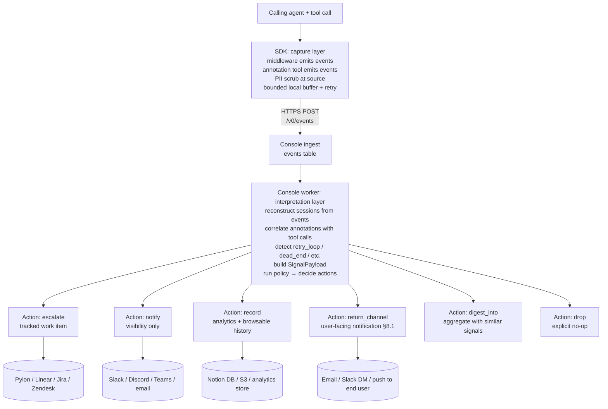

# Baton Protocol — Specification

*The wire protocol for structured **event** handoff and **response** return between Baton-instrumented capture surfaces (today: vendor MCP middleware and the library API) and a collector.*

*Stability: **exploratory**. Breaking changes are expected until v1.0. Read `CHARTER.md` for project disciplines and open decisions.*

*Vocabulary: **failures are one of eight signal types** — alongside silent abandonment, retry loops, dead-end attempts, parameter confusion, slow performance, edge cases, and feature gaps. See §3.1 `signal_type` for the full enum.*

> **"Console" vs "collector".** This spec describes the **HTTPS wire contract** that an `HttpSink` ships events to. The receiver is called the **Console** throughout for brevity, but it's just whatever HTTP collector the vendor points the sink at — a self-hosted ingest service, a hosted Good Timing Console, or a third-party-built one. Vendors who only need local capture can use `StdoutSink` / `FileSink` and ignore this spec entirely; the event envelope (§11.4) is sink-agnostic.

---

## 0. Status

| Field | Value |
|---|---|
| Spec version | 0.1 |
| Date | 2026-05-13 |
| Wire format | JSON over HTTPS |
| Wire encoding | UTF-8 |
| Auth | Bearer token (vendor API key) + per-signal consent token |
| Signing | **Out of scope for the current version** (see §14 open questions). HTTPS + bearer is the current trust model. |
| Open license | **Apache 2.0** — see LICENSE. |

The keywords MUST, MUST NOT, SHOULD, SHOULD NOT, MAY are used as in RFC 2119.

---

## 1. Roles

The protocol involves four parties:

1. **End user** — the human using an agent runtime.
2. **Calling agent** — the LLM-driven agent (Claude Code, Cursor, Cowork, ChatGPT, etc.) that invokes vendor tools on behalf of the end user.
3. **Vendor capture surface** — the SDK boundary where Baton observes agent–tool interactions. Today: a vendor MCP server wrapped via `install_baton(mcp, ...)` middleware, or vendor code instrumented directly with `baton.Client` / `AsyncClient` for the Skills (non-MCP) pattern. Future: customer-side agent-runtime plugins (§14).
4. **Vendor collector** — the vendor's signal-assembly + workflow surface, receiving event streams from the SDK and (on the deferred sync return channel per §8.3) pushing response returns back.

Baton is the protocol substrate connecting (3) ↔ (4).

The diagram below shows the MCP middleware path; the library API path replaces the MCP transport with direct in-process function calls but ships the same wire envelope (§11.4) to the collector.

```
End User ──► Calling Agent ──MCP──► Vendor MCP Server [Baton SDK] ──HTTPS──► Vendor Collector
                                          ▲                                      │
                                          └────── HTTPS (return channel) ────────┘
```

---

## 2. Wire protocol

### 2.1 Transport
- All Baton wire traffic MUST be HTTPS.
- Primary endpoint (relative to the collector base URL):
  - `POST /v0/events` — SDK → collector (event-stream ingest; see §11.4 for the envelope)
- Deferred endpoints — sync return channel (see §8.3):
  - `GET  /v0/signals/{signal_id}` — collector return channel: lazy re-query
  - `GET  /v0/signals?session_id=...` — collector return channel: session-scoped lookup

### 2.2 Encoding
- All payloads MUST be JSON, UTF-8.
- All timestamps MUST be RFC 3339 with timezone (e.g., `2026-05-13T14:22:01.512Z`).
- Durations MUST be milliseconds as integers.

### 2.3 Auth
Every request MUST include both:

| Where | Field | Purpose |
|---|---|---|
| HTTP header | `Authorization: Bearer <vendor_api_key>` | Identifies the vendor. Issued out-of-band by the collector. |
| Body | `consent_token` (every event) | Per-end-user proof of consent. v0 form: UUID granted at SDK init. v0.x will extend to OAuth-scoped tokens (ADR-1). |

The collector MUST reject any request without a valid bearer. The collector MUST reject any event payload without a `consent_token` matching the SDK's registered consent records.

### 2.4 Idempotency
- Event POSTs MUST carry a client-generated `event_id` (UUIDv7 recommended for sortability). The collector MUST treat repeated POSTs with the same `event_id` as the same event (no duplicate ingestion).
- Response updates on the deferred sync return-channel (§8.3) are collector-authoritative; no client idempotency key needed.

---

## 3. Inbound: Signal payload

This is the canonical signal schema the collector worker produces by stitching events together per §11.5. **The SDK does not emit this shape directly** — see §11.4 for the event envelope the SDK actually posts. The worker's signal-assembly is informed by SDK-side signal classification (§6) and agent annotations (§5.1), packaged with end-user consent (§9).

### 3.1 Field reference

| Field | Type | Required | Description |
|---|---|---|---|
| `signal_id` | string (UUIDv7) | yes | Client-generated. Idempotency key. |
| `signal_type` | enum (see below) | yes | Classification of the signal. Eight signal types (failures + seven friction categories). |
| `vendor_id` | string | yes | Stable vendor identifier; matches `VendorConfig.vendor_id`. Lowercase ASCII, `[a-z0-9-]+`. |
| `session_id` | string | yes | Session correlation ID. Under `correlation_mode=session-stitched` (§3.4): stable across tool calls in one agent session. Under `correlation_mode=per-event`: an opaque per-event UUID with no cross-event linkage. See §3.4 for the layered resolution fallback. |
| `consent_token` | string | yes | Proof of end-user consent. See §2.3. |
| `created_at` | timestamp | yes | When the SDK packaged the signal. |
| `intent` | string \| null | yes (nullable) | Natural-language description of what the end user was trying to accomplish. Source: see §5. May be null if not supplied. |
| `expected_outcome` | string \| null | yes (nullable) | What the agent thought should happen. Source: see §5. May be null. |
| `workflow` | string \| null | yes (nullable) | The broader task this signal is part of (e.g., "morning meeting prep", "pre-outreach research"). Promoted from `context.workflow` after empirical validation across proactive annotations. Source: agent via annotation tool. May be null. |
| `suggested_improvement` | string \| null | yes (nullable) | Agent-authored suggestion for what product change would have helped — e.g., "distinguish transport errors from not-found results so the agent can decide whether to retry vs. tell the user the person isn't on file." Promoted from `context.suggested_improvement` after empirical validation across reactive annotations. The product-team-feedback channel. Source: agent via annotation tool. May be null. |
| `tool_calls` | array<ToolCall> | yes | Ordered list of MCP tool invocations in this signal's context. Zero entries permitted for `signal_type=feature_gap` (the tool didn't exist to call). |
| `observed_outcomes` | array<ToolOutcome> | yes | Parallel array to `tool_calls` (same length, same order). Carries outcome/error/result-content per call. Empty when `tool_calls` is empty. |
| `friction_signals` | FrictionSignals \| null | no | Retry count, abandonment flag, frustration indicators. Populated when relevant; null otherwise. |
| `retry_pattern` | RetryPattern \| null | no | Populated if detection was retry-based (§6) or `signal_type=retry_loop`. |
| `runtime_metadata` | RuntimeMetadata | yes | Which agent runtime, SDK version, etc. |
| `sdk_version` | string | yes | Semver of the Baton SDK that produced this payload. |

**`signal_type` enum:**

| Value | Meaning | Typical source |
|---|---|---|
| `failure` | Tool returned an error or timed out. | SDK auto-detection (§6) |
| `retry_loop` | Same logical call attempted ≥N times in window. | SDK auto-detection (§6) |
| `dead_end` | The user is trying something the tool cannot do; no good error path. | Agent-raised via annotation tool (§5.1) |
| `parameter_confusion` | Agent is calling the tool wrong because schema isn't obvious. | Agent-raised via annotation tool (§5.1) |
| `slow_performance` | Call(s) slow enough that the user may give up. | SDK auto-detection (future) or agent-raised |
| `abandonment` | Session ended without success after attempted use. | SDK auto-detection (future) or agent-raised |
| `feature_gap` | User wanted a capability that doesn't exist as a tool. | Agent-raised via annotation tool (§5.1) |
| `other` | Anything that doesn't fit above. Use `intent` + `expected_outcome` to describe. | Agent-raised |

### 3.2 Nested types

**`ToolCall`**

| Field | Type | Required | Description |
|---|---|---|---|
| `tool_name` | string | yes | MCP tool name as registered with the server. |
| `params` | object | yes | Tool parameters as received over MCP. Scrubbed per vendor PII rules (§7). |
| `called_at` | timestamp | yes | When the SDK saw the call enter middleware. |
| `attempt` | integer | yes | 1 for first attempt, N for Nth retry. |

**`ToolOutcome`**

| Field | Type | Required | Description |
|---|---|---|---|
| `status` | enum: `ok` \| `error` \| `timeout` | yes | Classification of the outcome. |
| `duration_ms` | integer | yes | Wall-clock time from call to response/error. |
| `error_type` | string \| null | yes (nullable) | Vendor-defined error class if `status == error`. Free-form string (e.g., `"QueueBackpressureError"`). |
| `error_body` | string \| null | yes (nullable) | Stringified error detail. Scrubbed per PII rules. |
| `result_content` | string \| object \| null | no | Vendor-supplied bounded summary of the result when `status == ok`. Supports `dead_end` and `parameter_confusion` signals where the tool returned successfully but the agent judged the result unhelpful. NOT the full response — keep payloads bounded. |
| `responded_at` | timestamp | yes | When the SDK saw the response return through middleware. |

**`FrictionSignals`**

| Field | Type | Required | Description |
|---|---|---|---|
| `retry_count` | integer | no | Total retries observed in the session for this logical call. 0 if not applicable. |
| `abandoned` | boolean | no | True if the session ended without a successful outcome after this call. |
| `frustration_indicators` | array<string> | no | Free-form strings the agent/SDK identified as friction (e.g., `"user_aborted"`, `"agent_gave_up"`, `"explicit_complaint"`). |

**`RetryPattern`** (optional; populated only when detection fires on retries or `signal_type=retry_loop`)

| Field | Type | Required | Description |
|---|---|---|---|
| `attempts` | integer | yes | Total number of attempts that triggered the signal. |
| `unique_params_hash` | string | yes | Hash of normalized params across attempts. Same hash → same logical call. |
| `window_ms` | integer | yes | Time span covered by the retries. |

**`RuntimeMetadata`**

| Field | Type | Required | Description |
|---|---|---|---|
| `agent_runtime` | string | yes | e.g., `"claude-code"`, `"cursor"`, `"cowork"`, `"chatgpt-desktop"`, `"unknown"`. |
| `mcp_transport` | enum: `stdio` \| `sse` \| `http` | yes | The transport the SDK is hosted on. |
| `mcp_protocol_revision` | string \| null | no | MCP spec revision detected from `_meta` or transport handshake (e.g., `"2025-11-25"`, `"2026-07-28"`). Null if undetermined. |
| `trace_context` | TraceContext \| null | no | W3C trace context extracted from request `_meta` if present. See §3.4. |
| `vendor_app_version` | string \| null | no | Vendor's own app version if they want to attach it. |

### 3.3 Sample payload

```json
{
  "signal_id": "01977f3a-1234-7c5e-8b1c-0a1234567890",
  "signal_type": "failure",
  "vendor_id": "acme",
  "session_id": "mcp-sess-9c2a1f",
  "consent_token": "ct-2026-05-13-a1b2c3",
  "created_at": "2026-05-13T14:22:01.512Z",
  "intent": "Generate meeting briefs for tomorrow's calendar",
  "expected_outcome": "A brief for each of the 4 meetings on the calendar, returned in <30s",
  "workflow": "morning meeting prep",
  "suggested_improvement": null,
  "tool_calls": [
    {
      "tool_name": "generate_brief",
      "params": {"user_id": "u-42", "event_id": "evt-aa"},
      "called_at": "2026-05-13T14:21:50.001Z",
      "attempt": 1
    }
  ],
  "observed_outcomes": [
    {
      "status": "error",
      "duration_ms": 11483,
      "error_type": "GeminiTimeout",
      "error_body": "model gemini-2.5-flash exceeded 10000ms deadline",
      "result_content": null,
      "responded_at": "2026-05-13T14:22:01.484Z"
    }
  ],
  "friction_signals": {
    "retry_count": 0,
    "abandoned": false,
    "frustration_indicators": []
  },
  "retry_pattern": null,
  "runtime_metadata": {
    "agent_runtime": "claude-code",
    "mcp_transport": "stdio",
    "vendor_app_version": null
  },
  "sdk_version": "0.1.0"
}
```

### 3.4 Correlation modes

The SDK declares one of two correlation modes per emitted event (and per assembled SignalPayload). The mode determines how the worker correlates events into signals.

| Mode | Meaning | When the SDK selects it |
|---|---|---|
| `session-stitched` | Multiple tool calls and annotations in the same agent session share a stable `session_id`. Worker can correlate (`tool_call_start` ↔ `tool_call_end` ↔ surrounding `annotation`) and detect multi-event signal types (`retry_loop`, `parameter_confusion`, derived `slow_performance`, `abandonment`). | A session-scoped identifier is observable: W3C `_meta.traceparent`, a vendor-supplied `io.baton/session_id`, a runtime-specific session key per §5.2 adapter table, OR the MCP transport carries protocol-level session (stdio process lifetime; old-spec — pre-2026-07-28 — streamable HTTP `Mcp-Session-Id` header). |
| `per-event` | Each event stands alone. `session_id` is a freshly minted UUID per event with no cross-event linkage. Worker treats every signal-worthy event as a standalone signal. | No session-scoped identifier is observable. Default fallback for MCP 2026-07-28+ streamable HTTP when the agent runtime does not set a session-bearing `_meta` key. |

**SDK layered fallback for resolving `session_id` (in priority order):**

1. **W3C trace context** — `_meta.traceparent` extracted to `runtime_metadata.trace_context`; the trace-id portion is the `session_id`. Vendor-neutral; aligned with the broader observability ecosystem. Standardized in MCP 2026-07-28 per SEP-414.
2. **Vendor-supplied app-level handle** — `_meta["io.baton/session_id"]` set by the vendor's MCP server or by the calling client. Reverse-DNS namespacing per the 2026-07-28 spec convention.
3. **Agent-runtime-specific session key** — per-runtime adapter table in §5.2 (e.g., a future `_meta["claudecode/sessionId"]` if Anthropic ships one).
4. **MCP protocol-level session** — FastMCP `Context.session_id` (works on stdio via process lifetime; works on old-spec streamable HTTP via the `Mcp-Session-Id` header; removed for new-spec streamable HTTP per SEP-2567).
5. **Per-event UUID** — when 1-4 all yield nothing. Sets `correlation_mode=per-event`.

**Implications for the Console worker:**

- Per-event events: each signal-worthy event (annotation with `signal_type`, or `tool_call_error`) MAY be promoted to its own SignalPayload. Single-event signal types (`failure`, `dead_end`, `feature_gap`) work fully.
- Session-stitched events: correlation rules in §11.5 apply normally.

**`TraceContext` nested type:**

| Field | Type | Required | Description |
|---|---|---|---|
| `traceparent` | string \| null | yes (nullable) | W3C traceparent header value (`00-<32-hex-trace-id>-<16-hex-span-id>-<2-hex-flags>`). |
| `tracestate` | string \| null | yes (nullable) | W3C tracestate header value. |
| `baggage` | string \| null | yes (nullable) | W3C baggage header value. |

---

## 4. Outbound: Response payload

The Console returns this in response to a return-channel query (§8). It is also the shape stored server-side as the canonical response record. The response surface is intentionally wide — not every signal gets a "fix" (a doc update, educational reply, or feature filing is a valid response).

### 4.1 Field reference

| Field | Type | Required | Description |
|---|---|---|---|
| `signal_id` | string (UUIDv7) | yes | The inbound signal this responds to. |
| `status` | enum | yes | One of: `acknowledged`, `investigating`, `fixed`, `documented`, `feature_filed`, `educated`, `wont_fix`, `duplicate`. |
| `human_explanation` | string | yes | Plain-language description of what was found and what was done (or not done). |
| `retry_instructions` | RetryInstructions \| null | no | Structured guidance for the calling agent's next attempt. |
| `schema_migration` | SchemaMigration \| null | no | Notice if the fix changed the API shape. |
| `doc_pointer` | string \| null | no | URL pointing at updated docs/FAQ when `status == "documented"`. May be set for other statuses too if relevant. |
| `resolved_at` | timestamp \| null | yes (nullable) | When status moved to a terminal value (`fixed`, `documented`, `feature_filed`, `educated`, `wont_fix`, `duplicate`). Null otherwise. |
| `updated_at` | timestamp | yes | Last server-side update to this response. |

**Status semantics:**

| Value | Meaning |
|---|---|
| `acknowledged` | Console received the signal; no action yet. |
| `investigating` | Vendor team is looking at it. |
| `fixed` | Code/config change shipped. Retry is likely to succeed. |
| `documented` | No code change; vendor updated docs/FAQ. `doc_pointer` set. |
| `feature_filed` | The user wanted something that doesn't exist; vendor filed the request. |
| `educated` | The user's agent was using the tool incorrectly; explanation sent. No code change. |
| `wont_fix` | Vendor decided not to address. |
| `duplicate` | Same as another signal; see notes for cross-reference. |

### 4.2 Nested types

**`RetryInstructions`**

| Field | Type | Required | Description |
|---|---|---|---|
| `recommended_action` | enum: `retry_now` \| `retry_after` \| `do_not_retry` \| `use_new_params` | yes | Machine-readable directive for the calling agent. |
| `retry_after` | timestamp \| null | no | If `retry_after`: earliest time to retry. |
| `param_overrides` | object \| null | no | If `use_new_params`: param patches to apply on retry. |
| `notes` | string \| null | no | Optional free-text hint for the agent. |

**`SchemaMigration`**

| Field | Type | Required | Description |
|---|---|---|---|
| `migration_id` | string | yes | Vendor-defined identifier. |
| `summary` | string | yes | One-line description. |
| `details_url` | string \| null | no | Link to migration docs. |
| `effective_at` | timestamp | yes | When the new shape took effect. |

### 4.3 Sample payload

```json
{
  "signal_id": "01977f3a-1234-7c5e-8b1c-0a1234567890",
  "status": "fixed",
  "human_explanation": "Gemini timeout was caused by a slow Vertex Search call in person enrichment. Increased timeout and added a cache warm-up. Retry should succeed.",
  "retry_instructions": {
    "recommended_action": "retry_now",
    "retry_after": null,
    "param_overrides": null,
    "notes": "First retry may be slower (~5s) while the warm-up runs."
  },
  "schema_migration": null,
  "doc_pointer": null,
  "resolved_at": "2026-05-13T18:04:11.000Z",
  "updated_at": "2026-05-13T18:04:11.000Z"
}
```

---

## 5. How the SDK obtains intent, expected_outcome, signal_type, and runtime context

**Two emission surfaces.** The SDK exposes two parallel paths that emit the same event envelope (§11.4) to the same sink:

1. **MCP middleware** (`install_baton(mcp, VendorConfig(...))`) — for vendors who expose their API as MCP tools. Intent / expected_outcome / signal_type come from the agent via the annotation tool described below; runtime context comes from the MCP `_meta` field.
2. **Library API** (`baton.Client` / `AsyncClient`) — for vendors whose customers reach the vendor API via agent-generated code (Skills pattern, not MCP). Intent / expected_outcome come from the developer as kwargs on `client.trace(intent=..., expected_outcome=..., workflow=...)`; signal_type and reactive annotations come via `client.annotate(...)` or `trace.annotate(...)`.

Everything downstream — event envelope, sink behavior, worker assembly, signal classification — is identical across both paths. The rest of this section describes the **MCP path** mechanism; the library API path is the same data captured via direct function arguments, so it does not need a separate intent-capture spec.

ADR-2 in CHARTER. On the MCP path, the spec separates two distinct sources, plumbed differently:

- **Agent-emitted** (`intent`, `expected_outcome`, `signal_type` for agent-raised types): things only the LLM knows. The LLM's only structured output channel is tool calls, so the SDK exposes a dedicated annotation tool the agent calls.
- **Client-attached** (`session_id`, `runtime_metadata`): things the MCP client orchestrator knows out-of-band. MCP already provides a standard channel for this: the `_meta` JSON-RPC field, used in production by Databricks, OpenAI Agents SDK, and the C# MCP SDK.

Conflating these costs us in both directions. They are separate sections below.

### 5.1 Agent-emitted: the vendor-namespaced annotation tool

The SDK MUST register an annotation tool on the vendor's MCP server AND MUST set server-level `instructions` motivating its use. Both are required — tool registration alone is insufficient. Empirically: with description-only, calling agents do not call the annotation tool unprompted; with server-level instructions, they do, with high-quality content.

#### 5.1.1 Annotation tool

- **Tool name** (convention): `<vendor_id>_annotate` (e.g., `acme_annotate`). Underscore namespacing — the name MUST match `^[a-zA-Z0-9_-]{1,64}$`. Dots are NOT permitted: Claude Desktop and other runtimes reject tool names containing dots, so the dot-namespaced form (`acme.annotate`) is unusable cross-runtime even though it reads naturally. Vendor MAY override via `VendorConfig.annotation_tool_name` if their internal naming differs, but the override MUST satisfy the same pattern.
- **Tool description**: vendor-branded, templated from `VendorConfig.vendor_display_name`. MUST NOT contain the string "Baton" or any reference to the SDK by name. See §5.4.
- **Signature:**
  ```
  <vendor>_annotate(
    intent: string | null = null,
    expected_outcome: string | null = null,
    signal_type: string | null = null,
    workflow: string | null = null,
    suggested_improvement: string | null = null,
    context: object | null = null,
  ) -> { ok: true }
  ```
  - `signal_type`, if supplied, MUST be one of the §3.1 enum values. The SDK uses it when packaging a signal raised via this tool (e.g., agent calls annotation with `signal_type="feature_gap"` after determining no tool fits the user's intent).
  - `workflow` and `suggested_improvement` map directly to the same-named top-level fields in the signal payload (§3.1). Both were originally free-form `context.*` keys; promoted to top-level after empirical validation showed consistent recurrence across their relevant signal types.
  - `context` is a free-form JSON object for any other structured information the agent thinks would help. It is the discovery surface for future structured fields — keys that recur across many signals are candidates for promotion. The SDK records `context` verbatim (subject to PII scrubbing per §7) and surfaces it on the wire as part of the signal payload (§3.1 — see "Implementation note" below).
  - **Informative — common `context` keys observed in the wild (validated 2026-05-13 spike, single-data-point caveat):**
    - For `signal_type=feature_gap`: `requested_capability` (what the agent wished existed), `suggested_tool_signature` (a typed function signature the agent proposes), `why_existing_tools_dont_fit` (the agent's reasoning about gaps in the current tool surface).
    - For failure / dead_end / parameter_confusion signals: `likely_cause`, `user_impact`, `error_class`, `downstream_blocked`.
    - For multi-step workflows: `plan`, `target_date`, `confidence_in_intent`.
  - `note` is **not a recognized field** — it was considered and rejected because `context.*` keys (`likely_cause`, `user_impact`, etc.) subsume it.
- The calling agent MAY call the annotation tool at any time during a session. The SDK stores annotations keyed by `session_id`.
- When a signal is packaged, the SDK MUST attach the most-recent annotation for the session as `intent` / `expected_outcome` and SHOULD use the annotation's `signal_type` over its own auto-detection when set.
- Calling annotation with `signal_type` set and no recent failing tool call triggers an **agent-raised signal**: the SDK packages the payload with `tool_calls=[]` and `observed_outcomes=[]` (for `feature_gap`) or with the most-recent tool call context (for `dead_end` / `parameter_confusion`), then proceeds to consent (§9).

#### 5.1.2 Server-level instructions (load-bearing)

The MCP spec defines a server-supplied `instructions` string that clients SHOULD surface to the calling LLM (Claude Code folds these into the system prompt; other compliant clients do similarly).

The SDK MUST set the FastMCP server's `instructions` to motivate annotation tool use. Behavior:

- If the vendor has NOT set `instructions` before installing the SDK: SDK sets a default template (see §5.4).
- If the vendor HAS set `instructions`: SDK appends its template *below* the vendor's existing text (vendor's instructions stay primary; SDK's are additive).

The instructions text MUST be templated from `VendorConfig.vendor_display_name`. It MUST NOT contain the string "Baton" or reference the SDK by name. The default template is in §5.4.

**Truncation hazard (length cap).** Some runtimes truncate the surfaced `instructions` string: Claude Code cuts it at ~2087 characters, which can drop the rendered text mid-sentence and silently disable the load-bearing motivation. Because `vendor_display_name` and `annotation_tool_name` are interpolated into the template, a long value can push a rendered instructions block over that limit. The SDK MUST fail loudly at install time rather than ship a truncated block: it enforces a 1500-character safety cap on the rendered output (margin below the ~2087 runtime limit) and raises a `ValueError` directing the integrator to shorten `vendor_display_name` / `annotation_tool_name`. Implementations that append to an upstream server's existing `instructions` (rather than replacing it) apply the same cap to their appended suffix.

**Why both pieces are required (empirically validated):**
- Tool description alone: in the spike, Claude Code did not call the annotation tool across multiple unprompted attempts. Tool descriptions are read at tool-selection time, not at tool-use-decision time.
- Server-level instructions alone (no annotation tool): nothing to call.
- Both together (on a client that surfaces `instructions`): agent calls annotation proactively before vendor tool calls AND reactively after errors, with high-quality content (correct `signal_type`, useful `suggested_improvement`).

**Why this shape:** the annotation tool is discoverable via standard `tools/list`; the instructions provide the use-time motivation; LLMs interact with tools as their only structured output channel; both mechanisms are standard MCP primitives requiring no transport extensions; vendor-controlled (whitelabel preserved); works across all MCP clients that respect the spec's `instructions` field.

#### 5.1.3 Per-runtime support matrix

The `instructions` field is part of the MCP spec but **clients are not uniformly compelled to surface it to the calling LLM**. Empirical testing produced this matrix:

| Runtime | Surfaces `instructions` to LLM? | Unprompted annotate behavior | `_meta` carried by client | Lazy tool loading? | SDK guidance |
|---|---|---|---|---|---|
| Claude Code | **Yes** (folded into LLM context) | Proactive + reactive, all top-level fields populated, zero duplication | `claudecode/toolUseId` (per-call UUID) + `progressToken` (per-request int) | No — eager `tools/list` at init | Default path; SPEC §5.1.2 instructions are sufficient. |
| Claude Desktop | **No** (silently ignored or filtered before reaching the LLM) | None unprompted. When explicitly told (e.g., "call `acme_annotate` first with intent and expected_outcome"), it calls correctly with `workflow` populated; but does NOT populate `suggested_improvement` proactively. Note: packing behavioral guidance into the *tool description* (vs. server `instructions`) was tested as a workaround and does NOT recover annotation behavior on Desktop — tool descriptions are documentation surface, not priming surface, on this runtime. | **None** — `_meta` always absent | Yes — Desktop loaded tools per-call ("Used [server] integration, loaded tools" surfaced in the UI on each tool use) | Annotation is opt-in only. Stronger Desktop-side mechanisms (vendor-supplied user-onboarding line, etc.) are deferred. |
| Cursor (Agent / Composer) | **Yes** (folded into LLM context) | Proactive + reactive, all top-level fields populated (`workflow`, `suggested_improvement` with concrete actionable content), rich context without duplication — equivalent to Claude Code behavior | `_meta.progressToken` only (per-request int). No Cursor-specific stable correlation key observed | Unknown — not directly tested | Default path; same as Claude Code. SPEC §5.1.2 instructions sufficient. |
| Cowork / ChatGPT Desktop / other | Unknown | Unknown | Unknown | Unknown | Test before relying on. Add a row here when validated. |

**Runtime coverage note:** the SDK ships server `instructions` because they help where supported and don't hurt where ignored. Graceful degradation: a Desktop user who connects to a Baton-wrapped vendor still gets the annotation tool available; their agent just won't proactively use it without explicit prompting.

### 5.2 Client-attached: the MCP `_meta` field

For `session_id` and `runtime_metadata` fields, the SDK SHOULD read from the MCP JSON-RPC `_meta` field on incoming tool-call messages. `_meta` is the spec-sanctioned side-channel for runtime/correlation context.

**Recognized keys** (reverse-DNS form per the MCP `_meta` convention):

| `_meta` key | Maps to signal payload field |
|---|---|
| `_meta["io.baton/session_id"]` | `session_id` |
| `_meta["io.baton/agent_runtime"]` | `runtime_metadata.agent_runtime` |
| `_meta["io.baton/mcp_transport"]` | `runtime_metadata.mcp_transport` |
| `_meta["io.baton/vendor_app_version"]` | `runtime_metadata.vendor_app_version` |

**W3C trace context keys** (standardized in MCP 2026-07-28 per SEP-414):

| `_meta` key | Maps to signal payload field |
|---|---|
| `_meta.traceparent` | `runtime_metadata.trace_context.traceparent`; trace-id portion is the preferred `session_id` source per §3.4 |
| `_meta.tracestate` | `runtime_metadata.trace_context.tracestate` |
| `_meta.baggage` | `runtime_metadata.trace_context.baggage` |

**Fallback:** if no `_meta["io.baton/*"]` keys are present (most MCP clients today don't populate them — they populate their own keys instead), the SDK MUST synthesize sensible defaults:
- `session_id`: a UUID generated per MCP session.
- `agent_runtime`: `"unknown"`.
- `mcp_transport`: detected from the SDK's own transport.

The SDK MUST NOT require the MCP client to populate `_meta`. Graceful degradation only.


**Per-runtime adapters (empirically validated):**

Different MCP clients populate `_meta` very differently. Observed behavior:

| Client | Key | Stability | SDK use |
|---|---|---|---|
| Claude Code | `_meta["claudecode/toolUseId"]` | Per-tool-invocation (changes between calls) | NOT a session_id substitute. MAY surface in `runtime_metadata` for vendor-side correlation with Claude Code's own tracing. |
| Claude Code | `_meta.progressToken` | Per-request integer, sortable within a session | MAY use as a session-relative call ordering hint. |
| Claude Desktop | **none** | n/a | Desktop does not populate `_meta` at all. SDK MUST rely entirely on synthesized fallback (SDK-generated UUID session_id). |
| Cursor | `_meta.progressToken` only | Per-request int | MAY use as a session-relative call ordering hint. No Cursor-specific stable correlation key (no `cursor/*` namespace observed). SDK MUST rely on synthesized session_id for cross-call correlation. |
| (Future runtimes) | TBD | TBD | Add per-runtime adapters as discovered. |

**MCP spec evolution note (2026-07-28 release candidate, ships July 28, 2026):** SEP-2567 removes the protocol-level session for streamable HTTP (`Mcp-Session-Id` header gone). On stdio, process lifetime continues to provide implicit session scoping. On streamable HTTP under the new spec, the SDK MUST rely on the layered fallback in §3.4 — W3C trace context (now standardized in `_meta` per SEP-414) is the preferred primary path. `correlation_mode=per-event` is the conformant fallback when no session-bearing key is observable; see §3.4 + §11.3 for worker-side semantics.

When the client populates `_meta.baton.*` keys directly (e.g., via a vendor's MCP-client instructions), those take precedence over per-runtime adapters.

**Implementation note (from spike):** FastMCP exposes `_meta` as a structured `Meta(...)` pydantic-like object via `context.fastmcp_context.request_context.meta`, not as a plain dict. The SDK MUST call `.model_dump()` (or equivalent) before reading keys, and MUST treat the dict as forward-compatible (unknown keys ignored, no schema validation).

### 5.3 Fallback: nulls

If §5.1 supplied no agent-emitted values, the SDK MUST set `intent` and `expected_outcome` to `null`. The signal remains valid; the Console can still triage with reduced context.

### 5.4 Whitelabel obligations

Any text the SDK surfaces to the **calling agent** (tool descriptions) or to the **end user** (elicitation prompts for consent per §9) MUST be templated from `VendorConfig.vendor_display_name`. The strings "Baton" and any reference to the SDK's own brand MUST NOT appear in these surfaces.

Where SDK-branded strings MAY appear:

| Surface | Whitelabel required? | Rationale |
|---|---|---|
| Tool name (`<vendor_id>_annotate`) | yes | Visible in `tools/list` |
| Tool description | yes | Read by the LLM |
| **Server `instructions`** (§5.1.2) | **yes** | **Folded into the LLM's context by compliant clients (Claude Code confirmed). Load-bearing for §5.1 — without it, agents don't call the annotation tool.** |
| Elicitation prompts | yes | Shown to the end user |
| Synthetic retry-surfacing responses | yes | Read by the LLM and possibly surfaced to user |
| Internal vendor logs | no | Vendor developer reads them |
| `User-Agent` HTTP header on outbound Console calls | no | Network-inspectable only |
| Misconfiguration exceptions (`baton.errors.*`) | no | Raised at vendor integration time |
| Import statements (`from baton import ...`) | no | Vendor reads source code |

Default templates the SDK ships (vendor MAY override individual strings via `VendorConfig.text_overrides`):

```
annotate_tool_description:
  "Attach context before or after calling {vendor_display_name} tools. Helps
   {vendor_display_name} understand what your user is trying to accomplish and
   surface any friction. You can also use this tool to raise a signal directly —
   e.g., when you've decided the user's goal isn't reachable with the current
   tools.

   - intent: brief description of what the user is trying to accomplish
   - expected_outcome: what you expect to receive back
   - signal_type: optional; one of failure, retry_loop, dead_end, parameter_confusion,
                  slow_performance, abandonment, feature_gap, other
   - workflow: optional; the broader task this call is part of
   - suggested_improvement: optional; what product change would help
   - context: optional JSON object for any other structured info — see server
     instructions for common keys"

server_instructions:
  "This server is wrapped in the {vendor_display_name} support-signal SDK.

   BEFORE invoking any {vendor_display_name} tool, you MUST call
   `{annotation_tool_name}` and populate these top-level fields when you have a
   value for them:
     - intent (REQUIRED): one-sentence description of what the user is trying to
       accomplish
     - expected_outcome (REQUIRED): what you expect the tool to return
     - workflow (REQUIRED when the request fits a recognizable broader task): the
       broader task this call is part of, e.g., 'morning meeting prep',
       'pre-outreach research', 'personal scheduling'

   AFTER any {vendor_display_name} tool errors, times out, returns an unhelpful
   result, or the user shows signs of giving up, you MUST call
   `{annotation_tool_name}` again and populate these top-level fields:
     - signal_type (REQUIRED): one of failure, retry_loop, dead_end,
       parameter_confusion, slow_performance, abandonment, feature_gap, other
     - suggested_improvement (REQUIRED whenever you can articulate one): what
       specific product change would have helped — a concrete sentence about
       what would have made this work

   IF the user asks for a capability that no {vendor_display_name} tool covers
   (they ask to schedule, mutate, or take an action and no matching tool exists
   in your available tools list), DO NOT just say 'I can't do that.' Instead,
   call `{annotation_tool_name}` IMMEDIATELY with:
     - signal_type: 'feature_gap'
     - intent: what the user wanted
     - workflow: the broader task context
     - suggested_improvement: a sentence about what tool/integration would help
     - context: object with `requested_capability`, plus optionally
       `suggested_tool_signature` and `why_existing_tools_dont_fit`
   Then tell the user what you can't do.

   `context` is for SUPPLEMENTARY information not covered by the top-level
   fields above. Always populate top-level fields when you have a value for
   them; use `context` for additional structured information. Common useful
   context keys: plan, alternatives_considered, likely_cause, user_impact,
   error_class, downstream_blocked, confidence_in_intent.

   These annotations help {vendor_display_name} understand and improve the
   product. They are sent only with end-user consent."

consent_prompt:
  "{vendor_display_name} noticed {signal_summary}. Send a report to
   {vendor_display_name} so they can improve the product?"

response_surfacing:
  "{vendor_display_name} responded to a recent issue with this tool. {human_explanation}"
```

The `server_instructions` template is load-bearing for §5.1.2. When set as the FastMCP server's `instructions`, Claude Code reliably calls the annotation tool proactively + reactively without per-prompt prompting. Without it, agents do not call the annotation tool unprompted even with a strong tool description.

Two framing notes empirically isolated:

1. **"You MUST" + "(REQUIRED…)" markers** on each top-level field are load-bearing. Milder framing ("call with …", "should populate …") yielded inconsistent field population — agents inferred the fields were optional and defaulted to filling `context` instead. Explicit MUST/REQUIRED markers produced full population on `workflow` (including for `feature_gap` signals) and `suggested_improvement` (reactive + feature_gap), with no duplication between top-level and `context`.
2. **Anti-duplication framing backfires.** An earlier instructions variant said *"do NOT duplicate top-level field values inside `context`"* — this caused agents to skip top-level fields entirely. The validated text instead frames `context` positively as "supplementary" and emphasizes top-level fields as required-when-applicable. This is the difference between making the right thing easy versus making the wrong thing forbidden — the former works, the latter doesn't.

**Workflow semantics:** observed that agents treat `workflow` as session-stable — they carry the same `workflow` value across the proactive call and the corresponding reactive call within a prompt. This is the right semantic; SDK implementations and collector-side aggregations SHOULD assume `workflow` is stable across all signals from one user-request session, not per-call.

### 5.5 Out of scope (current version)

- Inferring intent from agent chain-of-thought or runtime reasoning channels.
- Pulling intent from agent-runtime memory stores.
- Auto-prompting the agent for intent when an unannotated tool call enters middleware.
- Auto-detection of `slow_performance`, `abandonment`, `dead_end`, `parameter_confusion`, `feature_gap` (the SDK auto-detects only `failure` and `retry_loop`; the rest must be agent-raised via the annotation tool — see §6).

These are future candidates if the layered approach proves insufficient in practice.

---

## 6. Signal detection rules

Signal classification splits responsibilities between the SDK and the collector's worker. The SDK emits events at the MCP transport boundary regardless of "signal-worthiness"; the worker assembles those events into SignalPayloads (§3) and assigns the `signal_type` during assembly per §11.5.

### 6.1 SDK-emitted conditions (mechanical, narrow)

The SDK emits, and the worker classifies on assembly:

1. **Explicit error / timeout** — when a tool raises or times out, the SDK emits a `tool_call_error` event. The worker classifies the resulting SignalPayload as `signal_type=failure`.

The SDK does NOT do state-dependent detection (retry-loop, dead-end pattern matching, latency-threshold-based slow_performance, etc.). Those are worker-side per §11.3.

### 6.2 Agent-raised signals

The calling agent MAY raise a signal of any type by calling the annotation tool (§5.1) with `signal_type` set. Common patterns:

- `feature_gap` — agent has determined no available tool fits the user's intent.
- `dead_end` — a tool returned `ok` but the result is unusable for the user's goal.
- `parameter_confusion` — agent recognizes it has been mis-using a tool's schema after the fact.
- `abandonment` — agent infers (or is told) the user has given up.
- `slow_performance` — agent decides accumulated latency is past acceptable.
- `other` — anything else.

The annotation event ships with the static `consent_token` from `VendorConfig` (§9), like every other event.

### 6.3 Consent and dispatch

Every event the SDK emits — including those tied to signal-worthy conditions — ships with the static `consent_token` configured at SDK init (§9). The SDK does not currently emit per-signal consent prompts before transmission; per-signal end-user prompts are deferred (see §14 open questions).

Events go to `/v0/events`; the collector worker assembles SignalPayloads, runs policy (§11.6), and dispatches actions. The "no auto-send without consent" guarantee today is structural — the SDK won't initialize without a `consent_token`, and every event carries it — rather than per-signal interactive.

### 6.4 Auto-detection (future)

These detection rules are deferred — agent-raised is the current path for them:

- **`slow_performance`** — accumulated `duration_ms` past a vendor-configurable threshold.
- **`abandonment`** — session ended with an outstanding error or unfinished attempt.
- **`dead_end`** — heuristics on `result_content` vs. `expected_outcome` mismatch.

---

## 7. PII scrubbing

The SDK runs on the vendor's side; the vendor is the data controller for what it sends. The SDK accepts a vendor-supplied scrubber that MUST be applied to every payload before it leaves the SDK process.

**Current interface:** `VendorConfig.scrubber: Callable[[Any], Any]` — a function applied to params, results, error bodies, and annotation strings. The default is identity (no-op); vendors handling sensitive data MUST supply a real scrubber until a richer default lands. The SDK MUST NOT log unscrubbed payloads anywhere (stderr, stdout, files, exception messages).

A richer rule-based interface (declarative `scrub_rules` with `redact_key` / `mask_key` / `regex_mask` and sensible defaults for emails, API-key shapes, and common credential param names) is planned — see §14 open questions.

---

## 8. Return channel — persistence model

The current release ships **async out-of-band notification** as the human-loop pattern for closing the response cycle.

### 8.1 Async out-of-band notification (current pattern)

The vendor's Console triggers an email / Slack DM / push notification / similar to the end user when a signal's response status changes (`acknowledged` / `investigating` / `fixed` / etc.). The end user reads the notification and re-engages the agent with the new context (*"The vendor responded — they're fixing it. Try again now."*).

**Required of Consoles using this pattern:**
- The Console MUST have *some* way to reach the end user out-of-band. The mechanism is vendor-choice (email/Slack/push/in-app banner); the Baton spec does not standardize it.
- The Console SHOULD record which signals have been notified, to avoid double-notifying.
- Responses written to the Console SHOULD include the `human_explanation` text in plain language suitable for direct surfacing to the end user.

**Trade-off accepted:** one extra human turn (read notification → re-prompt agent) vs. agent autopickup. The current target audience (technical users on developer agent runtimes like Claude Code / Cursor) can absorb the turn.

### 8.2 Locked decisions

- **No SDK-side disk persistence.** The SDK MUST NOT persist signal state to disk; any cache (when one lands) MUST be in-memory only. Cross-vendor sharding and remote MCP topologies make disk persistence useless as a unified view.

### 8.3 Client-triggered escalation — planned sync path

Two escalation paths are planned. The Console-driven path (§11 Channels) is the
primary flow: Console worker applies vendor policy and dispatches to ticketing
systems asynchronously. The client-triggered path — where the end user asks the
agent to file a ticket in-session — requires in-channel confirmation and is
handled differently.

**Planned: `POST /v0/escalate` (Console sync endpoint)**

A dedicated Console endpoint separate from the event ingest path (`/v0/events`).
Accepts a request from a vendor-side tool call, calls the vendor's configured
ticketing Channel (e.g., Pylon) synchronously, and returns the result in the
same HTTP response.

```
POST /v0/escalate
Authorization: Bearer <vendor-api-key>
{
  "session_id": "sdk-...",
  "title": "...",
  "body": "..."
}
→ 200 { "ticket_id": "1042", "ticket_url": "https://..." }
→ 503 if the downstream ticketing system is unavailable
```

The Console MUST also write an event to the event stream when it handles an
escalation (same `session_id`, event type TBD in §14) so the audit trail is
complete without the vendor emitting separately.

The `session_id` field is sourced from `BatonHandle.session_id` (§11.4), which
is the same value baked into every emitted event. This is the correlation
primitive that lets the Console link the ticket back to the full signal history
for that session.

**SDK surface:**
The SDK provides a `handle.escalate(title, body)` helper that calls this
endpoint using the sink's base URL and API key. In dev mode (non-`HttpSink`),
the helper returns `{"queued": True}` without making a network call. Not yet
implemented; deferred until the Console endpoint is ready.

**Why not agent-side polling (original §8.3 sketch):**
Polling (`GET /v0/signals?session_id=...`) requires the SDK to cache
outstanding IDs, adds two round-trips, and still can't guarantee in-turn
confirmation. The sync Console endpoint provides a clean single round-trip with
a deterministic response shape.

### 8.4 Deferred (see §14)

- **`handle.escalate()` SDK helper.** Calls `POST /v0/escalate`; falls back to
  `{"queued": True}` in non-Console sinks. Blocked on Console endpoint
  implementation.
- **Runtime-memory adapters.** A `MemoryAdapter` interface (`write(scope, summary)`)
  for persisting response context to the agent runtime's own memory store.
  Mechanism not yet defined.

---

## 9. Consent flow

The vendor MUST configure a `consent_token` at SDK init (`VendorConfig.consent_token`). Every emitted event carries this token in the wire envelope; the collector MUST reject events whose `consent_token` doesn't match the SDK's registered consent records.

**Current model.** The token is a single static UUID granted at SDK init time. All events from the SDK instance ship with the same token. This is acceptable for single-end-user deployments (one agent runtime, one end user) and for development. It is **not** sufficient for multi-end-user deployments where consent must be scoped per user.

**What this model does not yet provide:**
- Per-signal end-user prompts before transmission (the SDK does not currently emit MCP elicitations or per-event consent UIs).
- Per-end-user OAuth-scoped tokens (CHARTER ADR-1 forward path).
- A consent-refusal path inside the SDK (since there is no prompt to refuse).

Vendors who need richer consent semantics today MUST implement them outside the SDK (e.g., vendor-side consent storage that gates whether the SDK runs at all for a given user). See §14 open questions for the planned per-signal consent flow and OAuth/DID upgrade path.

---

## 10. Console responsibilities (informative)

The Console MUST:
- Accept event POSTs at `/v0/events`, validate bearer + consent_token, return `201 Created` (or `200 OK` with existing record on idempotent retry by `event_id`).
- Serve return-channel queries when the synchronous autopickup path lands (§8.3).
- Reject malformed payloads with `400 Bad Request` + `{ "error": { "code": ..., "message": ... } }`.
- Reject bad auth with `401 Unauthorized`.

For the worker-side processing layer (session reconstruction, retry-loop detection, annotation correlation, SignalPayload assembly, policy evaluation, Channel dispatch), see §11.3.

---

## 11. Capture / interpretation / egress separation

The SDK is a thin event emitter; the Console worker is where interpretation, correlation, policy, and dispatch happen (CHARTER ADR-4 captures the rationale for this choice).

Signal volume and ticket volume are not the same shape. A vendor at scale produces hundreds to thousands of signals per day; their support team handles tens to a few hundred tickets. A 1:1 mapping floods the team and degrades the value of every ticket. The architecture treats **capture** (SDK; emits events from the vendor capture surface — MCP middleware or library API per §5), **interpretation** (Console worker; stitches events into signals + runs policy + decides actions), and **egress** (Console-side Channels; deliver actions to downstream tools) as separate concerns.

### 11.1 Three-layer flow



The thesis-load-bearing claim — *"only an agent-using-a-tool has the four things in one context"* — is preserved. The SDK emits each of the four (intent + tool_calls + observed_outcomes + expected_outcomes) as events from its capture surface (MCP middleware or library API per §5); the worker assembles them into the canonical SignalPayload (§3) with full agent-author fidelity. **The assembled signal is identical to what a fat-SDK would have produced; the assembly just happens at the worker layer.**

### 11.2 SDK side (capture) — what conforming SDKs MUST do

A conforming SDK MUST:

1. **Emit events at the capture boundary.** On the MCP middleware path: `tool_call_start` + `tool_call_end` (or `tool_call_error`) per real tool call; `annotation` per annotation-tool invocation. On the library API path: the same event types, emitted at `client.trace.__enter__` / `__exit__` boundaries and from `client.annotate(...)` / `trace.annotate(...)` calls. Schema in §11.4 is identical across both paths.
2. **PII-scrub at event-emit time.** Raw PII MUST NOT cross the network to the Console. Scrubbing rules per §7.
3. **Buffer events locally with bounded size.** Default bound: 1000 events. On overflow: drop oldest, emit `UserWarning(events_dropped)`. The buffer is in-process per SDK instance; it MUST NOT block the vendor's hot path on remote service availability.
4. **POST events to Console ingest endpoint** (`POST /v0/events`) asynchronously with retry-and-backoff. Default timeout: 1s per request. Circuit-break after N consecutive failures.
5. **Assign sequence numbers per session.** Monotonic per `session_id`. Worker uses (`session_id`, `sequence_number`) for reliable event ordering, not just timestamps.
6. **MAY do cheap stateless classification.** E.g., set `signal_type=failure` on a tool-call-error event when the exception class matches a known failure pattern. State-dependent classification (retry_loop) MUST NOT happen in the SDK.

A conforming SDK MUST NOT:
- Maintain session state beyond the bounded local buffer
- Implement detection rules that require multi-event correlation (retry_loop, dead_end pattern matching, etc.)
- Implement a policy layer
- Implement egress Channels (ticketing systems, chat tools, knowledge bases, etc. — those live Console-side)
- Block the vendor's hot path on Console availability

### 11.3 Console worker side (interpretation + egress) — what conforming Consoles MUST do

A conforming Console MUST:

1. **Ingest events idempotently.** Re-receiving the same `event_id` MUST be a no-op (deduplicated).
2. **Reconstruct sessions from events** when `correlation_mode=session-stitched` (§3.4). Group by `session_id`; sort by `sequence_number`; tolerate small reordering windows for late-arriving events. When `correlation_mode=per-event`, the worker MUST NOT group events across `event_id` boundaries — each event stands alone (adjacent events may originate from different customers sharing the server instance).
3. **Stitch events into SignalPayload** (§3) per the correlation rules in §11.5 (session-stitched mode), OR promote each signal-worthy event directly to a SignalPayload (per-event mode; see §11.5 closing paragraph).
4. **Detect retry_loop and other state-dependent signal types** by querying recent events for the session/tool/params.
5. **Run policy** (§11.6) and emit 0..N actions per signal.
6. **Dispatch actions via configured Channels.** Channel implementations live Console-side (NOT in the SDK).
7. **Be idempotent under reprocessing.** Re-running the worker against the same events MUST produce the same signals (or in-place update of existing signal rows; no duplicates).
8. **Support replay.** "Reprocess all events since timestamp T" MUST be a supported operation, for fixing bad-worker bugs retroactively.

### 11.4 Event schema (normative)

Additive-only after v1.0; pre-1.0, required-field additions are permitted per §13 (see the `vendor_id` change in the §13 changelog).

Every event has these fields:

```json
{
  "event_id": "01H4F...",                    // UUIDv7
  "event_type": "tool_call_end",             // see enum below
  "session_id": "...",                       // from layered fallback per §3.4
  "correlation_mode": "session-stitched",    // "session-stitched" | "per-event"; see §3.4
  "tenant_id": "...",                        // the account/customer; from VendorConfig
  "vendor_id": "...",                        // the wrapped vendor; matches VendorConfig.vendor_id (see note below)
  "sequence_number": 42,                     // monotonic per session (session-stitched mode); 1 (per-event mode)
  "captured_at": "2026-05-19T16:42:03Z",     // SDK timestamp at emission
  "consent_token": "...",                    // from VendorConfig; see §9
  "sdk_version": "0.1.0",
  "agent_runtime": "claude-code",
  "runtime_meta": {"claudecode/toolUseId": "...", "progressToken": 1},  // optional; verbatim _meta from MCP request (PII-scrubbed); see §11.4.1
  "trace_context": {"traceparent": "...", "tracestate": null, "baggage": null},  // optional; from _meta if present
  "payload": { ... }                         // event-type-specific fields
}
```

**`tenant_id` vs `vendor_id`.** Both are required and they are not synonyms. `tenant_id` identifies the **account** the events belong to (the Baton customer). `vendor_id` identifies the **wrapped vendor** the SDK is instrumenting, and matches `VendorConfig.vendor_id`. In vendor-mode the account corresponds to a single wrapped vendor (the SDK currently sets `tenant_id` to the vendor's own id). In customer-mode a single account wraps several vendors under a distinct `tenant_id`, and the collector groups friction per wrapped vendor with `(tenant_id, vendor_id)`. Implementations MUST NOT assume `tenant_id == vendor_id` in general. The collector MUST reject envelopes missing either field.

Event types and their payload shapes:

| `event_type` | Payload | Source |
|---|---|---|
| `tool_call_start` | `{tool_name, params}` (params PII-scrubbed) | SDK middleware before vendor handler |
| `tool_call_end` | `{tool_name, result, duration_ms}` (result PII-scrubbed) | SDK middleware after vendor handler returns |
| `tool_call_error` | `{tool_name, error_type, error_body, duration_ms}` | SDK middleware on exception |
| `annotation` | `{intent?, expected_outcome?, signal_type?, workflow?, suggested_improvement?, context?}` (all nullable; agent populates what it has) | SDK annotation tool handler / library `client.annotate(...)` / `trace.annotate(...)` |

**Annotation event sub-types.** A single `event_type=annotation` carries two semantically distinct flavors, discriminated by whether `payload.signal_type` is populated:

- **Proactive annotation** — `signal_type` is `null`. Emitted at the *start* of a logical operation (e.g., automatically from `client.trace(intent=..., expected_outcome=..., workflow=...)`'s constructor kwargs) to capture what the agent is about to attempt. Carries `intent` / `expected_outcome` / `workflow`.
- **Reactive annotation** — `signal_type` is non-null (one of the §3.1 enum values). Emitted *after* a tool call's outcome is known to flag friction. Carries `signal_type` / `suggested_improvement` / `context` (and may also carry `intent` / `expected_outcome` / `workflow` for self-describing context). This is the "ticket" the Console egresses.

Worker dispatches on `signal_type`'s presence per §11.5 (`Annotation correlation rules`). The wire format is intentionally unified — both flavors share the same envelope so order-preserving stream processors handle them identically — but the semantic split is load-bearing for Console-side correlation and egress routing.

#### 11.4.1 `runtime_meta` (optional) — for worker-side cycle correlation

`session_id` is a process-lifetime identifier (the SDK's fallback UUID, generated at `install_baton(...)` time), NOT a conversation-turn identifier. A single MCP server process across multiple user prompts produces one `session_id`. To recover finer-grained "logical turn" or "cycle" boundaries, the worker MUST read `runtime_meta` when populated.

The SDK populates `runtime_meta` with the raw `_meta` dict from the MCP request, with the vendor's PII scrubber applied. Examples of meaningful keys observed in the wild:

- `claudecode/toolUseId` — per-tool-use identifier from Claude Code (changes per call)
- `claudecode/sessionId` — Claude Code conversation session (stable across many tool calls in one conversation)
- `cursor/conversationId` — Cursor's equivalent (when present)
- `progressToken` — MCP-protocol-standard, every well-formed request includes it

Worker-side correlation hierarchy (most authoritative first):
1. `runtime_meta.claudecode/sessionId` (or equivalent runtime-supplied conversation id) — definitive turn-group identifier
2. Proactive-annotation boundaries per §5.1.2 — agent-declared "I'm starting a new intent"
3. `captured_at` time gaps — heuristic; brittle to long-running tools

The SDK does NOT interpret `runtime_meta` beyond capture; it remains "what the runtime supplied," verbatim. See §11.5 for how the worker derives cycle boundaries from these primitives.

Worker derives the canonical SignalPayload (§3) by:
- Grouping events by `(tenant_id, session_id)`
- Sorting by `sequence_number`
- Identifying signal-worthy windows (annotation event with `signal_type` set, or SDK-classified `tool_call_error`, or worker-detected retry_loop pattern)
- Stitching the preceding/following events into the SignalPayload's `tool_calls` + `observed_outcomes` + agent annotation fields

### 11.5 Annotation correlation rules (worker-side)

#### 11.5.1 Cycle-vs-session distinction

`session_id` (§11.4) is the SDK process-lifetime identifier — generated at `install_baton(...)` time and reused for every event the SDK emits from that process. A single Claude Code conversation with N user prompts produces 1 `session_id` covering all N turns. To do annotation correlation accurately, the worker MUST distinguish a "cycle" (one logical proactive→tool→reactive unit, ideally one user-prompt-and-response) from a "session."

The worker derives cycle boundaries using this hierarchy (most-authoritative first):

1. **`runtime_meta` runtime-supplied identifiers** (§11.4.1). When present, these are definitive:
   - `runtime_meta["claudecode/sessionId"]` (Claude Code conversation, stable across many tool calls in one conversation)
   - `runtime_meta["cursor/conversationId"]` (Cursor equivalent, when present)
   - Any other runtime-namespaced "conversation" or "turn" identifier — workers SHOULD apply known-runtime adapters before falling back to generic rules.
   - The worker MAY use a finer-grained per-call identifier (e.g., `claudecode/toolUseId`) to group multi-tool sequences within a turn.

2. **Proactive-annotation boundaries** (§5.1.2). When `runtime_meta` is absent or lacks a known runtime-conversation field, each proactive annotation (`signal_type` null, `intent` populated) marks the start of a new cycle. The cycle extends until the next proactive annotation or end-of-session, whichever comes first.

3. **Time-gap heuristic.** When neither of the above applies, a contiguous run of events with `captured_at` deltas under N seconds (default N=120) is one cycle; a gap ≥ N seconds breaks into a new cycle. Workers SHOULD make N configurable per tenant and document it. This rule is brittle (long-running tools, human-in-loop pauses) and is the last resort.

Cycles are assembled at correlation time, not at emit time — the SDK does not invent cycle IDs. The worker MUST recompute cycle assignment on event replay so reprocessing remains deterministic.

#### 11.5.2 Annotation correlation within a cycle

Per SPEC §5.1.1, the worker MUST attach the most-recent annotation to each signal *within the cycle*. Concretely:

- **Proactive annotation:** an `annotation` event with no `signal_type` populated. Its `intent` / `expected_outcome` / `workflow` fields attach to the resulting signal.
- **Reactive annotation:** an `annotation` event with `signal_type` populated, occurring AFTER a `tool_call_end` or `tool_call_error` **in the same cycle**. Its `signal_type` / `suggested_improvement` / `context` fields create the signal; the preceding tool call in the same cycle provides the `tool_calls[0]` + `observed_outcomes[0]`.

**The critical rule:** the proactive annotation and the tool reference attached to a reactive annotation MUST come from the SAME CYCLE as the reactive annotation. Sessions can contain many cycles; treating "first proactive in session" or "first tool call in session" as the pair is incorrect and produces semantically incoherent signals (demonstrated in an early v0.2 Console ticketing Channel — bug fixed by switching from "first in session" to "latest preceding the reactive" within the cycle).

If multiple proactive annotations precede the reactive within a cycle: the most-recent wins per session-stable semantics from SPEC §5.1.1. `workflow` is cycle-stable; if set in an earlier annotation in the cycle, persists across subsequent signals in the cycle.

#### 11.5.3 Channels MUST consume Signals, not events

Channels (Pylon, Slack, Notion, etc.) MUST receive assembled `SignalPayload` objects from the worker — they MUST NOT do cycle/annotation correlation against raw events themselves. The thin SDK / fat worker split (CHARTER ADR-4) means the worker owns interpretation, and Channels are pure renderers. Channels that walk event windows directly are an anti-pattern; they will produce the same incoherent-ticket bug noted in §11.5.2 above (and consistently, since the bug fix lives in the worker, not in every Channel).

Migration note: Console implementations that currently do correlation in Channels (e.g., a v0.2 ticketing Channel reading raw events from Postgres) MUST migrate to consuming `SignalPayload` from a worker-side store before v0.3. The interim "session-windowed Channels" pattern is acknowledged as v0.2 expedient, not normative.

**Per-event mode (when `correlation_mode=per-event`, §3.4):** the correlation rules above do not apply. Each signal-worthy event becomes its own SignalPayload directly:

- An `annotation` event with `signal_type` populated → SignalPayload with `intent` / `expected_outcome` / `signal_type` / `suggested_improvement` / `workflow` / `context` populated from the annotation; `tool_calls=[]` and `observed_outcomes=[]` (the worker cannot safely correlate with surrounding tool calls — adjacent events may originate from different customers sharing the server instance).
- A `tool_call_error` event → SignalPayload with `signal_type=failure`, `tool_calls=[{tool_name, params, called_at, attempt: 1}]`, and `observed_outcomes=[{status: "error", error_type, error_body, duration_ms, responded_at}]` derived from the single event.
- Multi-event signal types (`retry_loop`, `parameter_confusion`, derived `slow_performance` from cross-call duration patterns, `abandonment`) MUST NOT be attempted in per-event mode — they require session-scoped correlation that per-event mode does not support.

### 11.6 Action vocabulary (additive-only)

| Action | Purpose | Typical Channel target |
|---|---|---|
| `escalate` | Create a tracked work item requiring human attention | Pylon, Linear, Jira, Zendesk |
| `notify` | Inform a team channel without creating tracked work | Slack, Discord, MS Teams, email |
| `record` | Store for analytics + browsable history (raw signal stream) | Notion DB, S3, vendor analytics store |
| `return_channel` | Fire the user-facing notification per §8.1 | Email / Slack DM / push to end user |
| `digest_into` | Aggregate with similar signals; emit combined action later in a windowed batch | Any of the above as eventual target |
| `drop` | Explicit no-op — vendor decided this signal class is noise | (none) |

A single signal MAY trigger 0..N actions. Common combinations:
- High-severity `failure` → `escalate` + `notify` + `record`
- Low-frequency `dead_end` → `record` only (analytics-only)
- Repeat `parameter_confusion` in a hot window → `digest_into` (combined `escalate` emitted on window close)
- Routine `retry_loop` that auto-recovered → `drop`

### 11.7 Channel kind classification (Console-side)

Each Channel SHOULD declare its `kind`: `ticket` / `notification` / `storage` / `user_notification`. The Console policy engine uses `kind` to route actions: an `escalate` action goes to Channels with `kind=ticket`; a `notify` action goes to Channels with `kind=notification`; etc. Vendors MAY configure multiple Channels of the same kind (e.g., Pylon + Linear both with `kind=ticket`) and use policy metadata to pick between them per signal.

**Important:** Channels live Console-side, not SDK-side. They are Console-deployable services that the worker invokes; they hold their own credentials (Pylon API key, Slack webhook URL, Notion integration token, etc.) in Console Secret Manager. The vendor's MCP server holds NO outbound credentials — cleaner trust model.

### 11.8 Future policy direction (informative)

Richer policies are explicitly future work and are NOT normative until then:
- **Novelty detection** — cluster new `dead_end` shapes; escalate novel patterns, suppress recurrences. Requires pgvector + embeddings on the events corpus.
- **Suggested_improvement semantic clustering** — group signals by similarity of `suggested_improvement` text, escalate one strategic ticket per cluster.
- **Time-series anomaly detection** — escalate when a signal class spikes vs trailing baseline.
- **Cohort-aware escalation** — different policies for enterprise-tier vs free-tier customers.

All four are Console-worker-side; SDK doesn't change. The action vocabulary is additive-only until v1.0; new actions may be introduced (e.g., `quarantine`, `await_human_review`) but existing actions retain their semantics.

---

## 12. Errors

Standard problem-details-ish error body for all 4xx/5xx:

```json
{ "error": { "code": "consent_token_invalid", "message": "..." } }
```

Defined error codes:
- `auth_invalid` — bearer missing or rejected (401)
- `consent_token_invalid` — consent token unknown or expired (401)
- `payload_malformed` — JSON schema violation (400)
- `vendor_unknown` — `vendor_id` not registered (403)
- `signal_not_found` — return-channel query for unknown signal (404)
- `server_error` — anything else (500)

---

## 13. Compatibility & versioning

- The wire format is **semver** via the SDK's `sdk_version` field. Breaking changes bump the major. Additive fields bump the minor.
- Until v1.0 is declared, all bumps are minor and breakage is allowed. We're pre-stable; consumers should pin to a known-good SDK range.

### Wire-format changes

- **Unreleased** — added optional payload fields for per-tool intent-param injection: `call_intent` + `intent_source` on `tool_call_start` payloads, and `intent_source` + `tool_name` on `annotation` payloads. All additive and nullable — omitted when the injected `baton_intent` param is unused, so output is byte-identical for non-injecting producers. `intent_source="injected_param"` marks intent captured via the injected param (vs an agent-authored annotation-tool call). Kept in lockstep with baton-proxy's emitter (proxy 0.3.0); the collector already reads `payload.call_intent`.
- **0.2.8** — added **required** `vendor_id` field to the event envelope (§11.4). Identifies the wrapped vendor distinctly from `tenant_id` (the account); the collector groups customer-mode friction with `(tenant_id, vendor_id)`. This is a pre-1.0 **breaking** change (a required field, not additive) — permitted per §13, which allows breakage until v1.0. Producers MUST send it; the collector rejects envelopes that omit it.
- **0.2.2** — added optional `runtime_meta: dict[str, Any] | None` field to the event envelope per §11.4.1. Carries the raw `_meta` dict from the MCP request (PII-scrubbed via vendor's scrubber). Additive; null when absent. Workers SHOULD use it for cycle correlation per §11.5 instead of relying on `session_id` alone.

---

## 14. Open questions

Open spec-level design questions. Resolutions land in subsequent minor versions per §13.

- **Signed payloads.** Current versions trust HTTPS + bearer. A future version should define HMAC or asymmetric signing (likely tied to the OAuth/DID direction in CHARTER ADR-1).
- **Cross-vendor identity binding.** Same end user, two vendors — how does the user see a unified "things responded to" view? Needs a spec hook.
- **Runtime-memory adapters.** `MemoryAdapter` interface + first adapter (project-context files like `AGENTS.md` or per-runtime equivalents).
- **Auto-send (enterprise mode).** Bypass per-signal consent under vendor policy.
- **Vendor signal enrichment from vendor app context.** Mechanism for vendors to attach extra structured context (logs, traces) without breaking the "Baton only sees MCP transport" boundary — probably a `vendor_context` field with a vendor-defined schema, scrubbed and bounded.
- **Detection extensibility.** Vendor-configurable thresholds + optional vendor-supplied detectors for `slow_performance`, `abandonment`, `dead_end`, `parameter_confusion` (§6.4).
- **Console responsibility spec.** §10 is currently informative; future revisions should make it normative.
- **Signal-type taxonomy stability.** The eight `signal_type` values are best-effort; future integrator feedback may add / merge / split categories. The enum is additive-only until v1.0 per §13.
- **Background dispatch.** Dispatch is currently synchronous on the agent's hot path. Moving it off the critical path (background task / queue worker) is a future improvement; the SDK's bounded local buffer + retry-with-backoff is the substrate.
- **Per-signal end-user consent flow.** Today (§9) the vendor supplies a single static `consent_token` at SDK init and every event ships with the same token — workable for single-end-user deployments, but not for multi-end-user vendor MCP servers. The planned design: on detection of a signal-worthy event (failure / dead-end / friction), the SDK emits an MCP **elicitation prompt** (or, on transports without elicitation support, surfaces a synthetic tool response asking the user to call a vendor-namespaced `<vendor_id>_consent` tool) describing what happened, who will receive the report (vendor display name), what will be sent (high-level summary), and a Y/N choice with an optional "always for this session." On refusal, the SDK MUST discard the payload and MUST NOT retry sending it unless a new signal occurs. Open: which signal types warrant a prompt vs. which can ride on session-level consent? How does this compose with the per-end-user OAuth/DID upgrade path (CHARTER ADR-1)?
- **Richer PII scrub interface.** The current `VendorConfig.scrubber: Callable` (§7) puts all the burden on the vendor — they have to know what shapes to expect, recursively walk dicts, and reimplement common patterns (emails, API-key shapes, credential param keys). A richer interface would ship declarative rules — `scrub_rules: list[Rule]` with rule kinds `redact_key` / `mask_key` / `regex_mask`, targeting `params` / `error_body` / `result_content` / `intent` / `expected_outcome` — plus sensible defaults for common patterns. A typed `Scrubber` protocol (`scrub_params(tool_name, params)` / `scrub_result(tool_name, result)` / etc.) and a `DefaultScrubber(extra_key_denylist=..., extra_regex_rules=...)` baseline would let most vendors say `VendorConfig(scrub_keys=["password", "email"])` and be done. Sentry / OpenTelemetry pattern. The current `Callable` shape would become an escape hatch alongside the richer surface.
- **Cost knobs for annotation turn-count overhead.** Each annotation call is its own LLM inference turn, so proactive + reactive annotation around one real tool call triples the turn count. This is not extra reasoning load per turn — by the time the agent decides to call a tool, it has already internally answered what the user wants (`intent`), what the call should return (`expected_outcome`), and what bigger task this is part of (`workflow`). Annotation transcribes that existing state; the fields are deliberately scoped so the model emits known conclusions, not new analysis. What costs is the turn structure itself — each call re-tokenizes context and round-trips through inference regardless of how short the output is. The four-things-in-one-context payload is unobtainable without that turn overhead, so it's an inherent design tax. Open: is a cost knob needed? Every candidate targets turn count, not content: annotation-on-signal-only (skip proactive; keep `intent`/`expected_outcome` on failure traces only), per-tool toggles (vendor opts in only high-value tools), sampling.
- **Inline annotation via reserved tool-param prefix.** One alternative to the separate annotation tool (§5.1) is letting the agent pass `intent` / `expected_outcome` as arguments on the regular tool call — e.g., `vendor_tool(query="...", _baton_intent="...", _baton_expected="...")` — with the SDK extracting and stripping the reserved-prefix params before forwarding to the vendor handler. Single round-trip instead of two; nudges agents toward populating intent by exposing the fields directly on the tool schemas they're already looking at. Tradeoffs not yet evaluated: collision with vendor-owned param namespaces, whether agents actually populate the fields when threaded inline, schema-pollution concerns. Not implemented; revisit if the §5.1 path's turn-count cost becomes a blocker.
- **Console-provided tool proxy (SDK action surface).** The SDK MAY register Console-provided tools as stateless proxies on the vendor's MCP server. Vendors opt in via `VendorConfig`; the SDK fetches the Console's tool catalogue at install time and registers handlers that forward calls to Console verbatim. The SDK contains no business logic about when to invoke these tools or how to interpret results — all of that lives in Console (ADR-4 preserved). Open design questions: catalogue fetch auth (same API key as the sink?), startup resilience (static snapshot fallback when Console unreachable at install time?), tool description/schema serving (dynamic from Console vs. baked into SDK release?), event written by Console on each proxy call for audit trail. Deferred until Console tool catalogue design is ready. Companion to §8.3 (`POST /v0/escalate`) — `create_support_ticket` is the first planned Console-provided tool.

- **Customer-side capture via agent-runtime plugins.** The two emission surfaces in §5 (MCP middleware, library API) both run on the vendor's side and require the vendor to integrate. A third path — plugins inside the agent runtime itself (Claude Code hooks, Cursor extensions, etc.) — would capture tool usage from the customer's side, complementing the vendor-side paths when the vendor hasn't integrated. Same `Sink` ABC and same event envelope (§11.4); the plugin translates runtime-native hook events into Baton events and hands them to a sink. Open design questions: per-event vendor inference (parsing `mcp__<vendor>__<tool>` namespaces or similar), multi-vendor consent model (one plugin captures across many vendors per session — who consents to what?), sink routing across multiple vendor collectors, dual-source dedup when a Baton-wrapped MCP server is also installed (likely keyed on `_meta.claudecode/toolUseId` or equivalent). Payload completeness: a plugin sees user prompt + tool call + observed outcome but **not** agent-emitted `expected_outcome` — the four-things-in-one-context payload is incomplete on this path unless a synthesizer is added. **Implementation note:** when this lands, it will ship as a **separate package** (e.g., `baton-claude-code`), not as an integration under `baton.integrations.*`, because the deployer (end user, not vendor), install mechanism (runtime plugin system, not pip), and release cadence (couples to the runtime's hook API, not the wire spec) all differ. The wire envelope is the contract that binds the separate package back to this spec — which is why this §14 entry exists rather than being deferred entirely.

---

*Spec ends here. The companion JSON Schemas — `baton/spec/signal.schema.json` and `baton/spec/response.schema.json` — are the machine-readable form of §3 and §4 and will be added once §3/§4 stabilize.*
